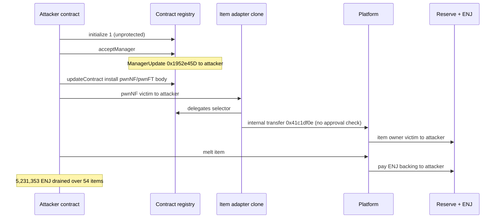
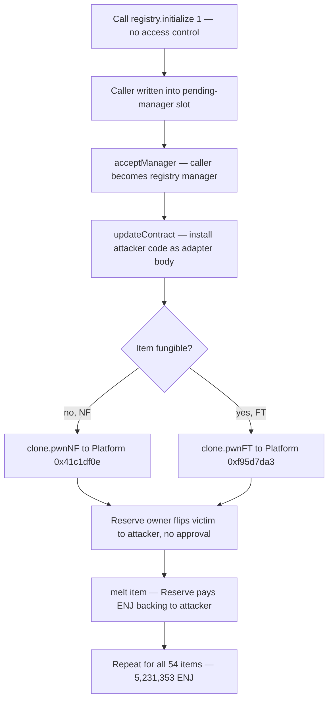

# Enjin "Crypto Items" — unprotected registry `initialize()` → manager takeover → delegatecall-body injection drains the ERC-1155 item reserve

> **Vulnerability classes:** vuln/access-control/missing-auth · vuln/access-control/uninitialized-proxy · vuln/access-control/admin-takeover · vuln/logic/arbitrary-external-call
> **Reproduction:** isolated Foundry project at [this folder](.). Full verbose trace: [output.txt](output.txt). PoC: [test/EnjinCryptoItems_exp.sol](test/EnjinCryptoItems_exp.sol). Victim contracts are unverified, so the code shown below is **RECONSTRUCTED** from the on-chain trace (selectors, delegatecall targets, storage-slot writes) — there is no `sources/` tree.

---

## Key info

| | |
|---|---|
| **Loss** | **5,231,353 ENJ** (≈ **$142K** at incident-time price), melted out of the item reserve in a single transaction ([output.txt:1540](output.txt), [output.txt:5661](output.txt)). |
| **Vulnerable contract** | The two Enjin "contract registries" — Registry A [`0x13fA4b9a…b157`](https://etherscan.io/address/0x13fA4b9a6C2F2604C919f96F456e3b50E968b157) and Registry B [`0x268C039A…B27f`](https://etherscan.io/address/0x268C039A3127D3107c014F0DC6c390A53e6dB27f) — each exposing an **unprotected `initialize(uint256)`**, plus the per-item adapter-clone delegatecall pattern they drive. |
| **Platform** | [`0xfaaFDc07…043C`](https://etherscan.io/address/0xfaaFDc07907ff5120a76b34b731b278c38d6043C) — the ERC-1155 item platform (holds the internal transfer + `melt` entrypoints). |
| **Reserve** | [`0x4E643a25…174e`](https://etherscan.io/address/0x4E643a25a64952895f553f20252861258727174e) — holds the ENJ backing and per-item ownership state. |
| **ENJ** | [`0xF629cBd9…3B9c`](https://etherscan.io/address/0xF629cBd94d3791C9250152BD8dfBDF380E2a3B9c) |
| **Original registry manager** | [`0x1952e45D…880c`](https://etherscan.io/address/0x1952e45D5bD519DC679Cc459C5fD0Ba46305880c) — fenced out by the attacker ([output.txt:1748](output.txt)). |
| **Attacker EOA** | [`0x5ec1ba78…8ca5`](https://etherscan.io/address/0x5ec1ba7892d11059c39557b762a97dd695778ca5) |
| **Attack contract** | [`0x7083Ddec…D321`](https://etherscan.io/address/0x7083DdecE38216C7741fa76c75326Bea744ED321) (became registry manager on-chain). In this reconstruction the stand-in attack contract is deployed fresh and appears in the trace as `EnjinCryptoItemsAttack 0x5615dE…b72f`. |
| **Attack tx** | [`0xd4a382da03c99ce3084661b913b50b525a4b283f66f510bcf1040152830b2a7e`](https://etherscan.io/tx/0xd4a382da03c99ce3084661b913b50b525a4b283f66f510bcf1040152830b2a7e) @ block **25,834,071** |
| **Chain / block / date** | Ethereum (chainId **1**) / fork **25,834,070** (parent of the exploit block) / ~**2026-08-26** |
| **Compiler** | PoC pragma `^0.8.15`, compiled with **solc 0.8.35** ([output.txt:1](output.txt)); default `evm_version` (no transient storage touched). |
| **Bug class** | Missing access control on a re-callable initializer. `initialize(uint256)` has no auth and no already-initialized guard, so any address can grab the registry's pending-manager slot, `acceptManager()` to full manager, and then `updateContract` arbitrary code as the body every adapter clone delegatecalls into. **Not a private-key / signer compromise** — the trace proves takeover via the open initializer. |

---

## TL;DR

1. Every Enjin "Crypto Items" item is fronted by a logicless per-item ERC-1155 **adapter clone**. The clone has no logic of its own: for *any* selector it looks up `delegates(selector)` on its **contract registry** and `delegatecall`s whatever implementation address is stored there.
2. The two live registries expose an **`initialize(uint256)` with no access control and no initialized check**. The attack contract calls `registry.initialize(1)`, which writes the caller into the registry's **pending-manager slot** ([output.txt:1740](output.txt)–[output.txt:1744](output.txt)); `acceptManager()` then promotes it to **full manager** — `ManagerUpdate` fires from the original manager `0x1952e45D` to the attacker ([output.txt:1748](output.txt)).
3. As manager, the attacker calls `updateContract(impl, "<sig>;", …)` to register **its own code** as the body the clones delegatecall for `pwnNF`/`pwnFT` ([output.txt:1753](output.txt), [output.txt:1768](output.txt)), and registers a no-op stub for `initialize`/`acceptManager` to re-lock the init path and fence the original manager out ([output.txt:1785](output.txt), [output.txt:1797](output.txt)). Both registries are taken the same way ([output.txt:1812](output.txt)–[output.txt:1823](output.txt)).
4. The installed body drives the platform's internal transfer functions — `0x41c1df0e` for non-fungibles, `0xf95d7da3` for fungibles — which move an item **with no owner/approval check** when invoked by the item's registered adapter. The NF instance owner flips straight from victim to attacker ([output.txt:1935](output.txt)) and a `TransferSingle` fires from the victim to the attacker ([output.txt:1938](output.txt)).
5. Each stolen item is immediately `melt()`ed for its ENJ backing, and **`melt` pays `msg.sender`** out of the Reserve ([output.txt:1943](output.txt)–[output.txt:1967](output.txt)). The first item alone (a creator item) pays **3,000,000 ENJ** ([output.txt:1966](output.txt)). Summed over 54 `(holder, id, amount)` tuples, the attacker ends with **5,231,353 ENJ** ([output.txt:5661](output.txt)); `assertApproxEqAbs(recovered, 5_231_353e18, 1e18)` passes ([output.txt:5664](output.txt)). `[PASS] testExploit()` ([output.txt:1537](output.txt)).

**This is a reconstruction, not a bytecode replay.** The PoC hijacks the two *real* registries and the *real* platform with typed `initialize()` / `acceptManager()` / `updateContract()` calls, then installs its **own** minimal adapter body (`MaliciousAdapter.pwnNF` / `pwnFT`) standing in for the attacker's. `pwnNF` / `pwnFT` are *our* function names — they are **not** on-chain selector names; the on-chain transfer selectors are `0x41c1df0e` and `0xf95d7da3`. The payload is deliberately our own code because the payload is not the vulnerability; the open initializer that lets an attacker install any payload is.

---

## Background

Enjin's "Crypto Items" is an ENJ-backed ERC-1155 platform. Each minted item is backed by locked ENJ held in the **Reserve** (`0x4E643a25…`), and `melt`ing an item returns its ENJ backing. Rather than a single monolithic token contract, each item is wrapped by a **per-item adapter clone** — a minimal proxy that carries no logic and routes every call through a shared **contract registry**. The registry holds a `delegates(selector) → implementation` dispatch table; the clone resolves the implementation for the incoming selector and `delegatecall`s it, so a clone's entire behaviour is whatever its registry says it is.

The registries themselves are proxies delegating to fixed implementation modules (the trace shows `RegistryA::initialize` executing in `0x24591e79…CfD2` and `RegistryA::updateContract` executing in `0x04866013…6134` via `delegatecall` — [output.txt:1741](output.txt), [output.txt:1754](output.txt)). Registry administration — who may edit the dispatch table — is gated by a **manager** role, transferred through a pending-manager / `acceptManager` two-step. The bug is that the *bootstrap* of that two-step, `initialize(uint256)`, was left callable by anyone at any time.

This PoC forks at block **25,834,070**, the parent of the exploit block, and drives every step as a real typed call against the real contracts. No `vm.deal`, no mocks: the ENJ the attacker walks away with is pulled from the real Reserve on the fork.

---

## The vulnerable code (RECONSTRUCTED)

> Victim contracts are **unverified**. The Solidity below is reconstructed from the trace: the delegatecall targets, the selectors (`delegates`, `updateContract`, `0x41c1df0e`, `0xf95d7da3`, `melt`), the `ManagerUpdate` event, and the exact storage slots the trace shows being written. It is a faithful *model* of the behaviour, not fetched source.

**1. The per-item adapter clone — a universal delegatecall shim.** For any selector it asks its registry which implementation to run, then delegatecalls it. Evidence: `clone.pwnNF` → `RegistryA::delegates(0xd500b902)` staticcall → delegatecall into the returned implementation ([output.txt:1925](output.txt)–[output.txt:1927](output.txt)); the clone is created holding its registry address in slot 0 ([output.txt:1898](output.txt)–[output.txt:1900](output.txt)).

```solidity
// RECONSTRUCTED — per-item adapter clone
contract ItemAdapterClone {
    address public registry; // slot 0, set at clone creation

    fallback() external payable {
        address impl = IRegistry(registry).delegates(msg.sig); // dispatch table lookup
        assembly {
            calldatacopy(0, 0, calldatasize())
            let ok := delegatecall(gas(), impl, 0, calldatasize(), 0, 0)
            returndatacopy(0, 0, returndatasize())
            switch ok case 0 { revert(0, returndatasize()) } default { return(0, returndatasize()) }
        }
    }
}
```

**2. The contract registry — unprotected `initialize`, then a manager-gated dispatch-table editor.** `initialize(uint256)` writes `msg.sender` into the pending-manager slot (slot 1) and sets the initialized flag (slot 2) — with **no `onlyOwner`/`onlyManager` and no "already initialized" revert**. Evidence: `RegistryA::initialize(1)` writes slot 1 `→ 0x5615de…b72f` (the caller) and slot 2 `0 → 1` ([output.txt:1743](output.txt)–[output.txt:1744](output.txt)); `acceptManager()` then writes slot 0 (manager) from `0x1952e45D` to the caller and clears pending ([output.txt:1750](output.txt)); `updateContract` writes the `delegates` mapping slot to the attacker's implementation ([output.txt:1762](output.txt)).

```solidity
// RECONSTRUCTED — contract registry (proxy over fixed impl modules)
contract ContractRegistry {
    address public manager;        // slot 0
    address public pendingManager; // slot 1
    uint256 public initialized;    // slot 2
    mapping(bytes4 => address) internal _delegates; // dispatch table

    // BUG: no access control, no "already initialized" guard — anyone can (re-)call.
    function initialize(uint256 /*version*/) external {
        pendingManager = msg.sender; // slot 1 ← caller
        initialized = 1;             // slot 2
    }

    function acceptManager() external {
        require(msg.sender == pendingManager);
        emit ManagerUpdate(manager, msg.sender); // 0x1952e45D → attacker
        manager = msg.sender;                    // slot 0 ← attacker
        pendingManager = address(0);
    }

    function updateContract(address impl, string calldata functions, string calldata /*commit*/) external {
        require(msg.sender == manager);          // now the attacker
        _delegates[_selectorOf(functions)] = impl; // clones will delegatecall `impl`
        emit CommitMessage(/* ... */);
    }

    function delegates(bytes4 selector) external view returns (address) { return _delegates[selector]; }
}
```

The manager check on `updateContract` and `acceptManager` is sound — the problem is entirely that `initialize` lets *anyone* become `pendingManager`, so the two-step guarding `manager` can be bootstrapped by a stranger.

**3. The platform's internal transfer — no owner/approval check for a registered adapter.** `0x41c1df0e(operator, from, to, id)` (NF) and `0xf95d7da3(operator, from, to, id, value)` (FT) flip item ownership in the Reserve directly. Evidence: `Platform::41c1df0e` → Reserve ownership slot flips `0x50bF21…(victim) → 0x5615de…(attacker)` with the only inputs being the four address/id words and no allowance read anywhere on the path ([output.txt:1928](output.txt)–[output.txt:1938](output.txt)).

```solidity
// RECONSTRUCTED — platform internal transfer (NF variant 0x41c1df0e)
function _transferNF(address operator, address from, address to, uint256 id) internal {
    // no ownerOf(id)==from-vs-msg.sender check, no isApprovedForAll(from, operator) check:
    // trust is placed entirely in the caller being the item's registered adapter clone.
    reserve.setInstanceOwner(id, to);          // storage owner: from → to
    emit TransferSingle(operator, from, to, id, 1);
}
```

Because step 2 lets the attacker point the adapter at code of their choosing, step 3's "the caller is the registered adapter" assumption is satisfied by attacker-controlled code, and the missing approval check means it moves *anyone's* item.

---

## Root cause

1. **`initialize(uint256)` on both registries has no access control and no initialized guard.** Any address can call it and be written into the pending-manager slot ([output.txt:1743](output.txt)). This is the single root cause; everything else is reachable from it.
2. **Manager bootstrap is a one-call grab.** `initialize` → `acceptManager()` is enough to move the `manager` slot from the legitimate manager `0x1952e45D` to the attacker ([output.txt:1748](output.txt), [output.txt:1750](output.txt)). The two-step was meant to protect manager transfer, but its first leg is the open initializer.
3. **The manager controls arbitrary delegatecall bodies.** `updateContract` writes the `delegates` dispatch table that every per-item clone delegatecalls through ([output.txt:1762](output.txt)). Owning the registry means owning the code of every item adapter it serves.
4. **The platform's internal transfer trusts the registered adapter with no approval check.** `0x41c1df0e` / `0xf95d7da3` move an item from any holder when called by the item's adapter ([output.txt:1935](output.txt)–[output.txt:1938](output.txt)); once the attacker controls the adapter body, that trust is a theft primitive.
5. **`melt` pays `msg.sender` the item's ENJ backing.** After stealing an item the attacker melts it and the Reserve transfers the backing to the attacker ([output.txt:1966](output.txt)–[output.txt:1967](output.txt)).

It is **not** a private-key or signer compromise: the takeover is a plain external `initialize()` call on an unguarded function, visible in the trace.

---

## Preconditions

- The registries' `initialize(uint256)` is callable by anyone and does not revert on re-initialization (holds on both at the fork — [output.txt:1740](output.txt), [output.txt:1812](output.txt)).
- The registry `manager` role can be assumed via `pendingManager` + `acceptManager()` with no second authorization from the incumbent manager.
- Per-item adapter clones delegatecall `registry.delegates(selector)`, so the manager-controlled dispatch table dictates clone behaviour ([output.txt:1925](output.txt)–[output.txt:1927](output.txt)).
- The platform's internal transfer selectors perform the move for a registered adapter without checking the holder's ownership/approval.
- Items hold a positive ENJ backing and `melt` pays `msg.sender` (true for the 54 drained tuples).
- Re-initializing clears the clone's `initialize(uint256)` delegate, which would brick the next clone creation; the attacker registers a no-op `initialize`/`acceptManager` stub to keep clone creation working and to re-lock the init path ([output.txt:1785](output.txt), [output.txt:1797](output.txt), [output.txt:1902](output.txt)–[output.txt:1905](output.txt)).

---

## Attack walkthrough

Fork **25,834,070**. The reconstruction's attack contract deploys fresh and appears as `EnjinCryptoItemsAttack 0x5615dE…b72f`. Trace: [output.txt](output.txt).

1. **Deploy the payload.** `new MaliciousAdapter` (the `pwnNF`/`pwnFT` body) ([output.txt:1736](output.txt)) and `new NoopStub` (the re-lock stub) ([output.txt:1738](output.txt)).
2. **Hijack Registry A.** `initialize(1)` delegatecalls the real registry impl `0x24591e79…CfD2` and writes the caller into pending-manager slot 1 and the initialized flag in slot 2 ([output.txt:1740](output.txt)–[output.txt:1744](output.txt)). `acceptManager()` emits `ManagerUpdate(0x1952e45D → attacker)` and moves manager slot 0 to the attacker ([output.txt:1747](output.txt)–[output.txt:1750](output.txt)).
3. **Install attacker code on Registry A.** `updateContract(MaliciousAdapter, "pwnNF(address,address,uint256);", "x")` points the `0xd500b902` selector at the attacker body ([output.txt:1753](output.txt), dispatch slot write at [output.txt:1762](output.txt)); same for `pwnFT` ([output.txt:1768](output.txt)). Then re-lock: register `NoopStub` for `initialize(uint256)` ([output.txt:1785](output.txt)) and `acceptManager()` ([output.txt:1797](output.txt)).
4. **Hijack Registry B identically.** `initialize(1)` ([output.txt:1812](output.txt)), `acceptManager()` → `ManagerUpdate(0x1952e45D → attacker)`, manager slot 0 flipped ([output.txt:1819](output.txt)–[output.txt:1823](output.txt)), then the same `updateContract` installs and re-lock.
5. **Per item — ensure the adapter clone exists.** For the first (creator) item, `getAdapter` returns `0x0` ([output.txt:1884](output.txt)–[output.txt:1889](output.txt)); the platform's create path (selector `0x33d332ab`) deploys a new clone `0x005ae6…` holding Registry A's address in slot 0 ([output.txt:1890](output.txt), [output.txt:1898](output.txt)–[output.txt:1900](output.txt)); its own `initialize` resolves through the registry to the `NoopStub` ([output.txt:1902](output.txt)–[output.txt:1905](output.txt)).
6. **Steal the item — no approval.** `clone.pwnNF(victim, attacker, id)` resolves `delegates(0xd500b902)` to `MaliciousAdapter` and delegatecalls it ([output.txt:1924](output.txt)–[output.txt:1927](output.txt)); the body calls `Platform::41c1df0e` ([output.txt:1928](output.txt)); the Reserve NF-owner slot flips `0x50bF21…(victim) → attacker` ([output.txt:1935](output.txt)) and `TransferSingle(from: 0x50bF21…, to: attacker)` fires ([output.txt:1938](output.txt)).
7. **Melt for the ENJ backing.** `Platform::melt([id],[1])` ([output.txt:1943](output.txt)); `getMeltValue` returns the backing ([output.txt:1951](output.txt)–[output.txt:1952](output.txt)); the item is burned (`TransferSingle(to: 0x0)` — [output.txt:1963](output.txt)); `ENJ::transfer(attacker, 3,000,000e18)` moves the backing from the Reserve to the attacker ([output.txt:1966](output.txt)–[output.txt:1967](output.txt)).
8. **Fungible items use the FT path.** For a fungible id (`id & ((1<<128)-1) == 0`), `clone.pwnFT(victim, attacker, id, value)` delegatecalls the body into `Platform::f95d7da3` ([output.txt:2666](output.txt)–[output.txt:2671](output.txt)), then `melt` as above.
9. **Loop over all 54 `(holder, id, amount)` tuples**, melting each stolen item.
10. **Total.** `ENJ::balanceOf(attacker)` returns `5,231,353000000000000000000` ([output.txt:5661](output.txt)–[output.txt:5662](output.txt)); `log_named_decimal_uint("ENJ recovered from melting") = 5,231,353.0` ([output.txt:5663](output.txt)); `assertApproxEqAbs(recovered, 5_231_353e18, 1e18)` passes ([output.txt:5664](output.txt)). `[PASS] testExploit() (gas: 11037037)` ([output.txt:1537](output.txt)); `Suite result: ok. 1 passed; 0 failed` ([output.txt:5677](output.txt)).

---

## Diagrams





---

## Remediation

- **Guard `initialize(uint256)`.** Use a one-time initializer modifier plus access control (owner/deployer-only), and revert on re-initialization. An open, re-callable initializer that writes a privileged slot is the entire bug.
- **Do not bootstrap the manager role from an initializer.** Make manager transfer a fully authorized two-step where the *incumbent* manager (or governance) nominates the pending manager; a stranger must never be able to set `pendingManager`.
- **Gate dispatch-table edits behind strong auth and a timelock.** `updateContract` rewrites the code every adapter clone delegatecalls; place it behind manager auth + a timelock, and constrain which selectors adapters may expose so a compromised manager cannot install arbitrary transfer bodies instantly.
- **Enforce ownership/approval in the platform's internal transfer paths.** `0x41c1df0e` / `0xf95d7da3` must check that the move is authorized by the holder (owner-is-caller or `isApprovedForAll`) regardless of the caller being a registered adapter. "The caller is the item's adapter" is not an authorization.
- **Re-verify every live registry and clone after patching.** Because the registries are proxies over fixed impl modules, confirm the deployed impls carry the guarded `initialize` and that no residual open initializer remains reachable on either registry.

---

## How to reproduce

Offline, from the committed `anvil_state.json` (anvil `--load-state`, no RPC). The harness forks Ethereum at block **25,834,070**:

```bash
_shared/run-poc/run_poc.sh 2026-08-EnjinCryptoItems_exp -vvvvv
```

Expected tail:

```
[PASS] testExploit() (gas: 11037037)
  Attacker Before exploit ENJ Balance: 0.000000000000000000
  ENJ recovered from melting: 5231353.000000000000000000
  Attacker After exploit ENJ Balance: 5231353.000000000000000000
Suite result: ok. 1 passed; 0 failed; 0 skipped
```
