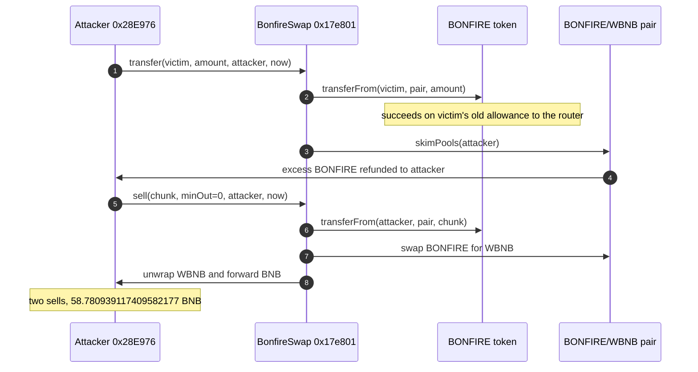

# BonfireSwap `transfer` spends any holder's standing allowance — missing caller check on the router's force-sell

> **Vulnerability classes:** vuln/access-control/missing-auth · vuln/logic/missing-check · vuln/input-validation/missing
> **Reproduction:** the PoC compiles and runs in an isolated Foundry project at [this project folder](.). Full verbose trace: [output.txt](output.txt). Router source is verified on BscScan and fetched into [sources/BonfireSwap_17e801/contracts_BonfireSwap.sol](sources/BonfireSwap_17e801/contracts_BonfireSwap.sol); the BONFIRE token is in [sources/Bonfire_5e9025/](sources/Bonfire_5e9025/).

---

## Key info

| | |
|---|---|
| **Loss** | Full incident ~66.08 WBNB (~$47–50K) across ~41 holders. This PoC, the five largest victims, realizes **58.780939117409582177 BNB** [output.txt:357](output.txt) |
| **Vulnerable contract** | BonfireSwap router — [`0x17e801E17CeFC6334059189c178D4783830E03D3`](https://bscscan.com/address/0x17e801E17CeFC6334059189c178D4783830E03D3#code) |
| **Attacker EOA** | [`0x2B5bF7D9D9Dc1EEc68f40C6B7a8f197e65f9731a`](https://bscscan.com/address/0x2B5bF7D9D9Dc1EEc68f40C6B7a8f197e65f9731a) |
| **Attack contract** | [`0x28E976Ea7b83553d6D1D45CE81334156A2632127`](https://bscscan.com/address/0x28E976Ea7b83553d6D1D45CE81334156A2632127) (created by the attack tx; `to` is empty) |
| **Attack tx** | [`0xb4c00e8f3ba815b6c70f45026f8794d2c1f079646a89919077688ce60692193f`](https://bscscan.com/tx/0xb4c00e8f3ba815b6c70f45026f8794d2c1f079646a89919077688ce60692193f) |
| **Chain / block / date** | BNB Smart Chain / attack block 122,003,954 (fork parent 122,003,953 [output.txt:361](output.txt)) / 2026-09-15 09:15:32 UTC |
| **Compiler** | Router `v0.8.7+commit.e28d00a7` (`pragma >=0.8.7`, [sources/BonfireSwap_17e801/_meta.json](sources/BonfireSwap_17e801/_meta.json)). BONFIRE token `v0.6.12+commit.27d51765` |
| **Bug class** | `transfer(to, amount, beneficiary, deadline)` pulls BONFIRE from `to` with the router's own allowance and never checks that `msg.sender` is `to` or that the caller has any allowance from `to`. |

## TL;DR

BonfireSwap is a custom BSC router for the reflective BONFIRE token (`0x5e90253f…5590`, 10% tax / 5% reflection, pair `0xD3F478F0…38f2` with WBNB). Holders who had used the router still had a standing `approve` to it. `transfer`, `simpleTransfer`, and `loggedTransfer` all call `_safeTransferFrom(token, to, pancakePair, amount)` where `to` is a caller-chosen address. There is no `msg.sender == to` check and no check that the caller was the one who granted the allowance. The pull succeeds solely because the victim previously approved the router.

The router's `skimPools` then hands the excess BONFIRE sitting on the pair to `beneficiary` — the attacker — rather than paying WBNB on that leg. The attacker later calls the router's own `sell` on the collected balance. In this offline fork the five largest real victims are drained with their real allowances and the real in-trace chunk sizes. Two `sell`s return 32.027618655416874391 and 26.753320461992707786 WBNB, unwrapped to **58.780939117409582177 BNB** [output.txt:357](output.txt). The historical tx sold the full collected stack for about 33.22 + 32.86 = 66.08 WBNB; this subset is the bulk of that drain, which the test floors at `> 40 ether` [output.txt:1072](output.txt). No flash loan and no privileged role are required.

## Background — what BonfireSwap does

BONFIRE is an old reflective BEP-20. Buys and sells go through the BONFIRE/WBNB Pancake pair and take a transfer tax plus a reflection share. BonfireSwap wraps that pair with `buy`, `sell`, and a "transfer into the pool then skim" path. The skim exists so that tokens pushed onto the pair above reserves can be swapped out (or, when the excess is the token itself, refunded) to a named `beneficiary`.

The router hardcodes the token, the pair, and WBNB:

```solidity
// sources/BonfireSwap_17e801/contracts_BonfireSwap.sol:25-27
IWETH public constant WETH = IWETH(0xbb4CdB9CBd36B01bD1cBaEBF2De08d9173bc095c);
address public constant tokenAddress = 0x5e90253fbae4Dab78aa351f4E6fed08A64AB5590;
address public constant pancakePair = 0xD3F478F0d5E98b01f757bc6cB54Db4C00b9838f2;
```

`sell` is the honest path: it pulls from `msg.sender`, swaps BONFIRE for WBNB, unwraps, and forwards BNB. `transfer` was meant as a convenience for a holder to push their own tokens at the pair and skim the result to a beneficiary. It treats the `to` argument as that holder. Nothing binds `to` to the caller.

The pair is `pools[0]`, so the `skimPools` inside `transfer` skims the freshly dumped excess back out as BONFIRE, not as WBNB. A standalone `skimPool` the historical attacker also emitted was wrapped in try/catch and reverted once potential was zero; it is not how value is realized. Monetization is the later `sell`.

## The vulnerable code

From the verified router ([sources/BonfireSwap_17e801/contracts_BonfireSwap.sol](sources/BonfireSwap_17e801/contracts_BonfireSwap.sol)).

### Arbitrary `from` on every transfer entrypoint

```solidity
// sources/BonfireSwap_17e801/contracts_BonfireSwap.sol:96-109
function transfer(address to, uint amountAIn, address beneficiary, uint deadline)
    public ensure(deadline) returns (uint amountAOut, uint amountBOut)
{
    _safeTransferFrom(tokenAddress, to, pancakePair, amountAIn);
    (amountAOut, amountBOut) = skimPools(beneficiary);
}

function simpleTransfer(address to, uint amountAIn, address beneficiary)
    public returns (uint amountAOut, uint amountBOut)
{
    return transfer(to, amountAIn, beneficiary, block.timestamp);
}

function loggedTransfer(address to, uint amountAIn, address beneficiary, uint deadline, string memory purpose)
    public ensure(deadline) returns (uint amountAOut, uint amountBOut)
{
    _safeTransferFrom(tokenAddress, to, pancakePair, amountAIn);
    (amountAOut, amountBOut) = skimPools(beneficiary);
    logbook.commissionedEvent(to, tokenAddress, amountAIn, amountAOut, amountBOut, purpose);
}
```

`_safeTransferFrom` forwards `transferFrom(from, to, amount)` and checks only that the token call succeeded. `from` is the victim. The router is `msg.sender` to the token, so the victim's allowance to the router is what authorizes the pull. The external caller of `transfer` is never consulted:

```solidity
// sources/BonfireSwap_17e801/contracts_BonfireSwap.sol:159-162
function _safeTransferFrom(address token, address from, address to, uint amount) internal {
    (bool success, bytes memory data) = token.call(abi.encodeWithSelector(TRANSFERFROM, from, to, amount));
    require(success && (data.length == 0 || abi.decode(data, (bool))), 'BonfireSwap: TRANSFERFROM_FAILED');
}
```

Contrast `sell`, which correctly uses `msg.sender` as the token source and then pays BNB to `to`:

```solidity
// sources/BonfireSwap_17e801/contracts_BonfireSwap.sol:136-141
function sell(uint amountAIn, uint minAmountOut, address payable to, uint deadline)
    public ensure(deadline) returns (uint amountAOut, uint amountBOut)
{
    _safeTransferFrom(tokenAddress, msg.sender, pancakePair, amountAIn);
    (amountAOut, amountBOut) = _enactSwap(tokenAddress, minAmountOut, 0, address(this), pancakePair);
    WETH.withdraw(amountBOut);
    to.transfer(amountBOut);
}
```

`deadline` (`ensure`) only checks `deadline >= block.timestamp`. It is not an authorization. The historical attack, and this PoC, pass `block.timestamp`.

## Root cause — why it was possible


## Secondary analysis (@SlowMist_Team)

> Missing access control on BonfireSwap.transfer: caller-chosen from is pulled with the router’s standing allowance and never checked against msg.sender.

Source: https://x.com/SlowMist_Team/status/2100064586980528458


1. **The token source is caller input.** `transfer` / `simpleTransfer` / `loggedTransfer` pass `to` straight into `transferFrom` as `from`. There is no `require(msg.sender == to)`.
2. **The allowance that matters is the router's, not the caller's.** Because the router is the ERC-20 `msg.sender`, any non-zero allowance a holder once granted `0x17e801…` is spendable by every address.
3. **Skim pays the attacker in the stolen token.** `skimPools(beneficiary)` sends the excess to the attacker-chosen address. The victim is not the recipient.
4. **`sell` has no slippage floor the victim can set.** The attacker calls `sell(chunk, 0, attacker, now)` on tokens they now hold. `minAmountOut = 0` is the attacker's choice; the bug is the pull, not the later swap.
5. **The token's max-transfer cap only changes chunking.** BONFIRE's max-tx (the PoC stays under 2,450 tokens per sell) forces two pulls of the largest victim and two sells. It does not check who called the router.

## Preconditions

- **Permissionless.** Any EOA or contract can call `transfer`. The PoC pranks an unrelated EOA [test/BonfireSwap_exp.sol](test/BonfireSwap_exp.sol) and asserts each victim is not the attacker.
- **A pre-existing allowance to the router.** At the fork each of the five holders has a max-uint allowance to `0x17e801…` [output.txt:368](output.txt). Nothing is `deal`ed or re-approved for them.
- **A balance worth pulling, under the token max-tx if the pull itself is capped.** The largest victim (`0xefF2…4096`) is pulled in two chunks of ~2,644.18 and ~2,644.93 BONFIRE, summing to the reported ~5,289.10.
- **No flash loan, no signature, no owner key.** Capital required is gas.

## Attack walkthrough (with on-chain numbers from the trace)

Fork parent block 122,003,953 [output.txt:361](output.txt). The PoC drains six pulls (five addresses; the top holder is split) then sells. Amounts are the real in-trace values, not approximations invented for the test.

| # | Action | Amount | Trace |
|---|--------|--------|-------|
| 0 | Read `allowance(victim, router)` for `0xefF2…4096`. Returns max uint256. The loop asserts the same for every victim | type(uint256).max | [output.txt:368](output.txt) |
| 1 | `transfer(0xefF2…4096, 2644.176000944142651753, attacker, now)`. Skim refunds 2,479.077747049672815009 BONFIRE to the attacker | pull 2,644.176 | [output.txt:409](output.txt), refund [output.txt:454](output.txt) |
| 2 | Second chunk of the same holder: pull 2,644.928766184339197335, skim 2,479.785112492374220503 | pull 2,644.929 | [output.txt:483](output.txt), [output.txt:528](output.txt) |
| 3 | `0xB5FA…C60a` pull 35.793541251552693748. This leg also trips the token's own Pancake V1 tax/liquify; the skim still pays the attacker 33.556044284316983501 BONFIRE | 35.794 | [output.txt:555](output.txt), [output.txt:690](output.txt) |
| 4 | `0x0e20…9636` pull 8.914921028910356181, skim 8.357627516150634324 | 8.915 | [output.txt:717](output.txt), [output.txt:762](output.txt) |
| 5 | `0x7a8A…9Acd` pull 8.879656371956250055, skim 8.324567341530369545 | 8.880 | [output.txt:789](output.txt), [output.txt:834](output.txt) |
| 6 | `0x1Aa7…f604` pull 8.844138239216892382, skim 8.291269536324475327 | 8.844 | [output.txt:861](output.txt), [output.txt:906](output.txt) |
| 7 | Attacker `balanceOf` before the dump. Reflective accounting, so this is not the sum of the Transfer-event amounts | 4,516.805525102470801854 BONFIRE | [output.txt:937](output.txt) |
| 8 | `sell(2450e18, 0, attacker, now)`. Pair pays 32.027618655416874391 WBNB; router unwraps and the attacker `receive`s that BNB | 32.027618655416874391 BNB | [output.txt:938](output.txt), [output.txt:973](output.txt), [output.txt:999](output.txt) |
| 9 | `sell(2067.058739798096068623, 0, attacker, now)`. Pair pays 26.753320461992707786 WBNB | 26.753320461992707786 BNB | [output.txt:1004](output.txt), [output.txt:1039](output.txt) |
| 10 | Logged profit | **58.780939117409582177 BNB** | [output.txt:357](output.txt), [output.txt:1071](output.txt) |

32.027618655416874391 + 26.753320461992707786 = 58.780939117409582177, matching the log exactly. The test then asserts that figure is greater than 40 BNB [output.txt:1072](output.txt). `[PASS]` at [output.txt:355](output.txt); suite `1 passed` at [output.txt:1076](output.txt).

**Profit/loss**

| Component | Amount |
|-----------|--------|
| BNB from the two `sell`s (5-victim subset) | +58.780939117409582177 |
| BONFIRE the attacker held before the tx | 0 (pulls are other holders' balances) |
| Flash-loan principal / fee | none |
| Historical full-tx WBNB (not all victims are in this PoC) | ~66.08 (33.22 + 32.86), reported |
| **Net in this reproduction** | **+58.780939117409582177 BNB** |

The largest single holder, `0xefF2FC4E3145f58F534d68A36Bcd3085Be6a4096`, loses 2,644.176000944142651753 + 2,644.928766184339197335 = 5,289.104767128481849088 BONFIRE, the ~5,289.10 figure in the public alert. The PoC comments count ~65 external holders in the real tx, of which ~41 had a balance worth draining, and ~5,082.49 BONFIRE collected across all skim refunds. These five pulls are the ones reconstructed here.

## Diagrams



## Remediation

1. **Bind the token source to the caller.** `require(msg.sender == to)` in `transfer`, `simpleTransfer`, `loggedTransfer`, and `simpleLoggedTransfer`, or delete the `to` argument and always pull from `msg.sender` the way `sell` already does.
2. **Do not let a router allowance be spent by third parties.** If a relayer must pull, require a signature over `(from, amount, beneficiary, deadline, nonce)` and mark the nonce used. A bare allowance to the router is not that signature.
3. **Separate skim from arbitrary pulls.** `skimPools(beneficiary)` should only pay out tokens the caller just deposited, measured against a balance delta of `msg.sender`, not against a `transferFrom` of an unrelated account.
4. **Tell holders to revoke.** Allowances already granted to `0x17e801…` stay spendable until the functions are removed or the token blocks that spender. Revocation is the user-side mitigation; it is not a fix for the router.
5. **Remove or gate the sibling entrypoints.** `simpleTransfer` and `loggedTransfer` share `_safeTransferFrom(token, to, …)`. Fixing only `transfer` leaves the same bug one function over.

## How to reproduce

The PoC runs **fully offline** from the committed `anvil_state.json`. No RPC.

```bash
# from the registry root
_shared/run_poc.sh 2026-09-BonfireSwap_exp -vvvvv
```

- **Chain / fork:** BNB Smart Chain, fork block **122,003,953** (`vm.createSelectFork` against local anvil; attack block is 122,003,954).
- **Expected result:** `[PASS]` and the extracted-BNB line:

```
BNB extracted (5-victim subset ~98.7% of drain): 58.780939117409582177
Suite result: ok. 1 passed; 0 failed; 0 skipped
```

The committed trace [output.txt](output.txt) is that offline `-vvvvv` run (`finished in 33.73ms`).

*Reference: [SlowMist, BonfireSwap router access-control loss ~$50K (PANews)](https://www.panews.io/articles/01a0a931-ae81-7226-b65f-179fd3b16281).*


## References

- https://x.com/TenArmorAlert/status/2100042823139721576 (@TenArmorAlert secondary analysis)

- https://x.com/SlowMist_Team/status/2100064586980528458 (@SlowMist_Team secondary analysis)

- https://x.com/DefimonAlerts/status/2100077978528936392 (@DefimonAlerts secondary analysis)
