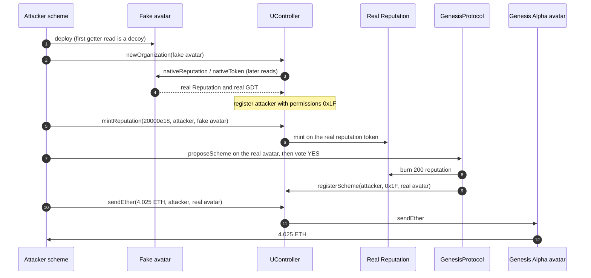

# DAOstack Genesis Alpha — permissionless `newOrganization` mints reputation and drains the avatar

> **Vulnerability classes:** vuln/access-control/missing-auth · vuln/governance/proposal-manipulation · vuln/logic/missing-validation
> **Reproduction:** the PoC compiles and runs in an isolated Foundry project at [this project folder](.). Full verbose trace: [output.txt](output.txt). UController, Reputation, and the Genesis Alpha avatar are **unverified** on Etherscan (`fetch_sources` returned `UNVERIFIED` for all three). The logic below is reconstructed from the fork trace. The PoC is [test/DAOstack_exp.sol](test/DAOstack_exp.sol).

---

## Key info

| | |
|---|---|
| **Loss** | **4.025 ETH**, the avatar's entire treasury. Attacker balance log goes from 0 to **4.025577021548053172 ETH** [output.txt:369](output.txt) (within the PoC's 0.001 ETH tolerance of 4.025 [output.txt:551](output.txt)) |
| **Vulnerable contract** | Shared UController — [`0xD5bEe5D9Ae589094c51e533f35656963fdA87305`](https://etherscan.io/address/0xD5bEe5D9Ae589094c51e533f35656963fdA87305) (unverified). Victim avatar [`0x7b11dFb29504abc8C0DFa60DC7E0Aa2AAe836DB0`](https://etherscan.io/address/0x7b11dFb29504abc8C0DFa60DC7E0Aa2AAe836DB0) |
| **Attacker EOA** | [`0x5cF6bf4197c13b9C0Ae4AECC6Eb10Ef61bC6bEB0`](https://etherscan.io/address/0x5cF6bf4197c13b9C0Ae4AECC6Eb10Ef61bC6bEB0) |
| **Attack contract** | Factory [`0xa90bbd7f48279f58a3ca9d8d2fd2c973fed494d7`](https://etherscan.io/address/0xa90bbd7f48279f58a3ca9d8d2fd2c973fed494d7) created in the tx, which creates the scheme [`0x304a8e57b7a84ab1c66bc6216f0634c23eeb3f18`](https://etherscan.io/address/0x304a8e57b7a84ab1c66bc6216f0634c23eeb3f18). Fake avatar [`0xd9902ea5a84a236a86a66d37b81dd1fe10c3f181`](https://etherscan.io/address/0xd9902ea5a84a236a86a66d37b81dd1fe10c3f181) |
| **Attack tx** | [`0xcfff7b060a7fb881f4bd8d2498dbe4e09454f7afaf5328fc12b59812f6737cc1`](https://etherscan.io/tx/0xcfff7b060a7fb881f4bd8d2498dbe4e09454f7afaf5328fc12b59812f6737cc1) (contract creation; `to` is empty) |
| **Chain / block / date** | Ethereum mainnet / attack block 26,059,090 (fork parent 26,059,089 [output.txt:374](output.txt)) / 2026-09-26 03:58:23 UTC |
| **Compiler** | Unknown. None of UController, Reputation, or the avatar is verified |
| **Bug class** | `UController.newOrganization(avatar)` is permissionless and will register the caller as a full-permission scheme over whatever reputation a caller-supplied avatar reports, including a reputation that already belongs to Genesis Alpha. |

## TL;DR

Genesis Alpha is a DAOstack DAO. Its avatar (`0x7b11…6DB0`) holds the ETH treasury. Its Reputation token (`0x6256…5BF9`) is the voting weight. Both are owned by one shared `UController` (`0xD5bE…7305`) — `owner()` on the real avatar returns that controller during the proposal [output.txt:440](output.txt). `newOrganization(address)` on that controller does not check that the caller is allowed to found an org, and it does not check that the reputation it records is already governed by another organization.

The attacker deploys a fake avatar whose `nativeReputation()` and `nativeToken()` return a decoy on the first read and the **real** Genesis Alpha reputation and GDT token on every later read. `newOrganization` stores those later reads and emits `RegisterScheme` for the attacker with permissions word `31` (`0x1F`) [output.txt:422](output.txt). As that scheme, `mintReputation(20_000e18, attacker, fakeAvatar)` lands on the real Reputation: `Reputation.mint` of 20,000 [output.txt:431](output.txt). Supply moves from 9,738.627137 to 29,738.627137.

That is a majority. The attacker calls SchemeRegistrar `proposeScheme` on the **real** avatar to install itself with permissions `0x1F`, then GenesisProtocol `vote(proposal, 1)`. The vote burns 200 reputation as the fee [output.txt:480](output.txt) and executes immediately: `registerScheme` on the real avatar [output.txt:510](output.txt). `sendEther(4.025 ether, attacker, realAvatar)` empties the treasury [output.txt:534](output.txt). A fresh unrelated address can repeat `newOrganization` plus `mintReputation` — `testNewOrganizationIsPermissionless` mints 1,234 reputation to `stranger` [output.txt:629](output.txt). No prior stake, no flash loan, no stolen key.

## Background — what this DAO trusts the controller to do

DAOstack splits a DAO into an avatar (treasury and owner of record), a reputation token (voting weight), a native token, and schemes that the controller will run if their permission bits are set. The controller is the owner of both the avatar and the reputation, so a scheme that can call `mintReputation` or `sendEther` is asking the owner to do it. Those entrypoints are safe only if scheme registration is itself gated.

Genesis Alpha's live addresses, all unverified, from the trace and the PoC:

| Role | Address |
|------|---------|
| UController | `0xD5bEe5D9Ae589094c51e533f35656963fdA87305` |
| Avatar / treasury | `0x7b11dFb29504abc8C0DFa60DC7E0Aa2AAe836DB0` |
| Reputation | `0x6256294145fb529dB7B248Eb86b4E6ef30F55BF9` |
| Native token GDT | `0xe30a71938b743d126E977A2b3F7450484F209a34` |
| SchemeRegistrar | `0x781f48F300f9c2f4862347537927FC9Dc48415E0` |
| GenesisProtocol | `0xFBaEf31bdEaCFA0a7902123005288784Dcc1EEba` |

Selectors recovered from the trace (`cast sig` agrees): `newOrganization(address)` `0xb9981364`, `mintReputation(uint256,address,address)` `0xeaf994b2`, `sendEther(uint256,address,address)` `0x634965da`, `proposeScheme(address,address,bytes32,bytes4)` `0x1c940d51`, `vote(bytes32,uint256)` `0x9ef1204c`.

At the fork, `Reputation.totalSupply()` is 9,738.627137 [output.txt:383](output.txt) and the avatar holds exactly 4.025 ETH [output.txt:384](output.txt).

## The vulnerable code

**RECONSTRUCTED** from [output.txt](output.txt). Do not treat this as verified Solidity. It records which calls happened and which checks did not.

```solidity
// RECONSTRUCTED. UController 0xD5bEe5D9…7305 is unverified.
// newOrganization is callable by any address. It trusts the avatar's getters.

function newOrganization(address _avatar) external {
    // trace: owner(), then nativeReputation() and nativeToken() several times
    require(_avatar.owner() == address(this));
    address rep = _avatar.nativeReputation();   // first read may be ignored
    address token = _avatar.nativeToken();
    rep = _avatar.nativeReputation();            // stored value is a LATER read
    token = _avatar.nativeToken();
    organizations[_avatar].reputation = rep;    // can be some other DAO's reputation
    organizations[_avatar].token = token;
    // permissions word written as 31 == 0x1F (all scheme bits)
    _registerScheme(msg.sender, _avatar, bytes32(0), bytes4(0x0000001f));
    // no "this reputation is already bound to one organization" check
}

function mintReputation(uint256 amount, address to, address avatar) external returns (bool) {
    // caller must be a scheme on `avatar` with the mint bit — true for the
    // attacker on the FAKE avatar, whose stored reputation is the REAL one
    Reputation(organizations[avatar].reputation).mint(to, amount);
}
```

The fake avatar is what makes the stored reputation the victim's. The trace is explicit. First `nativeReputation()` returns a stub deployed moments earlier [output.txt:398](output.txt). The next two calls return `0x6256294145fb529dB7B248Eb86b4E6ef30F55BF9` [output.txt:410](output.txt), [output.txt:414](output.txt). `nativeToken()` does the same: stub, then real GDT `0xe30a7193…` [output.txt:402](output.txt), [output.txt:409](output.txt). The controller's storage write is the real reputation [output.txt:425](output.txt):

```
@ 0x720e1b3d…1a99: 0 → 0x0000…6256294145fb529db7b248eb86b4e6ef30f55bf9
```

`RegisterScheme` fires for the exploit contract on the fake avatar [output.txt:422](output.txt), and the permissions slot becomes `31` [output.txt:424](output.txt).

`mintReputation` then calls `Reputation.mint` on `0x6256…5BF9`, not on a decoy [output.txt:431](output.txt). Supply slot `2` moves from `0x020fee99d7a4c0691000` (9,738.627137e18) to `0x064c225b6b1a24e91000` (29,738.627137e18).

The same missing check is re-proven without the drain: `testNewOrganizationIsPermissionless` deploys a fresh fake avatar from `stranger` (`0x49052147…A5dC`), calls `newOrganization` (no revert), and `mintReputation(1234e18)` succeeds [output.txt:625](output.txt). `reputationOf(stranger)` becomes 1,234 [output.txt:629](output.txt).

## Root cause — why it was possible

1. **`newOrganization` is unauthenticated.** A contract created in the same transaction, with no reputation and no scheme bits, calls it and gets `0x1F` on the org it just defined. The stranger test is the control experiment.
2. **Reputation identity is not unique.** The controller stores `avatar.nativeReputation()` and will later mint on that address. It never checks that this Reputation's owner-organization is already Genesis Alpha. One shared controller owning every org's reputation is what makes the mint valid at the token: the controller really is `Reputation.owner()`.
3. **Getters are callable and stateful, so the first read can be a decoy.** The fake avatar returns a stub once, then the real address. Whatever first-read sanity check the controller has, the value it stores is a subsequent read. The PoC does not need to know which internal call fed which check; the live controller accepts this getter behavior [output.txt:398](output.txt) through [output.txt:421](output.txt).
4. **Minted reputation votes in the same transaction.** GenesisProtocol reads `reputationOf` on the real reputation [output.txt:476](output.txt) (20,000 of 29,738.627137 total [output.txt:473](output.txt)), burns 200 as the vote cost [output.txt:480](output.txt), and calls `SchemeRegistrar.execute`, which `registerScheme`s the attacker on the real avatar with permissions `31` [output.txt:510](output.txt). There is no timelock between "I just minted this" and "the proposal executed."
5. **`sendEther` trusts that scheme bit.** Once the bit is set on the real avatar, the controller forwards 4.025 ETH [output.txt:534](output.txt).

## Preconditions

- **Permissionless.** No reputation, no GEN/GDT balance, no vote lock from a previous block. The attacker contract is deployed and calls `newOrganization` immediately.
- **The controller must be the owner of the victim reputation and of the victim avatar.** Both `owner()` reads in the trace return `0xD5bE…7305`.
- **The avatar must hold ETH.** It holds exactly 4.025 ETH at the fork [output.txt:384](output.txt).
- **No flash loan.** The majority is minted, not bought or borrowed. The only "cost" is 200 reputation burned by the voting machine, out of the 20,000 just minted.
- **Shape-shifting avatar.** The attack needs a contract whose `nativeReputation` / `nativeToken` change after the first read. That is ordinary Solidity; it is not a privileged role.

## Attack walkthrough (with on-chain numbers from the trace)

The historical tx is a creation. The EOA creates factory `0xa90bbd7f…94d7`, which creates scheme `0x304a8e57…3f18`, which creates fake avatar `0xd9902ea5…f181` and two 57-byte stubs (`0x7f7d02dd…`, `0x20aef079…`). The PoC inlines that scheme as `DAOstackExploit` and forwards ETH to the test. Internal value on the real tx is 4.025 ETH from the avatar to the scheme, then to the factory, then to the EOA.

| # | Action | Amount | Trace |
|---|--------|--------|-------|
| 0 | `totalSupply` before | 9,738.627137 reputation | [output.txt:383](output.txt) |
| 1 | Avatar ETH before | 4.025 ETH exactly | [output.txt:384](output.txt) |
| 2 | Deploy fake avatar. First getter reads return stubs; later reads return real reputation `0x6256…` and real GDT `0xe30a…` | — | [output.txt:389](output.txt), [output.txt:398](output.txt), [output.txt:413](output.txt) |
| 3 | `newOrganization(fakeAvatar)`. `RegisterScheme`, permissions stored as 31, reputation slot set to the real token | 0x1F | [output.txt:395](output.txt), [output.txt:422](output.txt), [output.txt:425](output.txt) |
| 4 | `mintReputation(20_000e18, attacker, fakeAvatar)` → `Reputation.mint` on the real token | +20,000 | [output.txt:429](output.txt), [output.txt:431](output.txt) |
| 5 | `SchemeRegistrar.proposeScheme(realAvatar, attacker, 0, 0x0000001f)`. New proposal, voting machine `0xFBaE…` | permissions 0x1F | [output.txt:438](output.txt), [output.txt:461](output.txt) |
| 6 | `vote(proposal, 1)`. Supply read 29,738.627137; attacker reputation 20,000. `burnReputation(200e18)` then `execute` → `registerScheme` on the real avatar | −200 reputation, scheme bit 31 | [output.txt:469](output.txt), [output.txt:473](output.txt), [output.txt:477](output.txt), [output.txt:480](output.txt), [output.txt:510](output.txt) |
| 7 | Supply after the burn | 29,538.627137 | [output.txt:497](output.txt), [output.txt:546](output.txt) |
| 8 | `sendEther(4.025 ether, attacker, realAvatar)`. Avatar calls `sendEther`; attacker `receive`s 4.025 ETH | 4.025 ETH | [output.txt:534](output.txt), [output.txt:537](output.txt) |
| 9 | Forward to the test. Balance log | 4.025577021548053172 ETH | [output.txt:542](output.txt), [output.txt:553](output.txt) |

Net reputation minted is `20_000e18 - 200e18 = 19_800e18`, asserted equal at [output.txt:547](output.txt). Avatar balance is 0 [output.txt:549](output.txt). The after-balance is 4.025577021548053172 rather than 4.025000000000000000; `assertApproxEqAbs` allows 0.001 ETH [output.txt:551](output.txt). The `sendEther` value itself is exactly 4.025 ETH. `[PASS] testExploit` [output.txt:367](output.txt). `[PASS] testNewOrganizationIsPermissionless` [output.txt:556](output.txt). Suite: `2 passed` [output.txt:633](output.txt).

**Profit/loss**

| Component | ETH |
|-----------|-----|
| Avatar treasury before | 4.025 |
| `sendEther` to the attacker scheme | +4.025 |
| Capital posted (reputation, tokens, flash loan) | 0 |
| Attacker ETH balance log after | 4.025577021548053172 |
| **Treasury taken** | **4.025 ETH** |

## Diagrams



## Remediation

1. **Bind a reputation to a single organization.** `newOrganization` must revert if `nativeReputation()` is already stored for any avatar. The same for the native token if mint rights are exclusive.
2. **Stop trusting a second read of a mutable getter.** Read `nativeReputation()` once and use that word for every check and for storage. A first-read decoy then cannot diverge from the stored address. Better: the avatar is a contract the controller deployed, not an arbitrary address.
3. **Remove public `newOrganization`, or restrict it to a factory that deploys a fresh reputation.** Registering `msg.sender` as `0x1F` on a caller-supplied avatar is organization creation and privilege grant in one call. Those should not be the same unauthenticated function.
4. **Timelock scheme installation and treasury sends.** A reputation balance that did not exist at the start of the block must not pass a proposal in that block. `sendEther` should not be reachable from a scheme registered in the same transaction.
5. **Verify the controller.** This bytecode has been live for years and is still unverified. Publish the matching source, and do not share one controller across treasuries that cannot rotate their owner.

## How to reproduce

The PoC runs **fully offline** from the committed `anvil_state.json`. No RPC.

```bash
# from the registry root
_shared/run_poc.sh 2026-09-DAOstack_exp -vvvvv
```

- **Chain / fork:** Ethereum mainnet, fork block **26,059,089** (parent of attack block 26,059,090).
- **Expected result:**

```
Attacker Before exploit ETH Balance: 0.000000000000000000
Attacker After exploit ETH Balance: 4.025577021548053172
Suite result: ok. 2 passed; 0 failed; 0 skipped
```

`[PASS] testExploit` and `[PASS] testNewOrganizationIsPermissionless` are both in [output.txt](output.txt). The committed trace is the offline `-vvvvv` run.

*Reference: [attack transaction on Etherscan](https://etherscan.io/tx/0xcfff7b060a7fb881f4bd8d2498dbe4e09454f7afaf5328fc12b59812f6737cc1) (no separate public write-up was identified; UController source is unverified).*


## References

- https://x.com/exvulsec/status/2103701786133667880 (@exvulsec secondary analysis)
