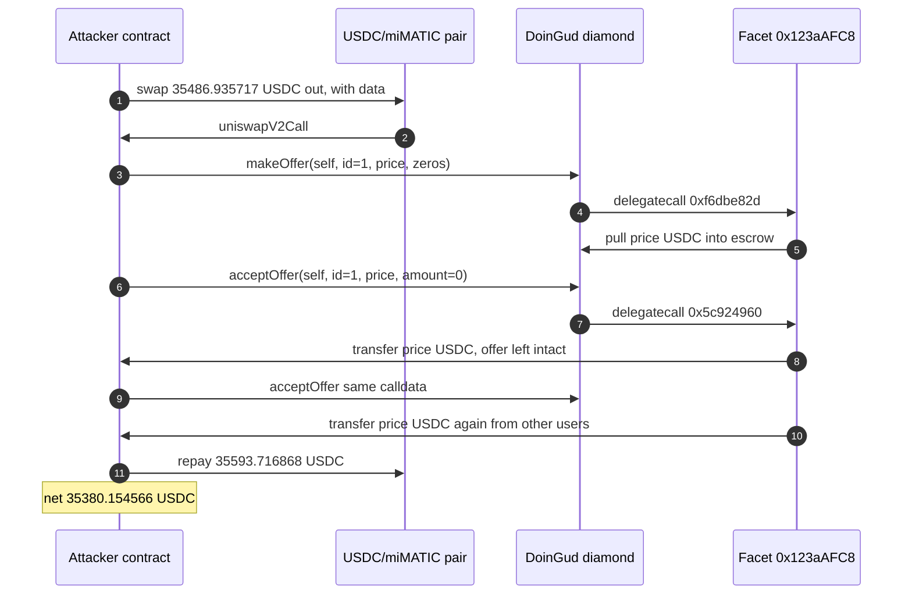

# DoinGud `acceptOffer` pays the escrow twice — `amount == 0` skips offer deletion

> **Vulnerability classes:** vuln/logic/incorrect-state-transition · vuln/logic/missing-check · vuln/logic/wrong-condition
> **Reproduction:** the PoC compiles and runs in an isolated Foundry project at [this project folder](.). Full verbose trace: [output.txt](output.txt). The diamond proxy is verified ([sources/DoinGudDiamond_E3A161/](sources/DoinGudDiamond_E3A161/)); the marketplace facet `0x123aAFC8…DDe1` is **unverified**. The vulnerable function below is reconstructed from the fork trace, not from source.

---

## Key info

| | |
|---|---|
| **Loss** | **35,380.154566 USDC** net [output.txt:591](output.txt). Two payouts of 35,486.935717 minus the 35,593.716868 flash-swap repayment |
| **Vulnerable contract** | Marketplace facet (delegatecalled) — [`0x123aAFC8D0a07CE1A146E53aA899e77f21A2DDe1`](https://polygonscan.com/address/0x123aAFC8D0a07CE1A146E53aA899e77f21A2DDe1) via diamond [`0xE3A161EdD679fC5ce2dB2316a4B6f7ab33a8eD6A`](https://polygonscan.com/address/0xE3A161EdD679fC5ce2dB2316a4B6f7ab33a8eD6A) |
| **Attacker EOA** | [`0xb8C717239BCACE558c3a8Dc471c16E07bF57a1Eb`](https://polygonscan.com/address/0xb8C717239BCACE558c3a8Dc471c16E07bF57a1Eb) |
| **Attack contract** | [`0xe588834AA3161a0720E8F6bf223748D6098a4B76`](https://polygonscan.com/address/0xe588834AA3161a0720E8F6bf223748D6098a4B76) (pre-deployed; the tx `to` is this contract, not a creation) |
| **Attack tx** | [`0x56818a63077f5ba8bfc0bc0877ac33502a5d65cc79dbf5dfaac2a0b8545216a8`](https://polygonscan.com/tx/0x56818a63077f5ba8bfc0bc0877ac33502a5d65cc79dbf5dfaac2a0b8545216a8) |
| **Chain / block / date** | Polygon / attack block 94,170,781 (fork parent 94,170,780 [output.txt:596](output.txt)) / 2026-09-21 03:27:25 UTC |
| **Compiler** | Diamond proxy `v0.8.9+commit.e5eed63a` ([sources/DoinGudDiamond_E3A161/_meta.json](sources/DoinGudDiamond_E3A161/_meta.json), proxy flag 1, implementation `0x48d740d3…4c4b2b`). Facet compiler unknown — source is not verified |
| **Bug class** | `acceptOffer(offerer, tokenId, price, amount)` sends `price` USDC to `msg.sender` when `amount == 0` and does not delete the offer, so the same calldata pays `price` again out of other users' escrow. |

## TL;DR

DoinGud's Polygon marketplace is an EIP-2535 diamond. The escrow USDC sits on the diamond `0xE3A161…eD6A`. The bidding logic lives in an unverified facet `0x123aAFC8…`, which the diamond `delegatecall`s. At the fork block that escrow already held **35,486.935717 USDC** of other users' funds [output.txt:616](output.txt) — exactly one offer-sized balance, before the attacker deposits anything.

`acceptOffer` (selector `0x5c924960`) transfers `price` USDC to the caller. With `amount == 0` it still pays, emits `TransferSingle` of value 0, and leaves the offer record in place. A second call with byte-identical calldata pays `price` again. `amount > 0` reverts for this self-offer (the path that would move an NFT and retire the offer cannot complete), so zero is precisely the branch that skips cleanup. There is also no `offerer != msg.sender` check: the attacker is both maker and taker.

The attacker flash-swaps 35,486.935717 USDC from the USDC/miMATIC pair `0x160532…4daD`, `makeOffer`s it into the escrow (selector `0xf6dbe82d`), accepts twice, and repays 35,593.716868 USDC (borrow + 0.3% Uniswap V2 fee, round up). Net profit **35,380.154566 USDC** [output.txt:591](output.txt), from a starting balance of 0 [output.txt:590](output.txt). The second payout is the theft; the first payout only returns the attacker's own flash-borrowed deposit.

## Background — what the marketplace does

The diamond holds escrowed USDC (PoS `0x2791Bca1…4174`, 6 decimals) for NFT offers. A maker calls `makeOffer` and the facet `transferFrom`s `price` USDC onto the diamond. A taker calls `acceptOffer(offerer, tokenId, price, amount)`. The intended end state is: USDC moves to the acceptor, `amount` of the NFT moves, and the offer is deleted so it cannot pay again.

The facet is not verified, so the entrypoints are invoked by the selectors decoded from the attack trace, with the argument layout the trace's ABI decoder required:

- `makeOffer` — `0xf6dbe82d(address offerer, uint256 tokenId, uint256 price, uint256[6] trailingZeros)`. Nine words. The facet reverts empty, before any storage read, if the argument region is shorter than 0x120 bytes.
- `acceptOffer` — `0x5c924960(address offerer, uint256 tokenId, uint256 price, uint256 amount)`.

Names are inferred from behavior. Selectors and words are from the trace, not from a guessed ABI blob pasted into a low-level replay. The PoC is [test/DoinGud_exp.sol](test/DoinGud_exp.sol).

At block 94,170,780 `USDC.balanceOf(diamond) == 35_486_935_717` [output.txt:618](output.txt). That pre-existing balance is the whole of the loss. The attack does not depend on a private key or on an NFT the attacker holds.

## The vulnerable code

**RECONSTRUCTED.** `getsourcecode` for `0x123aAFC8D0a07CE1A146E53aA899e77f21A2DDe1` returns no source. The diamond sources under [sources/DoinGudDiamond_E3A161/](sources/DoinGudDiamond_E3A161/) are the proxy, not this facet. What follows is the control flow the fork actually executed, confirmed by `testAmountZeroIsTheReplayBug` and `testAmountNonzeroReverts` in the same trace.

```solidity
// RECONSTRUCTED from output.txt. Not verified source.
// Diamond 0xE3A161… delegatecalls facet 0x123aAFC8….

function acceptOffer(address offerer, uint256 tokenId, uint256 price, uint256 amount) external {
    // looks up the funded offer (offerer, tokenId, price) and does NOT require
    // offerer != msg.sender
    USDC.transfer(msg.sender, price);          // pays even when amount == 0

    // amount == 0: _updateListingAfterTransfer's cleanup is `amount > 0`
    // (equivalently a `0 > 0` check). No offer delete, no zeroing of price.
    // NFT TransferSingle is emitted with value 0.
    if (amount > 0) {
        // move `amount` of the NFT and delete/retire the offer — this path
        // reverts for a self-offer that holds no NFT
        _consumeOffer(offerer, tokenId, amount);
    }
}
```

What the trace shows, and a decompile-level reading agrees with:

- First `0x5c924960` with `amount = 0`: USDC `transfer` of 35,486.935717 from the diamond to the attacker [output.txt:666](output.txt), then `TransferSingle(..., id: 1, value: 0)` [output.txt:674](output.txt). The offer storage written by `makeOffer` is not cleared.
- Second `0x5c924960` with the same four words: another USDC `transfer` of 35,486.935717 [output.txt:689](output.txt), another `TransferSingle` of value 0 [output.txt:697](output.txt). After this transfer the diamond's USDC balance slot is 0 (the `0xcc5889…` balance word goes from `0x8432faaa5` to 0 [output.txt:694](output.txt)).
- The same `acceptOffer` with `amount = 1` returns failure. `testAmountNonzeroReverts` asserts that [output.txt](output.txt) `[PASS] testAmountNonzeroReverts` at line 367. So the paying path and the consuming path are different, and zero selects the paying one.

`makeOffer` (`0xf6dbe82d`) does the opposite transfer: USDC `transferFrom` the attacker to the diamond for 35,486.935717 [output.txt:646](output.txt) and stores the offerer and price [output.txt:658](output.txt).

## Root cause — why it was possible


## Secondary analysis (@SlowMist_Team)

> acceptOffer transfers offer.price then never deletes or zeroes the offer (missing cancelOffer swap-and-pop); amount==0 skips _updateListingAfterTransfer because 0>0 is false, and there is no offerer!=msg.sender or offerAmount>0 check, so identical calldata replays the payout from shared escrow.

Source: https://x.com/SlowMist_Team/status/2102322041219322134


1. **Payout is not coupled to offer deletion.** `acceptOffer` sends `price` and, on the `amount == 0` path, writes no "offer consumed" state. The record still matches the second call.
2. **`amount == 0` is treated as a successful fill.** A zero NFT quantity should revert, or at least must not be a distinct code path that skips `_updateListingAfterTransfer`. The public alert's wording — a `0 > 0` cleanup check — matches the fork: nonzero reverts, zero pays and replays.
3. **Maker and taker may be the same address.** Nothing requires `offerer != msg.sender`, so the attacker can fund an offer and accept it in one transaction.
4. **Escrow is a shared USDC balance, not a per-offer vault.** The second `transfer(attacker, price)` draws whatever USDC is on the diamond. It is not limited to the coins `makeOffer` just pulled in. That is why the pre-existing 35,486.935717 is what leaves.
5. **The diamond only forwards the call.** Authorization and cleanup had to be in the facet. The verified proxy does not add them.

## Preconditions

- **Permissionless.** `makeOffer` and `acceptOffer` succeed from a contract that has no role on the diamond. The PoC's `DoinGudExploit` is deployed inside the test and is not the historical attacker.
- **Flash swap, not a flash-loan protocol with a callback fee negotiated off-chain.** The USDC/miMATIC Uniswap V2 pair `0x160532D2536175d65C03B97b0630A9802c274daD` (token0 = USDC) lends `price` because `swap` is called with non-empty data. Fee is the pair's 0.3%, rounded up: `(price * 1000) / 997 + 1 = 35,593,716,868` [output.txt:709](output.txt).
- **Escrow must already hold at least `price` of someone else's USDC.** Here it held exactly 35,486.935717 before the attack [output.txt:618](output.txt). A second accept of a larger `price` would fail the token transfer.
- **No NFT and no principal.** The attacker's USDC balance starts at 0 [output.txt:613](output.txt).

## Attack walkthrough (with on-chain numbers from the trace)

| # | Action | Amount (USDC, 6 dp) | Trace |
|---|--------|---------------------|-------|
| 0 | Attacker USDC before | 0.000000 | [output.txt:590](output.txt), [output.txt:613](output.txt) |
| 1 | Diamond escrow before any attacker deposit | 35,486.935717 | [output.txt:616](output.txt), asserted [output.txt:618](output.txt) |
| 2 | `pair.swap(35,486.935717, 0, attacker, data)`. Pair transfers that USDC to the attacker and calls `uniswapV2Call` | 35,486.935717 borrowed | [output.txt:623](output.txt), [output.txt:626](output.txt) |
| 3 | `makeOffer` `0xf6dbe82d(attacker, tokenId=1, price, 0,0,0,0,0,0)` delegatecall into the facet. Escrow `transferFrom`s the borrowed USDC in | +35,486.935717 to diamond | [output.txt:640](output.txt), [output.txt:646](output.txt) |
| 4 | `acceptOffer` #1 `0x5c924960(attacker, 1, price, 0)`. Diamond pays `price` back. `TransferSingle` value is 0 | 35,486.935717 out | [output.txt:664](output.txt), [output.txt:668](output.txt), [output.txt:674](output.txt) |
| 5 | `acceptOffer` #2, same calldata. Diamond pays `price` again and its USDC balance hits 0. This leg is the other users' escrow | 35,486.935717 out | [output.txt:687](output.txt), [output.txt:691](output.txt), [output.txt:694](output.txt) |
| 6 | Repay the pair. `Swap` event: `amount0In = 35,593.716868`, `amount0Out = 35,486.935717` | 35,593.716868 | [output.txt:709](output.txt), [output.txt:725](output.txt) |
| 7 | Sweep to the test. Logged profit | **35,380.154566** | [output.txt:735](output.txt), [output.txt:748](output.txt) |

**Profit/loss**

| Component | USDC |
|-----------|------|
| Payout #1 (returns the attacker's own deposit) | +35,486.935717 |
| Payout #2 (pre-existing escrow) | +35,486.935717 |
| Gross received | 70,973.871434 |
| Flash-swap repay (principal 35,486.935717 + fee 106.781151) | −35,593.716868 |
| **Net** | **35,380.154566** |

Check: 70,973.871434 − 35,593.716868 = 35,380.154566. The log is `35380154566` raw units [output.txt:748](output.txt), and the after-balance line is the same number [output.txt:592](output.txt). `[PASS] testExploit` at [output.txt:588](output.txt). The replay test passes at [output.txt:457](output.txt): the second identical `amount == 0` accept returns success with no state-clearing call between the two. The nonzero-amount test passes at [output.txt:367](output.txt) by reverting. Suite: `3 passed` [output.txt:766](output.txt).

## Diagrams



## Remediation

1. **Delete or zero the offer in the same transaction as the payout, on every path including `amount == 0`.** If deletion cannot be done, do not transfer. Checks-effects-interactions: mark the offer consumed before `USDC.transfer`.
2. **Revert when `amount == 0`.** A fill that moves zero NFTs is not a fill. Do not use a `amount > 0` guard as the only cleanup; a zero argument must not be a successful alternate branch.
3. **Reject self-acceptance** unless the protocol explicitly supports it, and even then the offer must be single-use.
4. **Segregate escrow.** Pay `price` out of a per-offer balance, not `USDC.balanceOf(diamond)`. A replay then cannot reach other makers' funds.
5. **Verify the facet.** The delegatecalled implementation is the code that moves money. Leaving it unverified is how this survived review. The proxy being verified does not cover it.

## How to reproduce

The PoC runs **fully offline** from the committed `anvil_state.json`. No RPC.

```bash
# from the registry root
_shared/run_poc.sh 2026-09-DoinGud_exp -vvvvv
```

- **Chain / fork:** Polygon, fork block **94,170,780** (parent of attack block 94,170,781).
- **Expected result:** three `[PASS]` lines and the USDC balance log:

```
Attacker Before exploit USDC Balance: 0.000000
USDC profit: 35380.154566
Attacker After exploit USDC Balance: 35380.154566
Suite result: ok. 3 passed; 0 failed; 0 skipped
```

The committed trace [output.txt](output.txt) is that offline `-vvvvv` run (`finished in 33.87ms`).

*Reference: [SlowMist / @clarahacks, DoinGud escrow replay](https://x.com/clarahacks/status/2102342457631342633).*


## References

- https://x.com/SlowMist_Team/status/2102322041219322134 (@SlowMist_Team secondary analysis)
