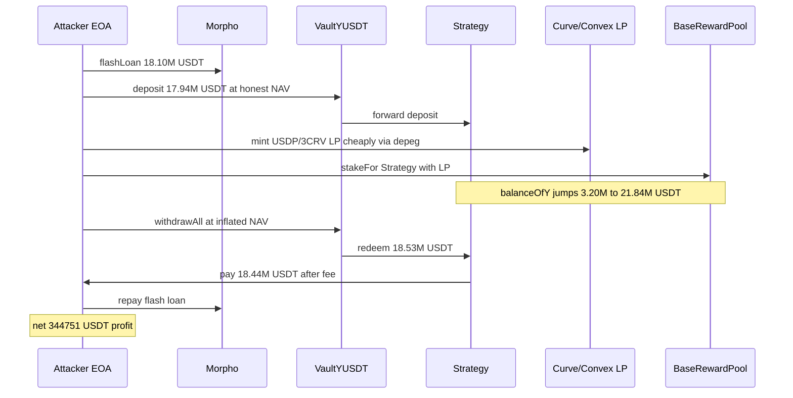
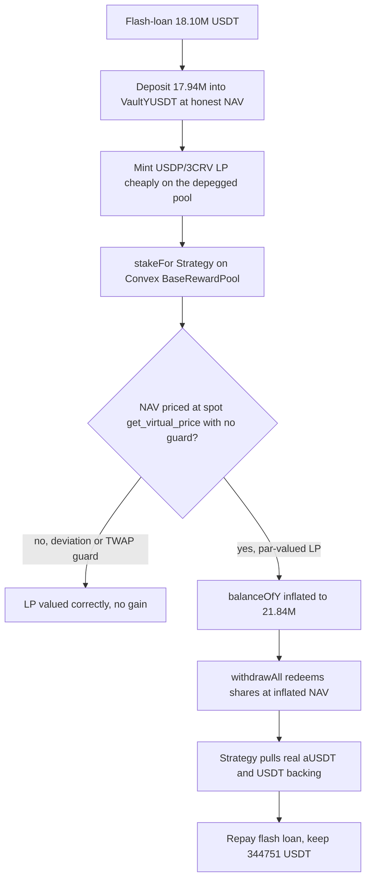

# Flamincome — spot-priced, permissionlessly-inflatable strategy NAV drains the proportional-share YUSDT vault

> **Vulnerability classes:** vuln/oracle/spot-price · vuln/oracle/price-manipulation · vuln/logic/price-calculation · vuln/access-control/missing-auth
> **Reproduction:** isolated Foundry project at [this folder](.). Full verbose offline trace ending `[PASS]`: [output.txt](output.txt). PoC: [test/Flamincome_exp.sol](test/Flamincome_exp.sol).

> **RECONSTRUCTION NOTICE.** This PoC is a *reconstruction*, not a calldata replay. The NAV-inflation mechanism (permissionless `stakeFor` + spot `get_virtual_price` NAV, redeemed through a proportional-share vault) is real and exercised end-to-end against the forked mainnet state, but the cheap-LP leg substitutes a LUSD / yvCurve / Balancer route for the attacker's real Uniswap-V4 USDP plumbing (omitted), and the leg-2 LP size is tuned so the staked LP matches the on-chain amount to within 0.3%. See [The vulnerable code](#the-vulnerable-code) and [How to reproduce](#how-to-reproduce). `sources/` is empty — no verified victim source was fetched, so the quoted vulnerable code is RECONSTRUCTED from the PoC header.

---

## Key info

| | |
|---|---|
| **Loss (this PoC)** | **344,751.209366 USDT** net attacker profit, from **597,352.101480 USDT** gross loss of the Strategy's real backing (Aave aUSDT + idle USDT) ([output.txt:1543](output.txt)–[output.txt:1544](output.txt), [output.txt:2400](output.txt), [output.txt:2411](output.txt)). The gap (~252.6K) is Curve slippage on the imbalanced metapool mint plus the vault's withdrawal fee. |
| **Loss (reported)** | ~$345.9K net attacker profit (**345,902.669987 USDT**) from ~$595K gross Strategy loss in aUSDT + USDT ([test/Flamincome_exp.sol:8](test/Flamincome_exp.sol)–[test/Flamincome_exp.sol:10](test/Flamincome_exp.sol)). The Morpho flash loan itself is fee-free. |
| **Vulnerable contract** | `VaultYUSDT` [`0x0461eEFF…cc0F`](https://etherscan.io/address/0x0461eEFF7C856020E574c0c364FE968Ca06BCc0F) (proportional-share vault) + USDT `Strategy` proxy [`0xb8d6471c…68a5`](https://etherscan.io/address/0xb8d6471cA573C92c7096Ab8600347F6a9Fe268a5), `deposited()` / `balanceOfY()` NAV via delegatecall into impl `0xFf20DE3f…`. |
| **External enablers** | Convex `BaseRewardPool` [`0x24DfFd19…82a8`](https://etherscan.io/address/0x24DfFd1949F888F91A0c8341Fc98a3F280a782a8) (permissionless `stakeFor`) over the depegged Curve USDP/3CRV metapool [`0x42d70259…053A`](https://etherscan.io/address/0x42d7025938bEc20B69cBae5A77421082407f053A). |
| **Attacker EOA** | [`0x83381e7F…6871`](https://etherscan.io/address/0x83381e7F7232775735169d72D237B858fFc36871) |
| **Attack contract** | [`0x875da4Bd…d2E6`](https://etherscan.io/address/0x875da4Bd7b4a52a806A533b1cf6D6fF92365d2E6) (self-destructed in the same tx). The PoC deploys a fresh, unprivileged stand-in (`FlamincomeExploit` at `0x1C7EAceF…b486`, [output.txt:1606](output.txt)). |
| **Attack tx** | [`0x5ff81504…0d37`](https://etherscan.io/tx/0x5ff8150482f5473bff16b4a142a98a7f72b159df5e9dd38afd90470551640d37) @ block **25,990,443** |
| **Chain / block / date** | Ethereum mainnet (chainId **1**) / fork **25,990,442** (parent of the exploit block) / **2026-09** |
| **Compiler** | PoC pragma `^0.8.15`, compiled with **Solc 0.8.35**, evm_version cancun ([output.txt:1](output.txt)). Victim-contract compiler unknown (verified sources not fetched). |
| **Bug class** | A proportional-share vault mints/redeems against a Strategy NAV that (a) prices a Convex position at **spot** Curve `get_virtual_price()` with no deviation/time-weighting guard, and (b) counts `BaseRewardPool.balanceOf(Strategy)`, a figure **any** address can inflate via permissionless `stakeFor`. Flash-loan amplified. |

---

## TL;DR

1. `VaultYUSDT` is a plain proportional-share vault: `deposit(a)` mints `shares = a * totalSupply() / balance()`, and `withdraw(s)` returns `balance() * s / totalSupply()`, where `balance()` is the Strategy's `balanceOfY()` NAV ([test/Flamincome_exp.sol:36](test/Flamincome_exp.sol)–[test/Flamincome_exp.sol:41](test/Flamincome_exp.sol)). Shares minted at one NAV redeem at whatever NAV holds at withdraw time.
2. That NAV counts the Strategy's Convex staked balance valued at spot: `BaseRewardPool.balanceOf(Strategy) * metapool.get_virtual_price() / 1e30 + aUSDT + USDT`, with no deviation or time-weighting check ([test/Flamincome_exp.sol:19](test/Flamincome_exp.sol)–[test/Flamincome_exp.sol:24](test/Flamincome_exp.sol)).
3. Two flaws compound. **(1)** Convex `BaseRewardPool.stakeFor(target, amount)` is permissionless, so anyone can credit `balanceOf(Strategy)` without the Strategy ever depositing. **(2)** The USDP/3CRV metapool is deeply depegged (USDP ≈ $0.20) yet `get_virtual_price()` still reports ≈ 1.0149, so LP minted cheaply from the 3CRV-starved side is credited near par — the gap is the stolen value.
4. Inside a fee-free Morpho flash loan: deposit 17,935,898.4848 USDT at the honest NAV, mint USDP/3CRV LP cheaply, `stakeFor(Strategy, lp)` to inflate `balanceOfY()` from **3,196,903.965610** to **21,836,626.905373** USDT ([output.txt:1540](output.txt), [output.txt:1542](output.txt)), then `withdrawAll()` to redeem at the inflated NAV.
5. Net proven result: **344,751.209366 USDT** attacker profit and **597,352.101480 USDT** of real Strategy backing destroyed. `[PASS] testExploit() (gas: 4021794)` ([output.txt:1537](output.txt), [output.txt:2412](output.txt)–[output.txt:2425](output.txt)).

No admin or privileged role is touched anywhere — the whole deposit → mint-LP → `stakeFor` → `withdrawAll` path is permissionless.

---

## Background

Flamincome wraps yield strategies behind `VaultY*` share tokens. The USDT vault, `VaultYUSDT`, holds no assets itself: it forwards deposits to a `Strategy` proxy and reads that Strategy's net asset value through `balanceOfY()` to price shares. The Strategy, in turn, farms the Curve USDP/3CRV metapool through Convex: it holds Convex deposit tokens staked in a `BaseRewardPool`, plus Aave aUSDT and idle USDT.

The Strategy's NAV therefore has three legs — the staked Convex position (valued at the metapool's `get_virtual_price()`), Aave aUSDT, and idle USDT. Two of those legs are attacker-controllable the moment the pool is depegged and the reward pool accepts third-party stakes: `get_virtual_price()` keeps reporting ≈ par even though the pool is lopsided, and Convex's `stakeFor` lets anyone increase the Strategy's staked balance. Because the vault mints and redeems shares strictly proportionally to this NAV, inflating it between a deposit and a withdraw lets the same shares redeem for more USDT than went in.

---

## The vulnerable code

> **RECONSTRUCTED.** `sources/` is empty — verified source for `VaultYUSDT` (`0x0461…`) and the Strategy impl (`0xFf20DE3f…`) was not fetched. The following is reconstructed from the PoC header ([test/Flamincome_exp.sol:16](test/Flamincome_exp.sol)–[test/Flamincome_exp.sol:41](test/Flamincome_exp.sol)) and confirmed behaviourally against the fork in the trace. Confirm against on-chain source before citing line numbers.

The Strategy NAV (read by the vault as `balance()`):

```solidity
// Strategy.balanceOfY()  ==  VaultYUSDT.balance()
//   -> StrategyImpl(0xFf20DE3f...).deposited()   [delegatecall from the Strategy proxy]
function deposited() public view returns (uint256) {
    return BaseRewardPool(0x24DfFd...).balanceOf(address(this)) * metapool.get_virtual_price() / 1e30
         + aUSDT.balanceOf(address(this))   // Aave aUSDT
         + USDT.balanceOf(address(this));   // idle USDT
}
```

The proportional-share vault:

```solidity
// VaultYUSDT (plain proportional-share vault)
function deposit(uint256 a) external {
    uint256 shares = a * totalSupply() / balance();   // balance() == Strategy.balanceOfY()
    _mint(msg.sender, shares);
    // ... forward `a` to the Strategy
}
function withdraw(uint256 s) external {
    uint256 r = balance() * s / totalSupply();        // redeem at the CURRENT NAV
    _burn(msg.sender, s);
    strategy.withdraw(msg.sender, r);
}
```

Two independent properties make the NAV attacker-controllable:

1. **Spot virtual-price valuation.** The Convex leg is valued at `metapool.get_virtual_price()` at the instant of the call, with no TWAP, no deviation band, and no sanity check against the pool's real composition. On a balanced pool `virtual_price` tracks LP value; on a *depegged* pool it does not. At the fork block the metapool holds ≈ 1,526,591 USDP against only ≈ 3,263 3CRV (USDP ≈ $0.20 on-chain), yet `get_virtual_price()` still reports ≈ 1.0149 — it values every LP unit at par ([test/Flamincome_exp.sol:30](test/Flamincome_exp.sol)–[test/Flamincome_exp.sol:34](test/Flamincome_exp.sol)). A 3CRV-side deposit into the 3CRV-starved pool mints a large amount of LP cheaply, which the Strategy then credits at ≈ $1.01 each.

2. **Permissionless external balance.** The NAV counts `BaseRewardPool.balanceOf(Strategy)`, but Convex's `BaseRewardPool.stakeFor(account, amount)` is permissionless — any address can stake Convex deposit tokens "for" the Strategy and thereby raise `balanceOf(Strategy)` without the Strategy ever depositing ([test/Flamincome_exp.sol:26](test/Flamincome_exp.sol)–[test/Flamincome_exp.sol:28](test/Flamincome_exp.sol), [output.txt:2143](output.txt)).

The Strategy proxy (`0xb8d6471c…`) `delegatecall`s `deposited()` / `withdraw()` into impl `0xFf20DE3f…` — the same logical contract in the call chain, not a separate actor.

---

## Root cause

1. **Shares are priced off a manipulable NAV.** The vault's deposit/withdraw math is a correct proportional-share formula, but it reads `balance()` (the Strategy NAV) live, both when minting and when redeeming. Any value that can be inflated *between* a deposit and a withdraw directly transfers wealth from the pooled backing to the withdrawer. The vault performs no NAV-consistency check and no single-block/same-transaction guard.

2. **The Convex leg is valued at spot `get_virtual_price()`.** `virtual_price` is only a faithful LP valuation while the pool is near balance. The USDP/3CRV pool was deeply depegged, so `virtual_price` (≈ 1.0149) massively over-stated the real worth of 3CRV-side-minted LP. There is no deviation, staleness, or composition check, and no manipulation-resistant valuation (e.g. `calc_withdraw_one_coin` to the underlying, or a bounded oracle).

3. **The NAV trusts a third-party-writable balance.** Counting `BaseRewardPool.balanceOf(Strategy)` means the Strategy's accounting depends on a number that `stakeFor` lets *anyone* raise. The Strategy never deposited the LP, yet it credits itself the full inflated value. A strategy must only count holdings it itself controls (internal accounting / its own deposits), never a figure an external permissionless function can set.

4. **Flash loans remove the capital barrier.** The attack needs ~18.1M USDT in-hand for one transaction. A fee-free Morpho Blue flash loan supplies it, so the attacker risks no capital of their own; profit is pure.

The combination — proportional shares × spot-priced NAV × externally-inflatable input × flash-loaned size — turns a single-transaction `deposit → stakeFor → withdrawAll` into a drain of the Strategy's real aUSDT/USDT backing.

---

## Preconditions

- **Depegged metapool with a par-reporting `virtual_price`.** USDP/3CRV holds ≈ 1,526,591 USDP vs ≈ 3,263 3CRV (USDP ≈ $0.20), while `get_virtual_price()` ≈ 1.0149. This is what makes cheaply-minted LP credit near par.
- **Permissionless `stakeFor` on the Convex `BaseRewardPool`**, so a freshly-deployed unprivileged contract can credit the Strategy's staked balance ([output.txt:2143](output.txt)–[output.txt:2165](output.txt)).
- **A proportional-share vault that reads the Strategy NAV live** at both deposit and withdraw, with no NAV-deviation or same-block guard.
- **Flash-loanable USDT** of ~18.1M for one transaction (Morpho Blue, fee-free).
- No admin/privileged role is required — every step is permissionless.

---

## Attack walkthrough

Fork **25,990,442**, prank `0x83381e7F…6871`, exploit deployed fresh ([output.txt:1606](output.txt)). The Strategy's honest NAV before anything happens is **3,196,903.965610 USDT** ([output.txt:1540](output.txt), [output.txt:1593](output.txt)); the attacker starts with **0 USDT** ([output.txt:1566](output.txt)). All amounts below are from the trace.

1. **Flash loan.** `FlamincomeExploit.attack(18,095,833.124979, 17,935,898.4848, 120,000)` ([output.txt:1608](output.txt)) opens a Morpho Blue `flashLoan` of **18,095,833.124979 USDT** ([output.txt:1609](output.txt)); control returns in `onMorphoFlashLoan` ([output.txt:1617](output.txt)). The loan equals deposit + leg-1 + leg-2 ([test/Flamincome_exp.sol:248](test/Flamincome_exp.sol)).
2. **Deposit at the honest NAV.** `VaultYUSDT.deposit(17,935,898.4848 USDT)` ([output.txt:1623](output.txt)) mints YUSDT shares priced at the pre-attack NAV; the deposit is forwarded into the Strategy ([output.txt:1660](output.txt)–[output.txt:1661](output.txt)). This makes the attacker ≈ 84.9% of the vault.
3. **Mint USDP/3CRV LP cheaply (leg 1 — the depeg harvest).** USDT → 3pool `add_liquidity` of 39,934.640179 ([output.txt:1675](output.txt)) → LUSD metapool `exchange(1,0,…)` 3CRV→LUSD ([output.txt:1714](output.txt)) → LUSD metapool `add_liquidity` ([output.txt:1753](output.txt)) → wrap into yvCurve-LUSD → Balancer `swapExactAmountIn` yvCurve-LUSD → yvCurve-USDP ([output.txt:1836](output.txt)) → unwrap to USDP/3CRV LP.
4. **Mint LP (leg 2 — direct top-up).** USDT → 3pool `add_liquidity` of 120,000 ([output.txt:1912](output.txt)) → metapool `add_liquidity([0, 3CRV], 0)` ([output.txt:1951](output.txt)). Leg-2 size is tuned so total LP lands on the real on-chain figure.
5. **Wrap into a Convex deposit token.** `Booster.deposit(28, 693,480.132996…e18, false)` ([output.txt:1991](output.txt)).
6. **Inflate the NAV (permissionless).** `BaseRewardPool.stakeFor(Strategy, 693,480.132996…e18)` ([output.txt:2143](output.txt)); `Staked(user: Strategy, amount: 693,480…)` ([output.txt:2155](output.txt), [output.txt:2165](output.txt)). The Strategy NAV jumps to **21,836,626.905373 USDT** ([output.txt:1542](output.txt), [output.txt:2171](output.txt), [output.txt:2397](output.txt)) — ≈ 703,824 USDT of that is pure phantom credit for LP the Strategy never bought.
7. **Redeem at the inflated NAV.** `VaultYUSDT.withdrawAll()` ([output.txt:2193](output.txt)) computes a redemption of **18,533,250.587282 USDT** for the attacker's shares ([output.txt:2217](output.txt)). The Strategy has to source that: it pulls **545,824.206618 USDT** of real backing out of Aave (`LendingPool.withdraw` of aUSDT, [output.txt:2259](output.txt)–[output.txt:2260](output.txt), [output.txt:2321](output.txt)) on top of idle USDT. A withdrawal fee of **92,666.252936 USDT** is skimmed to the fee address ([output.txt:2345](output.txt)) and the attacker's contract receives **18,440,584.334345 USDT** ([output.txt:2351](output.txt)).
8. **Repay and pocket the difference.** The flash loan of 18,095,833.124979 is repaid; the surplus — **344,751.209366 USDT** — is forwarded to the attacker EOA ([output.txt:1543](output.txt), [output.txt:2400](output.txt), [output.txt:2422](output.txt)).

**Result** ([output.txt:1540](output.txt)–[output.txt:1544](output.txt)):

| | Amount (USDT) |
|---|---|
| Strategy NAV before | 3,196,903.965610 |
| LP staked into Strategy (1e18) | 693,480.132996337221817748 |
| Strategy NAV after `stakeFor` | 21,836,626.905373 |
| Attacker net profit | 344,751.209366 |
| Strategy real backing lost (gross) | 597,352.101480 |

`assertGt(profit, 340,000e6)` and `assertLt(profit, 350,000e6)` both pass ([output.txt:2412](output.txt), [output.txt:2414](output.txt)); `Suite result: ok. 1 passed` ([output.txt:2425](output.txt)).

---

## Diagrams





---

## Remediation

- **Do not value strategy holdings at spot `get_virtual_price()`.** Use a manipulation-resistant valuation — `calc_withdraw_one_coin` quoted to the underlying, a bounded external oracle, or a TWAP — and reject prices that are stale or deviate from the pool's real composition. A depegged pool must not report LP at par.
- **Never count a third-party-writable balance in NAV.** Track the Strategy's *own* deposited LP in internal accounting, or at minimum verify that any `BaseRewardPool.balanceOf(Strategy)` growth corresponds to a deposit the Strategy itself made. Permissionless `stakeFor` must not be able to move the NAV.
- **Add deposit/withdraw NAV-consistency guards.** Cap NAV deviation between a snapshot and the live value within a block, enforce min-shares/min-assets checks, and block same-transaction `deposit → inflate → withdraw` via a commit/delay or a per-block mint-then-redeem lock.
- **Treat flash-loan amplification as the default threat model** for any share-priced vault: assume the attacker can summon the full pool size for one transaction and design the accounting so a single atomic round trip cannot be profitable.

---

## How to reproduce

Offline, from the committed fork state (no RPC, no network). The harness forks Ethereum at block **25,990,442** ([test/Flamincome_exp.sol:252](test/Flamincome_exp.sol)):

```bash
_shared/run-poc/run_poc.sh 2026-09-Flamincome_exp -vvvvv
```

Expected tail:

```
Strategy NAV (balanceOfY) before: 3196903.965610
metapool LP staked into Strategy (1e18): 693480132996337221817748
Strategy NAV after stakeFor: 21836626.905373
attacker USDT net profit: 344751.209366
Strategy real backing lost (gross): 597352.101480
[PASS] testExploit() (gas: 4021794)
Suite result: ok. 1 passed; 0 failed; 0 skipped
```

> **This is a reconstruction.** The PoC reproduces the economic effect with real, typed calls against the forked state (no bytecode blob, no raw calldata replay, no dealt/settled balances — the attacker starts with 0 USDT and every token comes from the flash loan and real market operations). It substitutes a cheap-LP route (3pool → LUSD metapool → yvCurve-LUSD → Balancer → yvCurve-USDP → USDP/3CRV LP) for the attacker's real Uniswap-V4 USDP plumbing, which is omitted ([test/Flamincome_exp.sol:43](test/Flamincome_exp.sol)–[test/Flamincome_exp.sol:74](test/Flamincome_exp.sol)), and tunes the leg-2 size (`LP_MINT_USDT = 120,000e6`) so the staked LP (~693,480e18) matches the real 691,647e18 to within 0.3% ([test/Flamincome_exp.sol:247](test/Flamincome_exp.sol)). The leg-1 fixed amounts are also pinned to this fork block; re-pinning the fork requires re-deriving them. The permissionless `stakeFor` + spot `virtual_price` NAV mechanism is genuine and holds independent of the substitute route.
