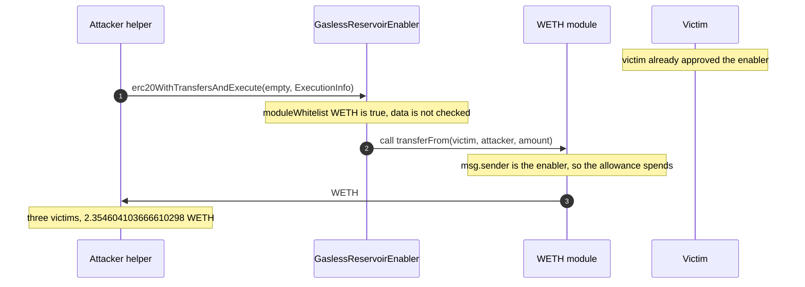

# GaslessReservoirEnabler — whitelisted WETH plus arbitrary `module.call` spends every standing approval

> **Vulnerability classes:** vuln/access-control/missing-auth · vuln/dependency/unsafe-external-call · vuln/input-validation/missing
> **Reproduction:** the PoC compiles and runs in an isolated Foundry project at [this project folder](.). Full verbose trace: [output.txt](output.txt). Enabler source is verified and fetched into [sources/GaslessReservoirEnabler_9B58fD/contracts_normal_deployment_GaslessReservoirEnabler.sol](sources/GaslessReservoirEnabler_9B58fD/contracts_normal_deployment_GaslessReservoirEnabler.sol). Not a proxy ([sources/GaslessReservoirEnabler_9B58fD/_meta.json](sources/GaslessReservoirEnabler_9B58fD/_meta.json)).

---

## Key info

| | |
|---|---|
| **Loss** | This tx: **8.7199 WETH** from 466 victims (~$23.8K at the fork-block price; the ~$23K alert). This PoC drains the 3 largest: **2.354604103666610298 WETH**, priced at **$6,439** [output.txt:363](output.txt), [output.txt:456](output.txt) |
| **Vulnerable contract** | GaslessReservoirEnabler — [`0x9B58fDAdc16E30fBA313E044bf9e88689C3F163e`](https://polygonscan.com/address/0x9B58fDAdc16E30fBA313E044bf9e88689C3F163e#code) |
| **Attacker EOA** | [`0x46f54C1A86575679FC3d29666C1717E9786279Aa`](https://polygonscan.com/address/0x46f54C1A86575679FC3d29666C1717E9786279Aa) |
| **Attack contract** | [`0x26a3d1f28de682f116744a5f026848dc0d7862eb`](https://polygonscan.com/address/0x26a3d1f28de682f116744a5f026848dc0d7862eb) (the tx `to`; pre-deployed helper, not a creation) |
| **Attack tx** | [`0x2e476745f0f546dbe4583359ea6258dfb4fababea08734f676df2e6006e1fdee`](https://polygonscan.com/tx/0x2e476745f0f546dbe4583359ea6258dfb4fababea08734f676df2e6006e1fdee) |
| **Chain / block / date** | Polygon / attack block 94,199,850 (fork parent 94,199,849) / 2026-09-21 |
| **Compiler** | `v0.8.11+commit.d7f03943` (`pragma ^0.8.9` on the contract file; optimizer 200 runs) |
| **Bug class** | `erc20WithTransfersAndExecute` has no auth. Its module whitelist contains the live WETH token, and `module.call(data)` runs attacker-supplied calldata, so `transferFrom(victim, attacker, amount)` spends approvals users granted the enabler. |

## TL;DR

GaslessReservoirEnabler is a Polygon meta-transaction helper. The intended path is EIP-712: a user signs, a relayer calls `executeMetaTransaction`, and `_msgSender()` is the signer so the contract can `transferFrom` that user. A second entrypoint, `erc20WithTransfersAndExecute(ERC20Transfer[], ExecutionInfo[])`, was added to pull tokens and then call whitelisted modules. It is `external` and `nonReentrant` only. It does not check a signature, a role, or that `data` is a known function.

`_executeInternal` requires `moduleWhitelist[module]` and `module.isContract()`, then `module.call{value}(data)`. At the fork, `moduleWhitelist(WETH)` is true [output.txt:381](output.txt). WETH (`0x7ceB23fD…f619`) is a contract. Passing `data = transferFrom(victim, attacker, amount)` makes the enabler the ERC-20 `msg.sender`. Every holder who had approved the enabler — the approval the gasless flow needs — is then spendable by any caller.

The historical transaction batches 466 such `ExecutionInfo`s and takes 8.7199 WETH. The public alert also describes a wider set of about 997 holders across WETH and ZED. This PoC does not replay that calldata. It builds three typed `ExecutionInfo`s for the three largest WETH victims, whose real balances and real allowances are still on the fork. Those pulls succeed for the exact wei amounts, summing to **2.354604103666610298 WETH** [output.txt:363](output.txt). A Uniswap V3 WETH/USDC.e slot0 at the fork prices that at $6,439 [output.txt:456](output.txt), about 27% of the WETH leg. The attacker contract holds no admin role: `hasRole(DEFAULT_ADMIN_ROLE, attacker)` returns false [output.txt:385](output.txt), [output.txt:387](output.txt).

## Background — what the enabler is for

The contract inherits `ReentrancyGuard`, an admin role, and `EIP712MetaTransaction`. `_msgSender()` is overridden to return the meta-transaction signer when the call came through the relayer, and the plain caller otherwise. `erc20WithTransfersAndExecute` uses that for the **transfer list** only: each `ERC20Transfer` is `token.safeTransferFrom(_msgSender(), address(this), amount)`. That list is empty in the attack. The drain is the second loop.

Modules are an admin-controlled set (`setModuleWhitelistStatus`, `onlyRole(DEFAULT_ADMIN_ROLE)`). The design assumes a module is protocol code the enabler is allowed to poke, and that someone else has constrained `data`. Neither assumption holds once an ERC-20 is on the list. A token's `transferFrom` is a normal external function. Whitelisting the token whitelists every function on it, with the enabler as `msg.sender`.

The three victims reconstructed here, and the amounts taken in the real tx (also the amounts the fork still holds):

| Victim | WETH |
|--------|------|
| `0x2F785EF4f514F6b785Ab93062e05CfCC937faC96` | 0.836325335838961283 |
| `0xd7026A56F38962F224753Bb59c25abc7dD687884` | 0.767721189811708090 |
| `0x5eADDc6F18c0341C1680AD669BEe6896509F6A60` | 0.750557578015940925 |
| **Sum** | **2.354604103666610298** |

No balance is `deal`ed. The test reads `balanceOf` and `allowance(victim, enabler)` and requires both to cover the amount before it calls anything.

## The vulnerable code

From [sources/GaslessReservoirEnabler_9B58fD/contracts_normal_deployment_GaslessReservoirEnabler.sol](sources/GaslessReservoirEnabler_9B58fD/contracts_normal_deployment_GaslessReservoirEnabler.sol).

### Unauthenticated batch, then an open call

```solidity
// sources/GaslessReservoirEnabler_9B58fD/contracts_normal_deployment_GaslessReservoirEnabler.sol:62-84
function erc20WithTransfersAndExecute(
    ERC20Transfer[] calldata erc20sTransfers,
    ExecutionInfo[] calldata executionInfos
) external nonReentrant {
    uint256 executionInfosLength = executionInfos.length;
    if (executionInfosLength == 0) {
        revert InvalidInput();
    }
    uint256 erc20sTransfersLength = erc20sTransfers.length;
    for (uint256 i = 0; i < erc20sTransfersLength; ) {
        ERC20Transfer memory erc20Transfer = erc20sTransfers[i];
        IERC20 token = erc20Transfer.token;
        token.safeTransferFrom(_msgSender(), address(this), erc20Transfer.amount);
        unchecked { ++i; }
    }

    for (uint256 i = 0; i < executionInfos.length; i++) {
        _executeInternal(executionInfos[i]);
    }
}
```

The only checks on the call target are "whitelisted" and "has code". `data` and `value` are not inspected:

```solidity
// sources/GaslessReservoirEnabler_9B58fD/contracts_normal_deployment_GaslessReservoirEnabler.sol:104-121
function _executeInternal(ExecutionInfo calldata executionInfo) internal {
    address module = executionInfo.module;

    if (!moduleWhitelist[module]) {
        revert NonWhitelistedModule();
    }
    if (!module.isContract()) {
        revert UnsuccessfulExecution();
    }

    (bool success, ) = module.call{ value: executionInfo.value }(executionInfo.data);
    if (!success) {
        revert UnsuccessfulExecution();
    }
}
```

`executeMetaTransaction` (in [sources/GaslessReservoirEnabler_9B58fD/contracts_base_EIP712_EIP712MetaTransaction.sol](sources/GaslessReservoirEnabler_9B58fD/contracts_base_EIP712_EIP712MetaTransaction.sol)) is the signed path. The attack never calls it. An empty `erc20sTransfers` array means `_msgSender()` is never asked to provide tokens. The WETH allowance is consumed inside `WETH.transferFrom`, where `msg.sender` is the enabler because the enabler is the contract that performed the `call`.

The PoC builds that calldata with `abi.encodeWithSelector(IERC20.transferFrom.selector, victim, attacker, amount)` ([test/GaslessReservoirEnabler_exp.sol](test/GaslessReservoirEnabler_exp.sol)). Same typed struct the verified ABI uses. Not a raw historical blob.

## Root cause — why it was possible


## Secondary analysis (@SlowMist_Team)

> missing authorization / unbound ERC20 transferFrom

Source: https://x.com/SlowMist_Team/status/2102227043979313539


1. **No authorization on the batch entrypoint.** `external nonReentrant` is not an allowlist. The trace shows the attacker holds no `DEFAULT_ADMIN_ROLE`.
2. **Whitelist checks the callee, not the calldata.** `moduleWhitelist[WETH] == true` is a configuration error that the code cannot survive. Any function on WETH, including `transferFrom` and `approve`, becomes callable as the enabler.
3. **`transferFrom`'s `from` is not bound to a signer.** The enabler never compares `from` to `_msgSender()` or to a digest. The standing approval users gave the enabler for gasless orders is a blank check once a third party can make the enabler the caller.
4. **The safe transfer loop is optional.** An empty `ERC20Transfer[]` is legal as long as `executionInfos` is non-empty. The drain does not need the attacker to hold WETH.
5. **Failure reverts the batch, success keeps the tokens.** `_executeInternal` reverts on a failed call, so the attacker only includes victims whose allowance and balance still cover `amount`. That is why 466 calls can land in one transaction: each one succeeds.

## Preconditions

- **Permissionless.** Any address calls `erc20WithTransfersAndExecute`. No signature, no relayer key, no owner.
- **WETH (or another token) is on `moduleWhitelist`.** Confirmed by a view at the fork [output.txt:381](output.txt). An ERC-20 that is not whitelisted makes `_executeInternal` revert `NonWhitelistedModule`.
- **Victims approved the enabler and still hold the token.** For these three, `balanceOf` and `allowance` are each `>=` the drained amount, asserted before the call [output.txt:389](output.txt) through [output.txt:409](output.txt). The allowances are pre-existing. The test does not `approve` on their behalf.
- **No flash loan and no capital.** The attacker WETH balance increases only by the three `transferFrom`s.

## Attack walkthrough (with on-chain numbers from the trace)

Fork parent 94,199,849. One `drain` call, three infos, empty transfer list.

| # | Action | Amount | Trace |
|---|--------|--------|-------|
| 0 | `moduleWhitelist(WETH)` | true | [output.txt:381](output.txt) |
| 1 | Victim `0x2F78…aC96` balance and allowance cover the pull | 0.836325335838961283 | [output.txt:389](output.txt), [output.txt:391](output.txt) |
| 2 | Victim `0xd702…7884` | 0.767721189811708090 | [output.txt:397](output.txt), [output.txt:399](output.txt) |
| 3 | Victim `0x5eAD…6A60` | 0.750557578015940925 | [output.txt:405](output.txt), [output.txt:407](output.txt) |
| 4 | `erc20WithTransfersAndExecute([], infos)`. Enabler `call`s WETH. First `transferFrom(0x2F78…, attacker, 0.836325335838961283)` | 0.836325335838961283 | [output.txt:415](output.txt), [output.txt:417](output.txt) |
| 5 | Second `transferFrom` | 0.767721189811708090 | [output.txt:425](output.txt) |
| 6 | Third `transferFrom` | 0.750557578015940925 | [output.txt:433](output.txt) |
| 7 | Logged sum, asserted equal to the sum of the three amounts | **2.354604103666610298** | [output.txt:363](output.txt), [output.txt:451](output.txt), [output.txt:452](output.txt) |
| 8 | `slot0` of WETH/USDC.e 0.05% pool `0x45dDa9cb…0608`. USDC per WETH from `sqrtPriceX96`, then `stolen * price / 1e18` | **$6,439** | [output.txt:456](output.txt) |

0.836325335838961283 + 0.767721189811708090 + 0.750557578015940925 = 2.354604103666610298. The assertions `usdStolen > 3000` and `usdStolen < 12_000` pass [output.txt:457](output.txt). `[PASS]` at [output.txt:355](output.txt). Suite `1 passed` at [output.txt:463](output.txt).

**Profit/loss**

| Component | Amount |
|-----------|--------|
| WETH taken from the three holders | +2.354604103666610298 |
| USD at the fork pool (integer division in the test) | ~6,439 |
| Attacker WETH posted | 0 |
| Full tx, all 466 WETH victims (not all reconstructed) | 8.7199 WETH, ~$23.8K |
| Share this PoC reproduces | 2.3546 / 8.7199 ≈ 27% of the WETH leg |
| **Net in this reproduction** | **+2.354604103666610298 WETH** |

## Diagrams



## Remediation

1. **Remove every ERC-20 from `moduleWhitelist`.** A module should be code the protocol wrote, not a token whose entire ABI becomes reachable. Do this before any other patch; the approvals already exist.
2. **Authenticate `erc20WithTransfersAndExecute`.** If it stays, it should be `onlyRole` or should require the same EIP-712 signature as `executeMetaTransaction`, binding `(module, data, value, from, nonce)`.
3. **Allowlist selectors, not just addresses.** Even a legitimate module should not accept arbitrary `data`. Reject anything other than an explicit set of function selectors, and reject `transferFrom` / `approve` outright.
4. **Bind `from` to the signer** if a token pull remains. `transferFrom(from, …)` with a caller-supplied `from` is the bug even if the callee is a trusted helper.
5. **Users revoke allowances to `0x9B58…163e`.** A code fix does not zero approvals already granted. WETH on Polygon has no permit that would expire them.

## How to reproduce

The PoC runs **fully offline** from the committed `anvil_state.json`. No RPC.

```bash
# from the registry root
_shared/run_poc.sh 2026-09-GaslessReservoirEnabler_exp -vvvvv
```

- **Chain / fork:** Polygon, fork block **94,199,849** (parent of attack block 94,199,850).
- **Expected result:**

```
drained victim: 0x2F785EF4f514F6b785Ab93062e05CfCC937faC96
  WETH taken: 0.836325335838961283
drained victim: 0xd7026A56F38962F224753Bb59c25abc7dD687884
  WETH taken: 0.767721189811708090
drained victim: 0x5eADDc6F18c0341C1680AD669BEe6896509F6A60
  WETH taken: 0.750557578015940925
total WETH drained: 2.354604103666610298
drained value (USD, approx): 6439
Suite result: ok. 1 passed; 0 failed; 0 skipped
```

The committed trace [output.txt](output.txt) is that offline `-vvvvv` run (`finished in 16.48ms`).

*Reference: [SlowMist / @clarahacks, GaslessReservoirEnabler allowance drain](https://x.com/clarahacks/status/2102355284958015532).*


## References

- https://x.com/SlowMist_Team/status/2102227043979313539 (@SlowMist_Team secondary analysis)
