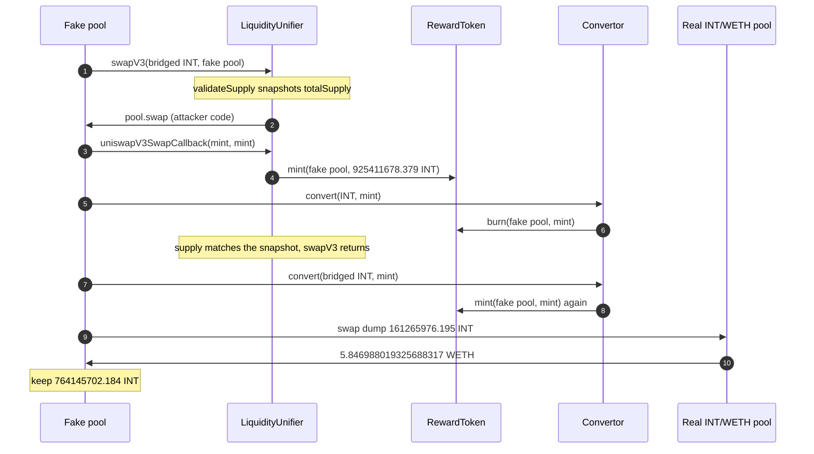

# Internet Token `swapV3` mints arbitrary INT to a fake pool — `validateSupply` is burned around

> **Vulnerability classes:** vuln/reentrancy/cross-contract · vuln/logic/missing-validation · vuln/access-control/missing-auth · vuln/logic/incorrect-state-transition
> **Reproduction:** the PoC compiles in [this project folder](.). The committed [output.txt](output.txt) is the **online** `-vvvvv` trace (`createSelectFork("base", 51593877)` at [output.txt:17](output.txt)). The offline anvil replay reverts, so do not treat a local `_shared/run_poc.sh` failure as a failed exploit. Verified source: [sources/LiquidityUnifier_837DBA/contracts_liquidity_LiquidityUnifier.sol](sources/LiquidityUnifier_837DBA/contracts_liquidity_LiquidityUnifier.sol), [sources/Convertor_6b82fD/contracts_tokens_Convertor.sol](sources/Convertor_6b82fD/contracts_tokens_Convertor.sol), [sources/RewardToken_968D6A/](sources/RewardToken_968D6A/).

---

## Key info

| | |
|---|---|
| **Loss** | Mint **925,411,678.379023085745037207 INT**, dump **161,265,976.195260022578593802 INT** for **5.846988019325688317 WETH**, keep **764,145,702.183763063166443405 INT** [output.txt:9](output.txt), [output.txt:10](output.txt). Public figure ~$265K including the retained INT |
| **Vulnerable contract** | LiquidityUnifier (holds INT `MINTER_ROLE`) — [`0x837DBAbc4f5FA78BAF177597edbDa09645822032`](https://basescan.org/address/0x837DBAbc4f5FA78BAF177597edbDa09645822032#code). Convertor [`0x6b82fDFC0344Bd76d5Cb58BC24D0FfE947975516`](https://basescan.org/address/0x6b82fDFC0344Bd76d5Cb58BC24D0FfE947975516#code) is the supply-check bypass |
| **Attacker EOA** | [`0x5F7cE6395818857aC20730dc990F614356D1Ec68`](https://basescan.org/address/0x5F7cE6395818857aC20730dc990F614356D1Ec68) |
| **Attack contract** | [`0x4acac3ecb4912147cbbf9dc927368a046e35b5b6`](https://basescan.org/address/0x4acac3ecb4912147cbbf9dc927368a046e35b5b6) (the tx is a creation; the whole attack runs in the constructor) |
| **Attack tx** | [`0xed62bb27bd1058d3d7cc93d55421d6d0001ced8cb4529b02773f5126a4edb08b`](https://basescan.org/tx/0xed62bb27bd1058d3d7cc93d55421d6d0001ced8cb4529b02773f5126a4edb08b) |
| **Chain / block / date** | Base / attack block 51,593,878 (fork parent 51,593,877 [output.txt:17](output.txt)) / 2026-09-21 07:51:43 UTC |
| **Compiler** | LiquidityUnifier `v0.8.34+commit.80d5c536`. Convertor and RewardToken `v0.8.24+commit.e11b9ed9` |
| **Bug class** | Permissionless `swapV3(token, pool)` treats any contract with the right `token0()`/`token1()` as a Uniswap V3 pool, then `uniswapV3SwapCallback` mints INT to `msg.sender` because that sender was just stored as `currentPoolV3`. |

## TL;DR

Internet Token (INT, `RewardToken` `0x968D6A…eC19`) on Base mints only from addresses that hold `TOKEN_MINTER`. LiquidityUnifier holds that role. Its `swapV3(address token, address pool)` is public. It checks that `pool` has code, is not on an exclusion list, and that `pool.token0()` / `pool.token1()` are `{rewardToken, token}` in either order. It does **not** check the Uniswap V3 factory. It sets `currentPoolV3 = pool` and calls `pool.swap(...)`.

A contract the attacker deploys passes those three checks. Its `swap` ignores the arguments and reenters `uniswapV3SwapCallback(mintAmount, mintAmount, "")`. The callback's only guard is `msg.sender == currentPoolV3`. That is the fake pool, so the unifier mints `mintAmount` INT to it [output.txt:74](output.txt). The one economic guard, `validateSupply`, snapshots `totalSupply()` and reverts if supply is higher after `swapV3`. Still inside the fake `swap`, before that check, the attacker calls `Convertor.convert(INT, mintAmount)`, which **burns** the INT and sends the bridged token (`OptimismMintableERC20` `0x1D34…ff4C`) the other way. Supply returns to the snapshot: 808,409,913.595513467171581989 before and after [output.txt:62](output.txt), [output.txt:119](output.txt). `swapV3` returns. Outside the modifier, `convert(OTHER, mintAmount)` mints the INT back [output.txt:128](output.txt). Net supply increase happens where the guard is no longer in scope.

The attacker then sells 161,265,976.195260022578593802 INT into the real INT/WETH pool `0xDEc6Ea…969d` and receives **5.846988019325688317 WETH** [output.txt:139](output.txt). Retained INT is mint minus dump: **764,145,702.183763063166443405** [output.txt:217](output.txt). Starting balances are 0 [output.txt:7](output.txt). No capital, no signature, no admin role.

## Background — what LiquidityUnifier and Convertor are for

LiquidityUnifier is a keeper job. It mints a configured `swapAmount` of INT into a real pool, swaps it for the other token, pays the caller a `keeperFee`, sends the rest to `treasury`, and burns leftover INT on the pool (`_clearPool`). `validateSupply` exists so a keeper call cannot be used to inflate INT: supply after the call must be `<=` supply before. The mint is supposed to be offset by `_clearPool`'s burn, with the other token being the proceeds.

`swapV3` was written to accept the pool as an argument so more than one pair could be serviced, with an exclusion list for the main pool (the comments in source even discuss LP exit). The argument is the hole. Validation is "looks like a pool," not "is a pool the factory created."

Convertor is a 1:1 bridge between the mintable INT and a transferrable bridged INT:

- `convert(mintable, amount)` burns INT from the caller and transfers bridged tokens out.
- `convert(transferrable, amount)` pulls bridged tokens and mints INT.

Both directions are permissionless aside from the minter/burner roles Convertor itself holds. Used inside `swapV3`, the burn hides the mint from `validateSupply`. Used after `swapV3`, the mint is a normal Convertor call and the modifier is gone.

INT supply at the fork, before the mint, is 808,409,913.595513467171581989 [output.txt:62](output.txt). The real pool's WETH side is what the dump takes: the swap event is `amount0 = -5.846988019325688317` WETH and `amount1 = +161,265,976.195260022578593802` INT [output.txt:198](output.txt).

## The vulnerable code

### Pool checks are trivial to fake

```solidity
// sources/LiquidityUnifier_837DBA/contracts_liquidity_LiquidityUnifier.sol:146-173
function swapV3(address token, address pool) external nonReentrant validateSupply {
    _validatePool(pool);
    _validatePoolV3Tokens(token, pool);

    bool zeroForOne = IUniswapV3Pool(pool).token0() == rewardToken;
    uint160 sqrtPriceLimitX96 = zeroForOne ? (TickMath.MIN_SQRT_RATIO + 1) : (TickMath.MAX_SQRT_RATIO - 1);
    uint256 balance = IERC20(token).balanceOf(address(this));

    currentPoolV3 = pool;

    IUniswapV3Pool(pool).swap({
        recipient: address(this),
        zeroForOne: zeroForOne,
        amountSpecified: swapAmount.toInt256(),
        sqrtPriceLimitX96: sqrtPriceLimitX96,
        data: ""
    });

    currentPoolV3 = address(0);
    uint256 received = IERC20(token).balanceOf(address(this)) - balance;
    _distribute(token, received);
    _clearPool(pool);
}
```

```solidity
// sources/LiquidityUnifier_837DBA/contracts_liquidity_LiquidityUnifier.sol:190-217
function _validatePool(address pool) internal view {
    if (pool == address(0)) revert("invalid pool");
    if (pool.code.length == 0) revert("invalid pool");
    if (_excludedPools.contains(pool)) revert("excluded pool");
}

function _validatePoolV3Tokens(address token, address pool) internal view {
    address token0 = IUniswapV3Pool(pool).token0();
    address token1 = IUniswapV3Pool(pool).token1();
    if (!(token0 == rewardToken && token1 == token || token0 == token && token1 == rewardToken)) {
        revert("invalid pool");
    }
}
```

No `factory.getPool`, no `pool.factory()`, no codehash. The trace shows the fake pool answering `token0() = INT` and `token1() = OTHER` [output.txt:64](output.txt), [output.txt:66](output.txt), then the unifier calling `FakePool.swap` with `amountSpecified = 1e27` (the stored `swapAmount`, which the fake pool ignores) [output.txt:71](output.txt).

### The callback mints whatever positive delta the pool reports

```solidity
// sources/LiquidityUnifier_837DBA/contracts_liquidity_LiquidityUnifier.sol:74-82
modifier validateSupply() {
    uint256 supply = IERC20(rewardToken).totalSupply();
    _;
    if (IERC20(rewardToken).totalSupply() > supply) {
        revert("supply cannot increase");
    }
}
```

```solidity
// sources/LiquidityUnifier_837DBA/contracts_liquidity_LiquidityUnifier.sol:175-188
function uniswapV3SwapCallback(int256 amount0Delta, int256 amount1Delta, bytes calldata) external {
    address _currentPoolV3 = currentPoolV3;
    if (msg.sender != _currentPoolV3) {
        revert("msg.sender != currentPoolV3");
    }
    int256 amount = amount0Delta > 0 ? amount0Delta : amount1Delta;
    RewardToken(rewardToken).mint(_currentPoolV3, amount.toUint256());
}
```

`RewardToken.mint` is `onlyRole(Role.TOKEN_MINTER)` ([sources/RewardToken_968D6A/contracts_tokens_RewardToken.sol](sources/RewardToken_968D6A/contracts_tokens_RewardToken.sol) line 119). The unifier passes that check; the attacker never calls `mint` directly. The callback passes both deltas as the full mint amount, so `amount0Delta > 0` selects it. Mint of `925411678379023085745037207` to the fake pool is the `Transfer` from `address(0)` [output.txt:77](output.txt).

### Convertor round-trip

```solidity
// sources/Convertor_6b82fD/contracts_tokens_Convertor.sol:23-37
function convert(address from, uint256 amount) external nonReentrant {
    if (from == address(transferrableToken)) {
        transferrableToken.safeTransferFrom(msg.sender, address(this), amount);
        mintableToken.mint(msg.sender, amount);
        return;
    }
    if (from == address(mintableToken)) {
        mintableToken.burn(msg.sender, amount);
        transferrableToken.safeTransfer(msg.sender, amount);
        return;
    }
    revert("invalid from token");
}
```

Inside the fake `swap`, `convert(INT, mintAmount)` burns INT [output.txt:86](output.txt) and transfers bridged tokens from the Convertor to the fake pool [output.txt:95](output.txt). After `swapV3` returns, `convert(OTHER, mintAmount)` pulls those bridged tokens back and mints INT again [output.txt:122](output.txt), [output.txt:128](output.txt). `_clearPool` then burns 0, because the fake pool's INT balance is already 0 at the end of `swapV3` [output.txt:111](output.txt), [output.txt:113](output.txt). The unifier also `transfer`s 0 of the bridged token to the fake pool and to the treasury [output.txt:105](output.txt), [output.txt:108](output.txt): the fake swap did not pay the unifier, so there is nothing to distribute. The guard sees a flat supply and returns.

## Root cause — why it was possible

1. **The pool address is caller-supplied and not authenticated.** Code size, an exclusion list, and two view functions are not a pool registry. The attacker deploys the pool in the same transaction, so it cannot have been excluded in advance.
2. **`currentPoolV3` is the callback authenticator, and the attacker sets it.** `msg.sender == currentPoolV3` is the Uniswap pattern. It is only sound if `currentPoolV3` was chosen by the protocol. Here it is the `pool` argument.
3. **The mint amount is the callback's delta, not `swapAmount`.** The real `swap` is invoked with `amountSpecified = swapAmount`, but a fake pool never has to honor that. Both deltas are `925,411,678.379023085745037207` INT [output.txt:72](output.txt).
4. **`validateSupply` is a before/after snapshot, not a ban on minting.** Any burn inside the call, including a burn through another protocol contract that is allowed to burn, resets the snapshot. The Convertor is that contract, and it will mint again the moment the modifier has exited.
5. **Cross-contract reentrancy is the delivery, not a separate bug.** `nonReentrant` on `swapV3` does not stop the pool from calling `uniswapV3SwapCallback` and `Convertor.convert`. Those are different contracts. The mint is supposed to happen in the callback; the bug is who is allowed to be the pool.

## Preconditions

- **Permissionless.** `swapV3` and `Convertor.convert` have no role check for the caller. The attacker needs no INT and no WETH. Both balances start at 0 [output.txt:7](output.txt), [output.txt:8](output.txt).
- **LiquidityUnifier holds `TOKEN_MINTER` and Convertor holds minter and burner.** The trace's `checkRole` calls from `RewardToken.mint` and `burn` succeed for those two contracts [output.txt:75](output.txt), [output.txt:87](output.txt), [output.txt:129](output.txt).
- **Convertor holds enough bridged INT to pay the burn leg.** `convert(INT, X)` does `transferrableToken.transfer(caller, X)` from the Convertor's own balance. That transfer succeeds for the full mint amount [output.txt:95](output.txt), so the Convertor was already stocked.
- **A real INT/WETH pool with WETH in it**, if the attacker wants ETH rather than only inflated INT. The dump takes 5.846988019325688317 WETH out of `0xDEc6Ea…969d`.
- **The fake pool must not be on `_excludedPools`.** A brand-new address is not.

## Attack walkthrough (with on-chain numbers from the trace)

Numbers below are the online trace. The historical tx is a contract creation from `0x5F7cE639…Ec68` to `0x4acac3ec…b5b6`. The PoC reconstructs that constructor: deploy `FakePool`, run, forward WETH and INT to the test.

| # | Action | Amount | Trace |
|---|--------|--------|-------|
| 0 | WETH and INT of the profit sink | 0 and 0 | [output.txt:7](output.txt), [output.txt:8](output.txt) |
| 1 | `swapV3(OTHER, fakePool)`. Supply snapshot | 808,409,913.595513467171581989 INT | [output.txt:61](output.txt), [output.txt:62](output.txt) |
| 2 | Fake `token0` / `token1` match `{INT, OTHER}` | — | [output.txt:64](output.txt), [output.txt:66](output.txt) |
| 3 | Fake `swap` reenters `uniswapV3SwapCallback(mint, mint)`. `RewardToken.mint(fakePool, mint)` | 925,411,678.379023085745037207 INT | [output.txt:72](output.txt), [output.txt:74](output.txt), [output.txt:77](output.txt) |
| 4 | Still inside fake `swap`: `Convertor.convert(INT, mint)` burns INT and sends bridged tokens to the fake pool | supply restored | [output.txt:85](output.txt), [output.txt:86](output.txt), [output.txt:95](output.txt) |
| 5 | Back in `swapV3`, supply check. `totalSupply()` equals the snapshot, so `validateSupply` does not revert. `_clearPool` burns 0 | 808,409,913.595513467171581989 | [output.txt:118](output.txt), [output.txt:119](output.txt) |
| 6 | Outside the modifier: `convert(OTHER, mint)` pulls bridged tokens and mints INT again | 925,411,678.379023085745037207 INT | [output.txt:121](output.txt), [output.txt:128](output.txt), [output.txt:131](output.txt) |
| 7 | Real pool `swap(fakePool, zeroForOne=false, dump, sqrtLimit)`. Pool sends WETH first | 5.846988019325688317 WETH | [output.txt:138](output.txt), [output.txt:139](output.txt) |
| 8 | Real pool's callback. Fake pool pays 161,265,976.195260022578593802 INT. `Swap` event amount0 negative WETH, amount1 the dump | 161,265,976.195260022578593802 INT in | [output.txt:147](output.txt), [output.txt:182](output.txt), [output.txt:198](output.txt) |
| 9 | Fake pool's remaining INT, forwarded to the sink | 764,145,702.183763063166443405 INT | [output.txt:217](output.txt), [output.txt:281](output.txt) |
| 10 | Logged profit | 5.846988019325688317 WETH and the retained INT | [output.txt:9](output.txt), [output.txt:10](output.txt), [output.txt:280](output.txt) |

925,411,678.379023085745037207 − 161,265,976.195260022578593802 = 764,145,702.183763063166443405. The test asserts that equality [output.txt:284](output.txt) and that WETH matches 5.846988019325688e18 within 1% relative [output.txt:282](output.txt). The trace value is exact, not approximate: `5846988019325688317` wei. `[PASS] testExploit` [output.txt:4](output.txt). Suite `1 passed` [output.txt:305](output.txt).

**Profit/loss**

| Component | Amount |
|-----------|--------|
| INT minted (second Convertor mint, the one that sticks) | +925,411,678.379023085745037207 |
| INT sold into the real pool | −161,265,976.195260022578593802 |
| INT retained | +764,145,702.183763063166443405 |
| WETH taken from the real pool | +5.846988019325688317 |
| Attacker capital | 0 |
| INT supply during `validateSupply` | unchanged at 808,409,913.595513467171581989 |
| **Net** | **5.846988019325688317 WETH + 764,145,702.183763063166443405 INT** |

## Diagrams



## Remediation

1. **Only swap pools the factory deployed.** `require(IUniswapV3Factory(factory).getPool(rewardToken, token, fee) == pool)`. A view-function impersonator then fails. Hardcoding the pool is the smaller fix if there is only one intended pair.
2. **Do not mint the callback delta.** Mint `swapAmount` (or the positive delta capped to `swapAmount`) to the known pool address, and only if `pool` passed the factory check. Ignore a delta larger than the swap the unifier requested.
3. **Measure what you care about, not a net supply delta.** `validateSupply` should revert if `RewardToken.mint` was called with an amount other than `swapAmount`, or if the minter's counterparty was not the stored real pool. A burn-and-remint around a snapshot will always pass a net check.
4. **Do not hold a public minter that any callback can trigger.** If keepers must mint, gate `swapV3` with a keeper role and drop `currentPoolV3` as an authenticator. The callback can check `msg.sender == knownPool` for a pool set by the admin, not by the caller of this transaction.
5. **Pause Convertor while a mint callback is open, or forbid Convertor calls in the same frame as `swapV3`.** The round trip is the bypass. Burning INT inside the guarded call is what makes the snapshot lie.

## How to reproduce

The committed [output.txt](output.txt) is an **online** fork trace, not the offline anvil replay. Line 17 is `VM::createSelectFork("base", 51593877)`. The registry test file has since been pointed at `http://127.0.0.1:8548`, and that offline replay **reverts**. The exploit itself is what the online trace records: `[PASS]`, the WETH line, and the INT line below. Re-running `_shared/run_poc.sh` against `anvil_state.json` is not expected to pass.

```bash
# from the registry root — offline replay reverts; output.txt is the online trace
_shared/run_poc.sh 2026-09-InternetToken_exp -vvvvv
```

- **Chain / fork:** Base, block **51,593,877** (parent of attack block 51,593,878). Online alias `base` in the trace.
- **Online `[PASS]` tail** (this is the trace to cite):

```
WETH Balance: 0.000000000000000000
INT Balance: 0.000000000000000000
WETH profit realized: 5.846988019325688317
INT retained by attacker: 764145702.183763063166443405
WETH Balance: 5.846988019325688317
INT Balance: 764145702.183763063166443405
Suite result: ok. 1 passed; 0 failed; 0 skipped
```

*Reference: [exvulsec alert, cited by @clarahacks](https://x.com/exvulsec/status/2101971282053263496).*


## References

- https://x.com/DefimonAlerts/status/2101969009461567690 (@DefimonAlerts secondary analysis)
