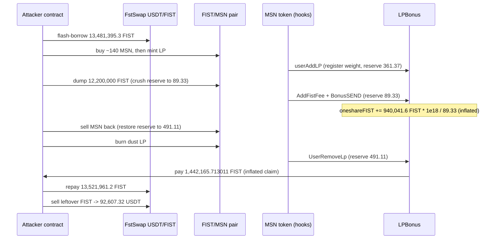
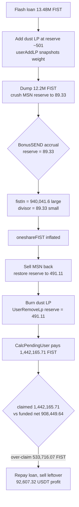

# LPBonus (MSN LP-reward pool) — reserve-inconsistency between reward accrual and withdrawal lets a flash-manipulated reserve inflate an LP's FIST claim

> **Vulnerability classes:** vuln/logic/reward-calculation · vuln/oracle/price-manipulation · vuln/defi/fee-manipulation · vuln/defi/flash-loan
> **Reproduction:** isolated Foundry project at [this folder](.). Full passing trace: [output.txt](output.txt). LPBonus and MSN are unverified (reversed from bytecode); `sources/` is empty, so the code below is **RECONSTRUCTED-FROM-BYTECODE** and corroborated by the execution trace, not by verified source.

---

## Key info

| | |
|---|---|
| **Loss (this PoC)** | Final attacker USDT balance **92,633.859396071632955691** (≈ **$92.6k**). The exploit's net new USDT, realized by selling the leftover stolen FIST, is **92,607.317234** ([output.txt:3846](output.txt)) — matching the reported figure to the wei; the remaining 26.542161 was the test contract's pre-existing balance ([output.txt:1539](output.txt)). |
| **Loss (reported)** | ~**92,607.317234 USDT** (~$92.6k) to the attacker. This headline figure is report-sourced; the PoC proves the ~$92.6k drain by reconstructing the on-chain sequence against the real contracts. |
| **Vulnerable contract** | `LPBonus` [`0x52272524…bb054b`](https://bscscan.com/address/0x52272524A22f941f5489c1233732797314BB054b) — **unverified, reversed from bytecode** |
| **MSN token** | [`0xd8b3ef86…97c1`](https://bscscan.com/address/0xD8B3EF86AFCE18EdbA91fED481ABE22F173597C1) — 18 dec, 2% transfer fee, fires the LPBonus reward hooks from its own `transfer`/`transferFrom` |
| **FIST token (reward)** | [`0xc9882dEF…0Bc6A`](https://bscscan.com/address/0xC9882dEF23bc42D53895b8361D0b1EDC7570Bc6A) — 6 dec |
| **USDT** | [`0x55d39832…7955`](https://bscscan.com/address/0x55d398326f99059fF775485246999027B3197955) |
| **FIST/MSN pair** | [`0xdD95c8a5…e6e5`](https://bscscan.com/address/0xDD95c8a545E98D2C6De4D20aBCC44b104da1E6E5) — Cake-LP, `token0 = FIST`, `token1 = MSN`; the LP position LPBonus tracks and the reserve source it reads |
| **FstSwap USDT/FIST pair** | [`0xB4Ec801a…D8C9`](https://bscscan.com/address/0xb4Ec801aED8C92F2E69589518AAa127afb37d8C9) — `token0 = USDT`, `token1 = FIST`; flash-swap capital source |
| **PCS Router** | [`0x10ED43C7…024E`](https://bscscan.com/address/0x10ED43C718714eb63d5aA57B78B54704E256024E) |
| **Attacker EOA** | [`0xb6fff29D…6f7A`](https://bscscan.com/address/0xb6fff29DD2B5423a159E50877Fc4af7A54E76f7A) |
| **Attack contract** | [`0xa8607269…43c7`](https://bscscan.com/address/0xa8607269686b6c15FC2EB84f4044F9aDE2b143c7) |
| **Attack tx / block** | [`0xecac1563bbb76fb8fefb4a7da4592260a8c1ddde21d7da62b78a9e3769808e6b`](https://bscscan.com/tx/0xecac1563bbb76fb8fefb4a7da4592260a8c1ddde21d7da62b78a9e3769808e6b) @ block **124,759,921** |
| **Chain / block / date** | BSC (chainId **56**) / fork **124,759,920** (parent of the attack block, pre-manipulation) / 2026-09 |
| **Compiler** | Test harness solc **^0.8.10**, `evm_version = cancun`. Target contracts unverified (no source). |
| **Bug class** | Reward index is accrued against one AMM reserve read and paid against a different one, both from a freely-manipulable `pair.getReserves()`. A flash-loan crush of the MSN reserve inflates the per-share index; a dust withdrawal collects the inflated claim. |

---

## TL;DR

1. `LPBonus` is an LP-reward pool for the MSN token. Its reward callbacks are all gated `require(msg.sender == MSN)` — they are hooks the MSN token fires from inside its own `transfer`/`transferFrom`. So every reward state change is reachable **permissionlessly** through ordinary MSN swaps / add- / remove-liquidity. No admin, owner, or signer is in the attacker's path.
2. Accrual (`BonusSEND`) swaps LPBonus's accumulated MSN fees to FIST and bumps a per-share index with `oneshareFIST += fistIn * 1e18 / reserveMSN`, where `reserveMSN` is read from `pair.getReserves()` **at accrual time**. Withdrawal (`UserRemoveLp` → `CalcPendingUser`) pays `user_weight * index` using the reserve read **at withdrawal time**. Both reads come from the same manipulable pair; neither is a TWAP or a consistent snapshot.
3. In one atomic tx the attacker flash-borrows **13,481,395.302739 FIST** ([output.txt:1564](output.txt)), registers a position while the MSN reserve is ~361–501, **crushes** the MSN reserve to **89.327789** ([output.txt:2511](output.txt)) so `BonusSEND` funds a huge FIST amount and divides the index by a tiny reserve, **restores** the reserve to **491.113095** ([output.txt:2864](output.txt)), then burns a **dust LP amount** to trigger `UserRemoveLp`, which pays the full inflated claim **1,442,165.713011 FIST** ([output.txt:2922](output.txt)).
4. That single dust position claims **1,442,165.713011 FIST** against an accrual that funded only **908,449.642947 FIST net** — a **533,716.070067 FIST** over-claim ([output.txt:3861](output.txt)–[output.txt:3863](output.txt)). The excess is paid out of FIST that belonged to the reward pool / other LPs.
5. Flash loan repaid ([output.txt:3814](output.txt)), leftover FIST sold for **92,607.317234 USDT** ([output.txt:3846](output.txt)). `[PASS] testExploit()` ([output.txt:1537](output.txt), [output.txt:3884](output.txt)).

The crush is a flash-loanable spot manipulation; there is no cross-block exposure and no capital at risk once the tx reverts-or-profits atomically.

---

## Background

MSN is a fee-on-transfer token (2% fee) on BSC whose liquidity lives in the PancakeSwap-style Cake-LP pair FIST/MSN (`0xdD95c8a5…e6e5`, `token0 = FIST`, `token1 = MSN`). FIST is the reward token (6 decimals). The `LPBonus` contract (`0x52272524…bb054b`) is a side accounting contract that distributes FIST rewards to holders of that LP position.

Crucially, `LPBonus` has no public user entry points of its own in the attack path. Its three relevant functions — `BonusSEND`, `userAddLP`, `UserRemoveLp` — are callbacks the MSN token invokes from inside its transfer hooks (each gated `require(msg.sender == MSN)`). Any MSN movement on the pair (a buy, a sell, a mint, a burn) causes MSN's hook to call back into `LPBonus`. The reserve that LPBonus uses to price rewards is whatever `pair.getReserves()` returns at the instant the hook fires — and `getReserves()` is read 24 times across the trace, always live, never snapshotted (`grep -c "getReserves() [staticcall]"` = 24).

Because MSN's own hooks perform the accrual and payout, the attacker never needs a privileged role: they drive the entire reward lifecycle by operating on the public AMM pair, funded by a flash loan from an unrelated FstSwap USDT/FIST pool.

LPBonus and MSN are **unverified** contracts; the mechanism below is reconstructed from the on-chain bytecode behaviour visible in the trace (the `BonusSEND` / `userAddLP` / `UserRemoveLp` / `AddFistFee` calls and their exact reserve arguments), not from verified source.

---

## The vulnerable code

*RECONSTRUCTED-FROM-BYTECODE — LPBonus and MSN are unverified. The following reflects the behaviour proven by the trace; names come from the dispatched selectors.*

**Accrual — `BonusSEND(reserveMSN, isRemove)`** (fires on every MSN movement, from the MSN transfer hook):

```solidity
// RECONSTRUCTED. reserveMSN = pair.getReserves().reserve1 at the moment the hook fires.
function BonusSEND(uint256 reserveMSN, bool isRemove) external {
    require(msg.sender == MSN);               // permissionless via MSN's own transfer hook
    uint256 fee = accumulatedMSNFee;          // MSN fees LPBonus has collected
    uint256 fistIn = _swapMSNforFIST(fee);    // sells `fee` MSN -> FIST on the SAME pair (AddFistFee)
    // per-share reward index, 1e18-scaled, divided by the LIVE reserve:
    oneshareFIST += fistIn * 1e18 / reserveMSN;   // <-- both fistIn and the divisor are reserve-dependent
    // ... redistributes a slice to other LP holders in the same call ...
}
```

Two things make this explosive when `reserveMSN` is small:
- `fistIn` is the proceeds of selling `fee` MSN **into a pool where MSN is scarce** (reserve crushed), so MSN is priced high and `fistIn` is large. In the trace the fee swap `AddFistFee(6.057 MSN, reserve 89.327789)` returns **940,041.612768 FIST** ([output.txt:2528](output.txt), [output.txt:2553](output.txt)).
- The divisor `reserveMSN` is the same crushed value (**89.327789**), so the per-share index is bumped as if the entire stake were priced against ~89 MSN ([output.txt:2578](output.txt): `BonusSEND(89327788899759978606, true)`).

**Registration — `userAddLP(user, amount, reserveMSN)`** snapshots the user's weight and the current index (`takedFIST`) at the reserve prevailing when liquidity is added — **361.373021** at the `userAddLP` call ([output.txt:1888](output.txt)), ~501 once the mint re-adds the 140 MSN ([output.txt:2219](output.txt)). Either way it is far above the ~89 accrual reserve the attacker is about to create.

**Withdrawal — `UserRemoveLp(user, amount, reserveMSN_now)` → `CalcPendingUser`** pays:

```solidity
// RECONSTRUCTED. reserveMSN_now = pair.getReserves().reserve1 at WITHDRAWAL time (491.113095).
function UserRemoveLp(address user, uint256 amount, uint256 reserveMSN_now) external {
    require(msg.sender == MSN);
    uint256 pending = CalcPendingUser(user, amount);  // = weight * (oneshareFIST - takedFIST[user]) / 1e18
    FIST.transfer(user, pending);                     // pays the INFLATED index, restored-reserve path
    // ...
}
```

The index `oneshareFIST` was inflated under the **89.327789** reserve, but it is consumed by a withdrawal that executes under the **491.113095** reserve ([output.txt:2913](output.txt)). The two reserve reads are inconsistent, and both are instantaneous `pair.getReserves()` values — there is no stored snapshot tying the payout to the reserve under which rewards were actually funded, and no manipulation-resistant oracle. `CalcPendingUser` pays **1,442,165.713011 FIST** to the dust position ([output.txt:2922](output.txt)).

---

## Root cause

1. **The reward index is priced on an instantaneous, manipulable AMM reserve.** `oneshareFIST += fistIn * 1e18 / reserveMSN` reads `reserveMSN` from `pair.getReserves()` with no TWAP and no bound. A single swap moves it from **504.230164** ([output.txt:1562](output.txt)) to **89.327789** ([output.txt:2511](output.txt)) and back to **491.113095** ([output.txt:2864](output.txt)).
2. **Accrual and withdrawal use different reserve reads.** The index is bumped under the crushed reserve (89.3) during `BonusSEND`, then paid out under the restored reserve (491.1) during `UserRemoveLp`. Nothing requires the two to be consistent; the attacker chooses one reserve for accrual and another for payout within the same transaction.
3. **Double amplification at the crush.** With MSN scarce, selling the accumulated MSN fee returns an outsized FIST amount (large numerator) *and* the index divides by the small reserve (small denominator). Both push `oneshareFIST` up together.
4. **No cap tying a claim to actually-funded rewards.** The dust position claims **1,442,165.713011 FIST** while the accrual it triggered funded only **908,449.642947 FIST net** / **940,041.612768 gross**; the pool pays the ~**533,716 FIST** gap out of pre-existing reward balance ([output.txt:3861](output.txt)–[output.txt:3863](output.txt)).
5. **Fully permissionless.** Every callback is gated `require(msg.sender == MSN)` and fired from MSN's transfer hooks, so the whole sequence is reachable by anyone operating the public pair — no admin, keeper, or signer step gates it.

The purchased position is dust and is held for microseconds inside one atomic tx; this is a flash-loan spot-manipulation, not a governance or multi-block attack.

---

## Preconditions

- A reward index priced on a live AMM reserve that an attacker can move with a swap (here `pair.getReserves().reserve1`, the MSN side of FIST/MSN). Met: 24 live `getReserves()` reads, no TWAP.
- Reward accrual and withdrawal both callable within one transaction, with no same-block / reentrancy guard linking the reserve under which rewards accrue to the reserve under which they are paid. Met: MSN's transfer hooks fire `BonusSEND` and `UserRemoveLp` on demand.
- A flash-loan source for the FIST needed to crush the reserve. Met: FstSwap USDT/FIST pair lends **13,481,395.302739 FIST** via `fstswapCall` ([output.txt:1564](output.txt), [output.txt:1571](output.txt)).
- Accumulated MSN fees inside LPBonus so that `BonusSEND`'s fee swap produces a large `fistIn` at the crushed reserve. Met: `AddFistFee(6.057 MSN, 89.327789)` → 940,041.612768 FIST ([output.txt:2528](output.txt), [output.txt:2553](output.txt)).
- A pre-existing FIST reward balance in LPBonus large enough to pay the over-claim. Met: the 1,442,165.71 FIST claim settles in full ([output.txt:2922](output.txt)).

---

## Attack walkthrough

Fork **124,759,920** (parent of the attack block), test contract `0x7FA9…1496`. Trace: [output.txt](output.txt). Start state: attacker USDT **26.542161622221038197** ([output.txt:1539](output.txt)), FIST/MSN reserves `(1,361,845.456121 FIST, 504.230164 MSN)` ([output.txt:1562](output.txt)).

1. **Flash-borrow FIST.** `FSTSWAP.swap(0, 13481395302739, …, 0x01)` lends **13,481,395.302739 FIST** and calls back into `fstswapCall` ([output.txt:1564](output.txt), [output.txt:1571](output.txt)).
2. **Buy ~140 MSN.** Send **539,710.857353 FIST** to the pair ([output.txt:1572](output.txt)); the pair returns **142.857 MSN** gross, and MSN's 2% transfer fee delivers **140.000000000115325628 MSN** net to the attacker ([output.txt:1592](output.txt)). The MSN movement fires `BonusSEND(504.230164, true)` — an ordinary accrual at the normal reserve ([output.txt:1593](output.txt)).
3. **Add liquidity → register the position.** Transfer **140 MSN** ([output.txt:1881](output.txt)) plus **736,684.445385 FIST** to the pair and `mint` ([output.txt:2188](output.txt)). MSN's hook fires `userAddLP(attacker, 140e18, 361.373021…)` ([output.txt:1888](output.txt)), snapshotting the attacker's weight / `takedFIST` while the reserve is ~501 (`BonusSEND(501.373021, true)`, [output.txt:2219](output.txt)).
4. **Crush the MSN reserve.** Dump **12,200,000 FIST** into the pair ([output.txt:2513](output.txt): `amount0In 12200000000000`), driving the MSN reserve down to **89.327788899759978606** ([output.txt:2511](output.txt)–[output.txt:2512](output.txt)).
5. **Accrue at the crushed reserve.** The same swap's MSN movement fires the fee machinery: `AddFistFee(6.057064918535115840 MSN, 89.327789)` ([output.txt:2528](output.txt)) sells the accumulated MSN fee for **940,041.612768 FIST** ([output.txt:2553](output.txt)), then `BonusSEND(89.327788899759978606, true)` bumps `oneshareFIST` against the tiny reserve ([output.txt:2578](output.txt)). This is the index inflation.
6. **Restore the reserve.** Sell the held MSN back into the pair, raising the MSN reserve to **491.113095162589329323** ([output.txt:2864](output.txt), [output.txt:2876](output.txt)).
7. **Dust withdrawal collects the inflated claim.** Burn a **dust 40,372 LP** ([output.txt:2899](output.txt)); the tiny **558,183,177 wei MSN** leaving the pair to the attacker ([output.txt:2906](output.txt)) fires `UserRemoveLp(attacker, 558183177, 491.113095)` ([output.txt:2913](output.txt)), whose `CalcPendingUser` transfers **1,442,165.713011 FIST** to the attacker ([output.txt:2922](output.txt)). The remaining position is burned ([output.txt:3220](output.txt)), paying a second small `UserRemoveLp` ([output.txt:3252](output.txt)).
8. **Repay and cash out.** Repay the flash loan: transfer **13,521,961.186298 FIST** (principal + 0.3% fee) back to FstSwap ([output.txt:3814](output.txt), [output.txt:3829](output.txt)). Sell the leftover **391,849.853206 FIST** for **92,607.317234 USDT** ([output.txt:3845](output.txt)–[output.txt:3846](output.txt)).
9. **Result.** `claimedReward` **1,442,165.713014 FIST** vs `fundedReward` (net) **908,449.642947 FIST** → over-claim **533,716.070067 FIST** ([output.txt:3861](output.txt)–[output.txt:3863](output.txt)); final USDT **92,633.859396** ([output.txt:3866](output.txt)). Assertions: profit ≈ 92,607.317234 ([output.txt:3869](output.txt)), claimed ≈ 1,442,165.713011 ([output.txt:3871](output.txt)), claimed > funded ([output.txt:3873](output.txt)) all pass — `1 passed; 0 failed` ([output.txt:3884](output.txt)).

| | FIST (6 dec) |
|---|---|
| Claimed by the dust position (`UserRemoveLp`) | 1,442,165.713014 |
| Funded by the accrual (net, retained in LPBonus) | 908,449.642947 |
| Funded by the accrual (gross `BonusSEND` swap output) | 940,041.612768 |
| Over-claim (claimed − funded net) | 533,716.070067 |
| Realized profit, converted to USDT | 92,607.317234 USDT (~$92.6k) |

---

## Diagrams





---

## Remediation

- **Do not price the reward index on an instantaneous AMM reserve.** Replace `pair.getReserves()` with a manipulation-resistant source — a TWAP, or an off-chain/oracle price — for both the fee-swap valuation and the per-share division.
- **Use one consistent reserve snapshot across a reward lifecycle.** If a reserve must be used, the reserve under which rewards *accrue* must be the same reserve used when they are *paid*; store it with the accrual rather than re-reading `getReserves()` at withdrawal.
- **Add same-block / reentrancy protection** so reward accrual and withdrawal cannot be composed within a single manipulated-reserve window. Rewards earned in block N should not be claimable until a later block.
- **Cap per-position claims to actually-funded rewards.** A claim should never exceed the FIST the position's accrual genuinely contributed; `CalcPendingUser` paying out of pre-existing pool balance beyond funded accrual is the drain.
- **Treat token-hook callbacks as untrusted entry points.** `require(msg.sender == MSN)` does not make `BonusSEND` / `UserRemoveLp` safe when MSN fires them on every permissionless transfer; guard the economic invariants, not just the caller.

---

## How to reproduce

Offline, from the committed `anvil_state.json` (no live RPC). The harness forks BSC at block **124,759,920**:

```bash
_shared/run-poc/run_poc.sh 2026-09-LPBonus_exp -vvvvv
```

Expected tail:

```
[PASS] testExploit() (gas: 5049376)
  FIST claimed by UserRemoveLp : 1442165.713014
  FIST funded into LPBonus (net): 908449.642947
  over-claim (claimed - funded): 533716.070067
  realized USDT profit         : 92633.859396071632955691
Suite result: ok. 1 passed; 0 failed; 0 skipped
```
