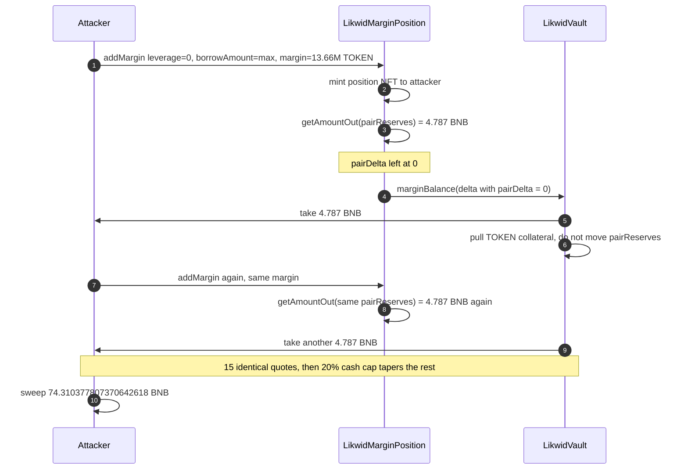
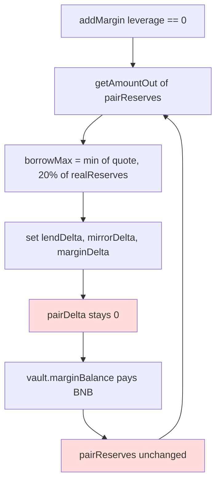

# Likwid `leverage == 0` borrow — frozen pair reserves re-quote the same BNB on every collateral add
> **Vulnerability classes:** vuln/logic/missing-state-update · vuln/defi/price-manipulation · vuln/logic/incorrect-accounting
> **Reproduction:** the PoC compiles and runs offline in an isolated Foundry project at [this project folder](.). Full verbose trace: [output.txt](output.txt). Verified `LikwidMarginPosition` source is in [sources/LikwidMarginPosition_6bec0c](sources/LikwidMarginPosition_6bec0c).
---
## Key info
| | |
|---|---|
| **Loss** | **74.310377807370642618 BNB** taken from LikwidVault in this transaction (reported ~74.31 BNB). Attacker BNB before the call is 0 [output.txt:369] |
| **Vulnerable contract** | LikwidMarginPosition — [`0x6bec0c1dc4898484b7f094566ddf8bc82ed7abe8`](https://bscscan.com/address/0x6bec0c1dc4898484b7f094566ddf8bc82ed7abe8#code) |
| **Victim (BNB custody)** | LikwidVault — [`0x065d449ec9D139740343990B7E1CF05fA830e4Ba`](https://bscscan.com/address/0x065d449ec9D139740343990B7E1CF05fA830e4Ba) |
| **Attacker EOA** | [`0x90bde1e0Bb16B3DEEb9d638aCf8D01F19fD2F31e`](https://bscscan.com/address/0x90bde1e0Bb16B3DEEb9d638aCf8D01F19fD2F31e) |
| **Attack contract** | [`0xC63FB27F52ed8d06673c60c3075B2D3bD26Cf4AA`](https://bscscan.com/address/0xC63FB27F52ed8d06673c60c3075B2D3bD26Cf4AA) (pre-held 218,584,952.803871107870716658 TOKEN) |
| **Attack tx** | [`0x83cbd07d59aedc2f114c351c568d3386ff5bc7caa87d12bc6494e2dc7bf16f4d`](https://bscscan.com/tx/0x83cbd07d59aedc2f114c351c568d3386ff5bc7caa87d12bc6494e2dc7bf16f4d) |
| **Chain / block / date** | BSC (chain id 56) / exploit block 122,525,331, fork parent 122,525,330 / 18 September 2026 |
| **Compiler** | Solidity `v0.8.28+commit.7893614a`, optimizer on, 200 runs (verified source) |
| **Bug class** | `_executeAddCollateralAndBorrow` (the `leverage == 0` path) sizes the borrow with `SwapMath.getAmountOut(pairReserves, ...)` and never writes `delta.pairDelta`, so the AMM reserves that feed the next quote do not move. Splitting one collateral pile into many positions repeats the first-trade marginal price. |

## TL;DR
Likwid margin positions can be opened in two modes. `leverage > 0` is a real leveraged swap: it writes `delta.pairDelta`, and the vault's `marginBalance` moves the pool. `leverage == 0` is "post TOKEN collateral, borrow BNB." That path still asks `getAmountOut` for a quote against `poolState.pairReserves`, then fills `lendDelta`, `mirrorDelta`, and `marginDelta` and **leaves `pairDelta` at its zero default**. The quote source never sees the trade.

`addMargin` is permissionless. It mints a fresh position NFT to the caller and `_requireAuth` only checks that the caller owns that NFT, so there is no admin or signer. The attacker repeats `addMargin` 24 times with `marginForOne = true`, `leverage = 0`, and `borrowAmount = type(uint256).max` ("borrow the max the quote allows"). The first 15 calls each pull the identical **4.787036565697387419 BNB** out of the vault [output.txt:457] against **13,661,559.550241944241919791 TOKEN** of collateral. Later calls shrink only because `borrowMaxAmount` is also capped at 20% of the shrinking *real* BNB reserve, not because the marginal price moved. The last call borrows just **0.000019556097259383 BNB** [output.txt:2136].

Net of this transaction, from a starting attacker balance of 0: **74.310377807370642618 BNB** lands on the test contract [output.txt:370], paid for with pre-held TOKEN and no BNB. `[PASS] testExploit()` gas 6,230,423 [output.txt:367].

Likwid's own ledger of the wider incident (capital the attacker had already put into the pool, plus a later token sale) books a smaller *net* for the attacker (+2.19 BNB) and a smaller drop in what they call real pool liquidity. That does not change what this call does: the vault pays the frozen quote, 24 times, and 74.31 BNB leaves.

## Background — what Likwid margin does
`LikwidMarginPosition` is the position manager for a custom BNB/TOKEN pool held by `LikwidVault`. The pool key in the attack is `currency0 = address(0)` (native BNB), `currency1 = TOKEN` (`0x0f12d5048a6bed7ECc572fa7805D03Af7B5FB9d2`, an ERC-1967 proxy), `fee = 3000`, `marginFee = 2500`.

A user calls `addMargin`. The contract mints an ERC-721 to `params.recipient`, stores `marginForOne`, and enters `_margin`:

- If `leverage > 0`, `_executeAddLeverage` treats the position as a swap through the pool and sets `delta.pairDelta` so the vault updates pair reserves.
- If `leverage == 0`, `_executeAddCollateralAndBorrow` treats it as a collateralised borrow. The borrow ceiling is a constant-product `getAmountOut` on the **current pair reserves**, then haircut by `minBorrowLevel`, then capped at 20% of `realReserves` of the borrowed currency.

Settlement is `vault.unlock` → `unlockCallback` → `vault.marginBalance(key, delta)`. The vault `take`s the borrowed BNB to the position owner and `transferFrom`s the TOKEN collateral in. Whatever `pairDelta` is on that struct is what the vault is given to apply to the AMM. A zero `pairDelta` means the pricing reserves stay put.

TOKEN here is only the collateral the attacker already held. The pricing bug is entirely in the position manager.

## The vulnerable code
Verified source: [sources/LikwidMarginPosition_6bec0c/src_LikwidMarginPosition.sol](sources/LikwidMarginPosition_6bec0c/src_LikwidMarginPosition.sol).

### The leverage path does update the pair
```solidity
if (position.marginForOne) {
    delta.marginDelta = toBalanceDelta(0, amount);
    delta.pairDelta = toBalanceDelta(-borrowAmount.toInt128(), marginWithoutFee.toInt128());
    delta.lendDelta = toBalanceDelta(0, lendAmount);
    delta.mirrorDelta = toBalanceDelta(-borrowAmount.toInt128(), 0);
} else {
    delta.marginDelta = toBalanceDelta(amount, 0);
    delta.pairDelta = toBalanceDelta(marginWithoutFee.toInt128(), -borrowAmount.toInt128());
    // ...
}
```
(`_executeAddLeverage`, lines 221–228.)

### The `leverage == 0` path never assigns `pairDelta`
```solidity
(uint256 borrowMaxAmount,) = SwapMath.getAmountOut(
    poolState.pairReserves, poolState.lpFee, !position.marginForOne, params.marginAmount
);
// ... haircut by minBorrowLevel, then:
borrowMaxAmount = Math.min(borrowMaxAmount, borrowRealReserves * 20 / 100);
if (params.borrowAmount == type(uint256).max) params.borrowAmount = borrowMaxAmount.toUint128();

if (position.marginForOne) {
    amount1Delta = amount;                  // TOKEN collateral in
    amount0Delta = borrowAmount.toInt128(); // BNB debt out
    delta.lendDelta = toBalanceDelta(0, amount);
    delta.mirrorDelta = toBalanceDelta(-borrowAmount.toInt128(), 0);
} else {
    // symmetric, still no pairDelta write
}
delta.marginDelta = toBalanceDelta(amount0Delta, amount1Delta);
```
(`_executeAddCollateralAndBorrow`, lines 241–289.) `MarginBalanceDelta.pairDelta` is a struct field ([src_types_MarginBalanceDelta.sol](sources/LikwidMarginPosition_6bec0c/src_types_MarginBalanceDelta.sol) line 15) and stays the zero `BalanceDelta`. `_handleMargin` forwards that struct unchanged:

```solidity
(BalanceDelta delta) = vault.marginBalance(key, params);
```
(line 635.)

### Auth does not gate the function
```solidity
function addMargin(PoolKey memory key, IMarginPositionManager.CreateParams calldata params)
    external
    payable
    ensure(params.deadline)
    returns (uint256 tokenId, uint256 borrowAmount, uint256 swapFeeAmount)
{
    tokenId = _mintPosition(key, params.recipient);
    // ...
}
```
`_margin` then calls `_requireAuth(tokenOwner, params.tokenId)`, and `_requireAuth` only checks `spender == ownerOf(tokenId)` ([src_base_BasePositionManager.sol](sources/LikwidMarginPosition_6bec0c/src_base_BasePositionManager.sol) lines 55–58). The NFT was minted to `params.recipient` in the same call, so any EOA that sets `recipient` to itself passes.

## Root cause — why it was possible
1. **The pricing input and the state write are different fields.** `getAmountOut` reads `pairReserves`. Only `pairDelta` is the delta the vault applies back onto those reserves. The borrow branch fills every other delta and skips `pairDelta`.
2. **`borrowAmount = type(uint256).max` means "give me `borrowMaxAmount`."** There is no external price or slippage parameter. The contract substitutes the static quote, so the caller does not even have to know the number.
3. **The 20% real-reserve cap is not a price-impact cap.** It limits one position to a fifth of *cash* reserves. It does not move `pairReserves`, so the next position of the same collateral size is quoted at the same marginal price. Fifteen identical quotes in the trace are the bug, not a coincidence.
4. **Positions are independent.** Each `addMargin` mints a new NFT. Collateral is not aggregated into one position that would have to clear a single, impact-adjusted quote.
5. **No privilege is required.** `addMargin` is `external payable`. The only "auth" is ownership of an NFT the function just minted.

## Preconditions
- A pool whose `pairReserves` quote, for a chunk of TOKEN the attacker can post, is a large fraction of vault BNB. Here one 13.66M TOKEN chunk quotes 4.787 BNB, and the vault can pay that 15 times before the 20% cash cap bites.
- The attacker must already hold the TOKEN. The attack contract's balance at the fork block is **218,584,952.803871107870716658 TOKEN** [output.txt:389], present since at least block 122,525,300. The PoC does not `deal` or mint it; it `transfer`s that real balance into the exploit contract [test/Likwid_exp.sol](test/Likwid_exp.sol).
- No pause, per-block position cap, or "reserves must change" invariant on the `leverage == 0` path.

## Attack walkthrough (with numbers from the trace)
| # | Step | Effect (from [output.txt](output.txt)) |
|---|------|----------------------------------------|
| 1 | Fork parent block 122,525,330. Read TOKEN on the real attack contract and transfer it to a fresh exploit contract | `Transfer` of 218,584,952.803871107870716658 TOKEN [output.txt:395]. Attacker BNB before: 0 [output.txt:369] |
| 2 | `addMargin` #1, `leverage = 0`, `marginAmount = 13,661,559.550241944241919791 TOKEN`, `borrowAmount = type(uint256).max` | Vault `take`s **4.787036565697387419 BNB** to the exploit contract [output.txt:457]. Return `(tokenId 1045, borrow 4787036565697387419, fee 0)` [output.txt:505] |
| 3 | `addMargin` #2 through #15, same margin amount | Each `take` is the **same** 4.787036565697387419 BNB [output.txt:530], [output.txt:603], and the same pattern through token id 1059. Pair reserves are not walking the curve |
| 4 | Calls 16–24, tapering margins (6.83M TOKEN, then 53,365 TOKEN, then halves down to 52.114713860481049506 TOKEN) | Borrow shrinks only with the 20%-of-`realReserves` cap. Last `take` is **19,556,097,259,383 wei** (0.000019556097259383 BNB) [output.txt:2136]; return [output.txt:2184] |
| 5 | Sweep BNB to the test contract | `LikwidExp::receive{value: 74310377807370642618}` [output.txt:2185] |

**Profit / loss (this transaction):**
- Attacker BNB before: **0** [output.txt:369]. After: **74.310377807370642618 BNB** [output.txt:371].
- Assertion `assertApproxEqAbs(gained, 74.310377810e18, 0.01e18)` passes [output.txt:2189]. The 2 wei-scale gap versus the 74.310377810 figure in the incident write-up is inside that tolerance.
- TOKEN posted across the 24 calls is the schedule in [test/Likwid_exp.sol](test/Likwid_exp.sol) (`_margins()`), summing to 211,832,397.21 TOKEN. That TOKEN was already the attacker's; this tx spends no BNB to obtain it.

## Diagrams





## Remediation
1. **Write `pairDelta` on the borrow path, or stop pricing borrows off `pairReserves`.** If a `leverage == 0` borrow is meant to be a swap, set `delta.pairDelta` the way `_executeAddLeverage` does (lines 223 and 228) so the next `getAmountOut` sees the moved reserves. If it is meant to be a pure money-market borrow, do not call `getAmountOut` on AMM reserves at all; price collateral with an oracle and a utilisation curve.
2. **Aggregate collateral against one reserve snapshot per transaction.** A caller must not be able to split one balance into N positions that each clear the pre-trade marginal price. Quote the sum, or update reserves before the next position in the same block.
3. **Keep the 20% cash cap, but do not treat it as the price-impact check.** It only slows the drain once real BNB is already leaving. A per-block borrow cap on `pairReserves` impact (or a minimum reserve move) would have made call #2 quote a different number than call #1.
4. **Do not let `borrowAmount = type(uint256).max` silently become the internal quote.** Require the caller to pass a finite `borrowAmount` and a `borrowAmountMax` they actually computed, and revert if the quote moved.

## How to reproduce
The PoC runs fully offline from the committed `anvil_state.json`. `_shared/run_poc.sh` starts anvil on a free port, rewrites the test's `http://127.0.0.1:8546` fork URL, and uses BSC chain id 56:

```bash
_shared/run_poc.sh 2026-09-Likwid_exp -vvvvv
```

Fork block is **122,525,330**. Expected tail:

```
[PASS] testExploit() (gas: 6230423)
Attacker Before exploit BNB Balance: 0.000000000000000000
BNB drained from LikwidVault: 74.310377807370642618
Attacker After exploit BNB Balance: 74.310377807370642618
Suite result: ok. 1 passed; 0 failed; 0 skipped
```

The full call trace is [output.txt](output.txt).

*Reference: [Likwid postmortem](https://x.com/likwid_fi/status/2100985268518126060).*
