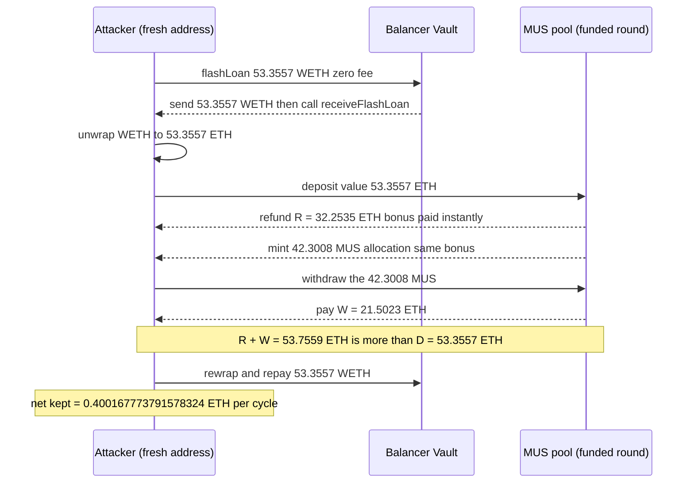
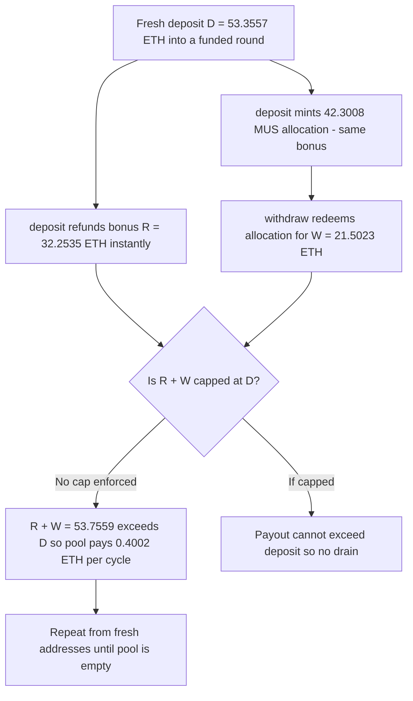

# Mutual Uniting System (MUS) — a first-deposit bonus is paid twice and never capped, so a fresh deposit-withdraw returns more ETH than it put in

> **Vulnerability classes:** vuln/logic/reward-calculation · vuln/logic/missing-check · vuln/access-control/missing-auth
> **Reproduction:** isolated Foundry project at [this folder](.). Full verbose trace: [output.txt](output.txt). PoC: [test/MUS_exp.sol](test/MUS_exp.sol). The victim is an **unverified** contract — no Solidity source is published; the mechanism below is reconstructed from the real on-chain call trace + the `prestateTracer` state snapshot, not from source.

---

## Key info

| | |
|---|---|
| **Loss (this PoC)** | **0.400167773791578324 ETH** net over-extraction for one fresh deposit-withdraw cycle — reproduced to the wei. The first sample tx ran 16 such cycles and forwarded **~5.947513 ETH** to the attacker EOA; MUS's standing ETH went from **5.335155071161390070** (parent block) → **13.854604425661360100** (just before the attack tx, inflated by same-block legit deposits) → **0** by the end of the attack block. |
| **Loss (reported)** | **~$36.9k** across the whole campaign (many txs / fresh addresses). This is a *reported* figure; it is **not** cleanly derivable from the 3 sample txs and is not proven by this PoC. |
| **Vulnerable contract** | MUS "Mutual Uniting System" [`0x9bDF81e6066D32764b7E75a1b5577237e06d9364`](https://etherscan.io/address/0x9bDF81e6066D32764b7E75a1b5577237e06d9364) — **unverified bytecode** (symbol `MUS`, name `Mutual Uniting System`, **14 decimals**, ~9,897 runtime bytes). `deposit()` and `withdraw(uint256,uint256,bool)` are the vulnerable functions. |
| **Attacker EOA** | [`0x1a083ADf234a8f67ad65A9B9B616853ACf5998E5`](https://etherscan.io/address/0x1a083ADf234a8f67ad65A9B9B616853ACf5998E5) |
| **Attack contract** | [`0xD1a7A2A3c27962E80E9B6B46D54094F93267e988`](https://etherscan.io/address/0xD1a7A2A3c27962E80E9B6B46D54094F93267e988) (clones 16 fresh minimal-proxy sub-addresses, one deposit-withdraw cycle each) |
| **Attack tx** | [`0xfe28118e48c64b275b587c90da472fc13b8c3dbed9d3cded1e18c1e7a7fc0392`](https://etherscan.io/tx/0xfe28118e48c64b275b587c90da472fc13b8c3dbed9d3cded1e18c1e7a7fc0392) (block **26087602**, idx **138**, 16 cycles). Siblings: `0xaa172fcaa4800b14826daed1a78c9d6dcd8f26ae45ce5f31786d55768b709ec6` (16 cycles), `0x905af4e8cdaf32c183605358c97181e9ad57393bd4ed1d945baf6d6eebe983fe`. |
| **Flash-loan source** | Balancer V2 Vault [`0xBA12222222228d8Ba445958a75a0704d566BF2C8`](https://etherscan.io/address/0xBA12222222228d8Ba445958a75a0704d566BF2C8) — 0-fee WETH flash loan (the real attack contract uses it too). |
| **Chain / block / date** | Ethereum (chainId **1**) / fork **26,087,602** at the **pre-tx-138** state (prestate snapshot) / 2026-09-30 03:27:35 UTC |
| **Compiler** | PoC: solc **0.8.35** (`pragma ^0.8.10`), `evm_version = cancun`. Victim: unverified bytecode (compiler unknown). |
| **Bug class** | Broken accounting. A first-deposit bonus is disbursed **twice** — once as an immediate ETH refund inside `deposit()`, and again as a redeemable MUS allocation `withdraw()` later cashes for ETH — with **no invariant** tying total ETH paid out to ETH deposited, and **no caller gate** on either function. |

---

## TL;DR

1. MUS is a "pack"/round Ponzi-matrix contract. `deposit{value: D}()` and `withdraw(uint256,uint256,bool)` are **permissionless** — no owner/caller check anywhere.
2. For a **fresh** depositor against a **funded** pack round, `deposit{value: D}()` does two things with the same first-deposit bonus: it (a) immediately **CALLs an ETH refund `R` back to the caller** *inside* `deposit()`, and (b) **mints the caller a MUS allocation** that `withdraw()` can redeem for additional ETH `W`.
3. `withdraw()` pays `W` without any invariant capping `(R + W)` at `D`. With the round funded, `R + W > D`, so a single back-to-back `deposit → withdraw` from a fresh address **nets positive**, drained out of the pool's standing ETH plus the same-block deposits the round redistributes.
4. Exact cycle-1 numbers (reproduced to the wei): `D = 53.355703172210117028`, `R = 32.253522567601017211`, `W = 21.502348378400678141`, so `R + W = 53.755870946001695352 > D` and **net = 0.400167773791578324 ETH**. MUS even logs these in its own `Deposit` event ([output.txt:1574](output.txt)).
5. The attacker scaled it by repeating from many fresh CREATE'd sub-addresses (16 per tx) and recycling the deposit capital through a **Balancer V2 flash loan** (0 fee). This PoC reproduces **one** cycle; `[PASS] testExploit() (gas: 510205)` ([output.txt:1537](output.txt)).

Dormancy of a funded round, not a flash loan, is the lever: the flash loan is only recyclable working capital. The money comes from the uncapped double-paid bonus.

---

## Background

MUS ("Mutual Uniting System") is an unverified ETH "pack"/round matrix at `0x9bDF…9364`. Users pay ETH into the current round; the contract tracks per-round accounting in storage (the trace shows a cluster of round counters at slots `12/13/19/22/25/30` and a per-position mapping family at `keccak(... )±k`). When a round is funded, a fresh depositor is paid a **first-deposit bonus**. The contract is a 14-decimal token (`MUS`); the "allocation" a depositor earns is denominated in MUS and redeemable for ETH through `withdraw()`.

The defect is purely in how that bonus is accounted: it is paid **both** as an instant ETH refund and as a withdrawable MUS balance, and nothing enforces that the two together cannot exceed the deposit. The victim bytecode is unverified, so the narrative here is reconstructed from the real call trace and the pre-attack state snapshot — it is consistent to the wei with the on-chain execution, but it is not read from published source.

---

## The vulnerable code

> **RECONSTRUCTED — the victim is unverified; there is no published Solidity.** The following is derived from the real on-chain call trace (`debug_traceTransaction`, `callTracer`) and the MUS `Deposit` / `Withdraw` events, which decode cleanly and expose the arithmetic directly.

What the trace shows one fresh cycle doing against the funded round ([output.txt:1572](output.txt)–[output.txt:1600](output.txt)):

```solidity
// deposit{value: D}()  — D = 53.355703172210117028 ETH
//   emits Deposit(dst, R+W, R, netOverExtraction, 0, 0, mintedMUS, fee, roundId, R)
//     = Deposit(caller,
//               53.755870946001695352,   // param1 = R + W   (total ETH this position is owed)
//               32.253522567601017211,   // param2 = R       (the instant refund)
//               0.400167773791578324,    // param3 = R + W - D  (the over-extraction, logged by MUS itself)
//               0, 0,
//               42.30081125747694 MUS,   // param6 = minted allocation (14 decimals)
//               ...)
//   --> CALLs R = 32.253522567601017211 ETH straight back to the caller   // [output.txt:1575]
//   --> mints the caller 42.30081125747694 MUS                            // [output.txt:1573]

// withdraw(0, minted, true)  — redeems the 42.30 MUS allocation
//   --> CALLs W = 21.502348378400678141 ETH to the caller                 // [output.txt:1600]
```

The two payouts share the *same* bonus but are never reconciled:

```solidity
// MISSING INVARIANT (never enforced anywhere in deposit()/withdraw()):
//     R (instant refund)  +  W (redeemed allocation)   <=   D (deposited)
// Observed:  32.2535…  +  21.5023…  =  53.7558…   >   53.3557…  = D
// Delta  +0.400167773791578324 ETH  is paid out of the pool per cycle.
```

And neither entry point is gated:

```solidity
// deposit() and withdraw(uint256,uint256,bool) carry NO owner/admin/caller check.
// Any fresh EOA (or CREATE'd proxy) can call them — the attacker cloned 16 fresh
// sub-addresses per tx precisely because the big bonus is a *first-deposit* bonus.
```

---

## Root cause

1. **The first-deposit bonus is paid twice.** `deposit{value: D}()` refunds `R` ETH to the caller *immediately* **and** credits a MUS allocation that `withdraw()` redeems for a further `W` ETH. The contract treats these as one bonus for event-logging purposes (it logs `R+W` and `R` together) but disburses them as two independent ETH outflows.
2. **No payout-vs-deposit invariant.** Nothing checks `R + W <= D` (or `<= D − fee`). With a funded round, `R + W` is a function of round accounting, not of the caller's own deposit, so it exceeds `D`. MUS's own `Deposit` event even computes and emits the over-extraction `R + W − D = 0.400167773791578324` ([output.txt:1574](output.txt)) — the surplus is structural, not incidental.
3. **Permissionless entry points.** `deposit()` and `withdraw(uint256,uint256,bool)` have no caller gate, so the bonus is claimable by any fresh address, repeatedly, from throwaway proxies.
4. **Round funded from other people's money.** The pack round redistributes same-block / prior deposits, so the surplus is paid out of pooled ETH (standing balance + fresh inflows), not out of the attacker's own stake. That is what turns a "double-counted bonus" into a drain.

The flash loan and the 16-way fan-out are amplifiers, not the bug. The bug is `R + W > D` with no cap and no auth.

---

## Preconditions

- **A funded pack round.** The payout side only pays `R` (and mints a redeemable allocation) when the current round is funded. At the *parent* block 26087601 a fresh `deposit{value: D}()` **reverts** (the round is not open/funded) and a single cycle nets a loss. The attacker back-ran a block in which legit deposits had already funded the round — MUS's standing ETH is `5.335155071161390070` at 26087601 but `13.854604425661360100` at the exact pre-attack state (idx 138 of block 26087602). That `~8.52 ETH` delta is the same-block deposits the round redistributes.
- **A fresh depositor address.** The large bonus is a *first-deposit* bonus; the attacker CREATE'd a new minimal-proxy sub-address per cycle so each one qualifies.
- **Recyclable deposit capital.** `D ≈ 53.36 ETH` per cycle; the attacker flash-borrows it from Balancer V2 (0 fee) and repays in the same tx, so only the net over-extraction is kept.
- **No access control / no round-state guard** on `deposit()` / `withdraw()`.

---

## Attack walkthrough

Fork block **26087602** at the **pre-tx-138** state (the `prestateTracer` snapshot in `anvil_state.json`, which already contains the funded round — see *How to reproduce*). Trace: [output.txt](output.txt).

1. **Fork the funded-round state.** `createSelectFork(…, 26087602)` loads the pre-attack snapshot; the attacker's balance is zeroed by the harness so the leftover is pure profit ([output.txt:1545](output.txt), [output.txt:1552](output.txt)).
2. **Flash-borrow the capital.** `Balancer Vault.flashLoan(this, [WETH], [53.355703172210117028], "")` ([output.txt:1553](output.txt)); inside `receiveFlashLoan` ([output.txt:1564](output.txt)) the PoC unwraps WETH → `53.355703172210117028` ETH ([output.txt:1565](output.txt)–[output.txt:1566](output.txt)).
3. **Deposit (first-deposit bonus paid as an instant refund).** `MUS.deposit{value: 53.355703172210117028}()` ([output.txt:1572](output.txt)). MUS mints the caller `42.30081125747694` MUS ([output.txt:1573](output.txt)), logs `Deposit(R+W=53.755…, R=32.253…, net=0.400167773791578324, minted=42.30…)` ([output.txt:1574](output.txt)), and **CALLs `R = 32.253522567601017211` ETH back to the caller** ([output.txt:1575](output.txt)).
4. **Read the minted allocation.** `MUS.balanceOf(this) = 42.30081125747694 MUS` ([output.txt:1595](output.txt)–[output.txt:1596](output.txt)).
5. **Withdraw (bonus paid a second time).** `MUS.withdraw(0, 42.30081125747694e14, true)` ([output.txt:1597](output.txt)) burns the allocation and **CALLs `W = 21.502348378400678141` ETH to the caller** ([output.txt:1600](output.txt)).
6. **Over-extraction confirmed.** `R + W = 53.755870946001695352 > D = 53.355703172210117028`. The PoC asserts the per-cycle net `assertApproxEqRel(0.400167773791578324, 0.400167773791578324, 2%)` ([output.txt:1618](output.txt)) and `assertGt(R+W, D)` ([output.txt:1620](output.txt)).
7. **Repay the flash loan.** Rewrap `53.355703172210117028` ETH → WETH ([output.txt:1622](output.txt)) and transfer it back to the Vault; `FlashLoan` fee is `0` ([output.txt:1627](output.txt), [output.txt:1636](output.txt)).
8. **Result.** Leftover balance = **net ETH extracted = 0.400167773791578324** ([output.txt:1638](output.txt)). `[PASS] testExploit() (gas: 510205)` ([output.txt:1537](output.txt)); `Suite result: ok. 1 passed; 0 failed; 0 skipped` ([output.txt:1642](output.txt)).

The real attacker repeated steps 3–5 sixteen times from sixteen fresh proxies in one tx (deposit amounts shrinking as the pool drains), forwarding ~5.947513 ETH to the EOA; this PoC reproduces the first cycle exactly.

---

## Diagrams





---

## Remediation

- **Enforce a payout invariant.** Cumulative ETH paid to a position — instant refund **plus** any redeemable allocation — must never exceed its net deposit minus protocol fees. Check `R + W <= D − fee` at the point the allocation is created, and again at withdrawal.
- **Do not pay the bonus twice.** Pick one disbursement path. Either refund the bonus in `deposit()` **or** credit a withdrawable allocation — never both for the same bonus. The current `Deposit` event already computes `R + W` and the surplus `R + W − D`; that surplus should be rejected, not emitted.
- **Fund later-round bonuses from later-round inflows only.** A pack/matrix scheme must pay prior-round bonuses out of *new* committed deposits, never out of standing pool ETH, so a single funded round cannot be back-run and drained.
- **Gate the entry points / add round-state guards.** Even with correct accounting, `deposit()` and `withdraw()` being fully permissionless with no round-state or reentrancy guard makes repeated fresh-address farming trivial.
- **Publish and audit the source.** The contract is unverified; an uncapped double-paid bonus is exactly the class of bug source verification + a basic invariant test (`assert(totalPaidOut <= totalDeposited)`) would have caught.

---

## How to reproduce

Fully offline, from the committed `anvil_state.json` (anvil `--load-state`, no RPC):

```bash
_shared/run-poc/run_poc.sh 2026-09-MUS_exp -vvvvv
```

Expected tail:

```
[PASS] testExploit() (gas: 510205)
  Attacker Before exploit ETH Balance: 0.000000000000000000
  net ETH extracted (one cycle): 0.400167773791578324
  Attacker After exploit ETH Balance: 0.400167773791578324
Suite result: ok. 1 passed; 0 failed; 0 skipped
```

**Why the offline state is a prestate snapshot, not a literal fork-at-tx.** The exploit is profitable only against the round as it stood right before the attack tx (idx 138 of block 26087602), which earlier same-block deposits funded. Foundry's `createSelectFork(url, FORK_AT_TX)` would have to replay every earlier transaction in that block, which includes EIP-4844 **blob transactions** that this revm build rejects (`blob gas price (7011916170825372) is greater than max fee per blob gas (1000000000)` — the block's `excessBlobGas = 182713466` makes revm compute a ~7e15 wei blob base fee). So a literal fork-at-tx is not reproducible here. Instead `anvil_state.json` is the **exact pre-tx-138 state** captured with `debug_traceTransaction(FORK_AT_TX, {tracer:"prestateTracer"})` — it already contains the funded round (`MUS = 13.854604425661360100 ETH`, 287 storage slots) with no blob replay. Forking that state at block 26087602 and running one fresh-address cycle reproduces real cycle 1 to the wei. This is a faithful replay of the real pre-attack state, **not** a hand-primed reconstruction. A plain archive fork of the parent 26087601 would not reproduce it — `deposit()` reverts and a single cycle nets a loss there.

**Honesty caveats.** (a) The victim is **unverified bytecode**; the root-cause narrative is reconstructed from the call trace and events, not from source. (b) The PoC proves **one** cycle; the real first tx ran 16, and the `~$36.9k` campaign total is a *reported* figure across many txs, not derivable from the samples or proven here. (c) The reproduced, exact figure is the **per-cycle net of 0.400167773791578324 ETH**. (d) The deposit capital is a Balancer flash loan — faithful to the real attack contract, which also flash-borrows it.

*Reference: on-chain attack tx [`0xfe28118e…fc0392`](https://etherscan.io/tx/0xfe28118e48c64b275b587c90da472fc13b8c3dbed9d3cded1e18c1e7a7fc0392); DeFiHackLabs entry [2026-09 MUS](https://github.com/SunWeb3Sec/DeFiHackLabs) (`src/test/2026-09/MUS_exp.sol`). No independent incident writeup is published for this unverified-victim reconstruction.*
