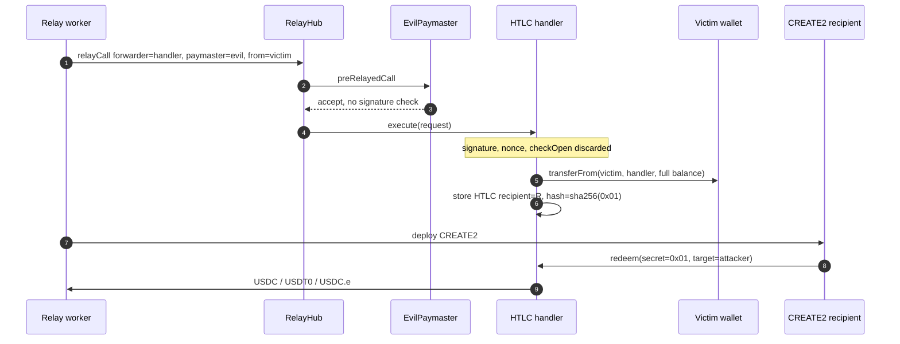
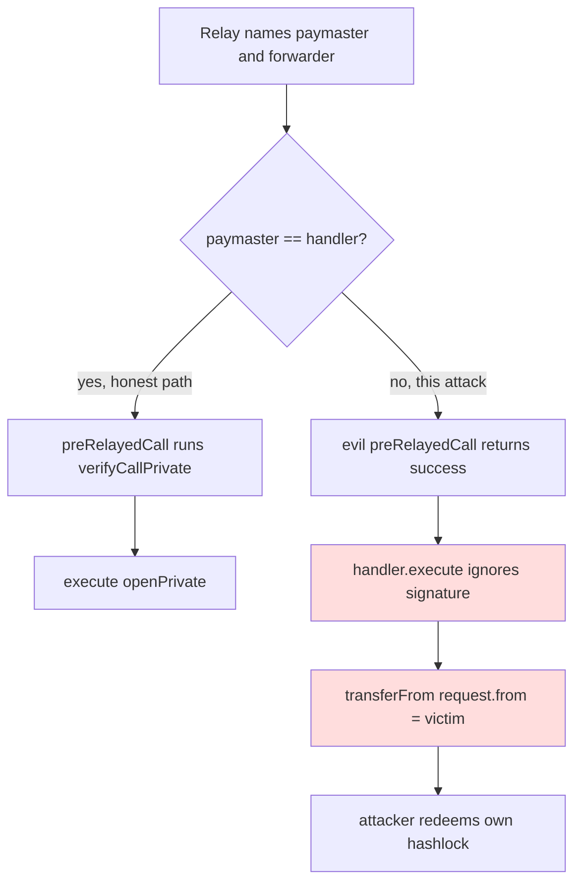

# Nimiq HTLC handlers — OpenGSN `execute()` ignores the signature and opens an HTLC as the liquidity wallet
> **Vulnerability classes:** vuln/access-control/missing-auth · vuln/auth/signature-bypass · vuln/bridge/htlc
> **Reproduction:** the PoC compiles and runs offline in an isolated Foundry project at [this project folder](.). Full verbose trace: [output.txt](output.txt). Verified handler sources are in [sources/ERC20PermitHTLCHandler_0cFD86](sources/ERC20PermitHTLCHandler_0cFD86) and [sources/ERC20MetaHTLCHandler_F615bD](sources/ERC20MetaHTLCHandler_F615bD).
---
## Key info
| | |
|---|---|
| **Loss** | **50,463.792096 USD** of 6-decimal stables: 26,130.641710 USDC + 24,332.489269 USDT0 + 0.661117 USDC.e. Victim balances go to 0; the attacker receives each balance in full [output.txt:357] |
| **Vulnerable contracts** | ERC20PermitHTLCHandler (USDC) [`0x0cFD862bE942846Cebad797d7c1BC6e47714959b`](https://polygonscan.com/address/0x0cFD862bE942846Cebad797d7c1BC6e47714959b#code); ERC20MetaHTLCHandler (USDT0 / USDC.e) [`0xF615bD7EA00C4Cc7F39Faad0895dB5f40891359f`](https://polygonscan.com/address/0xF615bD7EA00C4Cc7F39Faad0895dB5f40891359f#code) |
| **Victim** | Swap-liquidity wallet [`0x24Cb173Ae221AeA93369f34bdcF0Ddb35b436773`](https://polygonscan.com/address/0x24Cb173Ae221AeA93369f34bdcF0Ddb35b436773) (unlimited approvals to both handlers) |
| **Attacker EOA** | [`0x2258491525C21f334c5a2dc22CE55e55023FC45D`](https://polygonscan.com/address/0x2258491525C21f334c5a2dc22CE55e55023FC45D) (EIP-7702 delegated, code prefix `0xef0100`) |
| **Attack contract** | No separate persistent exploit contract on the incident EOA. The PoC deploys `EvilPaymaster` and a CREATE2 `HTLCRecipient` and drives the real RelayHub. Setup tx [`0xb067efae73637f3564f58af7f6027afc497e81e47624b0048636085c678858c0`](https://polygonscan.com/tx/0xb067efae73637f3564f58af7f6027afc497e81e47624b0048636085c678858c0) |
| **Attack tx** | [`0xb2ca76dfbfe571742b4b66465b777ab1e06988a8632be1631bef9654cc64d169`](https://polygonscan.com/tx/0xb2ca76dfbfe571742b4b66465b777ab1e06988a8632be1631bef9654cc64d169) |
| **Chain / block / date** | Polygon (chain id 137) / setup block 93,930,784, exploit block 93,930,854, fork one block before setup at 93,930,783 / 16 September 2026 |
| **Compiler** | Solidity `v0.8.17+commit.8df45f5f`, optimizer on, 200 runs (both handlers) |
| **Bug class** | Each handler is its own OpenGSN forwarder and its own paymaster. `execute()` discards the EIP-712 signature, nonce, and `checkOpen` preconditions and `transferFrom`s `request.from`. The hub only runs those checks on whichever paymaster the relay names, so a self-staked relay plus an always-accept paymaster never hits `verifyCallPrivate`. |

## TL;DR
Nimiq's Polygon swap handlers custody HTLCs for USDC, USDT0, and bridged USDC.e. The liquidity wallet had approved both handlers for unlimited token. A direct `open()` would pull tokens from `msg.sender` only after `checkOpen`. The gasless path does not.

OpenGSN's `RelayHub.relayCall` calls `paymaster.preRelayedCall` and then `forwarder.execute`. The attacker registers a normal relay (1 POL stake, the hub minimum) and sets `relayData.paymaster` to a contract whose `preRelayedCall` returns success, and `relayData.forwarder` to the handler. The hub therefore never calls the handler's `preRelayedCall`, which is the only function that runs `verifyCallPrivate` (EIP-712 signature, nonce, allowance, recipient). `execute()` is `onlyRelayHub` and then immediately `openPrivate(request.from, ...)`, and `request.from` is the victim.

The PoC opens three HTLCs for the victim's full balances, deploys the precomputed CREATE2 recipient, and `redeem`s with `secret = bytes32(uint256(1))`. Attacker receipts match the victim's pre-state exactly: **26,130.641710 USDC**, **24,332.489269 USDT0**, **0.661117 USDC.e**, total **50,463.792096** [output.txt:357]. `[PASS] testExploit()` gas 1,452,208 [output.txt:355].

## Background — what the handlers are supposed to do
`ERC20PermitHTLCHandler` and `ERC20MetaHTLCHandler` implement hash-time-locked swaps and are also OpenGSN v2.2.0 forwarders. Both point `getHubAddr()` at RelayHub [`0x6C28AfC105e65782D9Ea6F2cA68df84C9e7d750d`](https://polygonscan.com/address/0x6C28AfC105e65782D9Ea6F2cA68df84C9e7d750d). The hub's stake manager is [`0x15C7B7CE10f3A9AE63554bCE7C54d0a818E967C7`](https://polygonscan.com/address/0x15C7B7CE10f3A9AE63554bCE7C54d0a818E967C7).

On the direct path, `open()` builds an `HTLCData`, runs `checkOpen(msg.sender)` (allowance and amount), then `openPrivate`, which `transferFrom`s the sender into the handler and stores the HTLC. `redeem()` checks that `msg.sender` is the recipient and that `sha256(secret)` matches the hash, then pays `target`.

On the gasless path the same checks live in `preRelayedCall` → `verifyCallPrivate`. That function calls `verifyInternal` (domain separator, typehash, signature) and then `checkOpen` / `checkRedeem`. `execute()` was written as the forwarder step that the hub calls *after* the paymaster has already accepted, so the author treated the signature as already checked. The hub does not promise that the paymaster is the forwarder. Any staked relay picks the pair.

`owner()` on the handler only gates `registerToken`, `setRelayHub`, and withdrawals. None of those are on the drain path.

## The vulnerable code
The two handlers are the same bug with a different token-approval helper (`openWithPermit` vs `openWithApproval`). USDC handler: [contracts_ERC20PermitHTLCHandler.sol](sources/ERC20PermitHTLCHandler_0cFD86/contracts_ERC20PermitHTLCHandler.sol). USDT0/USDC.e handler: [contracts_ERC20MetaHTLCHandler.sol](sources/ERC20MetaHTLCHandler_F615bD/contracts_ERC20MetaHTLCHandler.sol) lines 221–236, same shape.

### `execute()` throws away the signature and pulls `request.from`
```solidity
function execute(
    ForwardRequest calldata request,
    bytes32 domainSeparator,
    bytes32 requestTypeHash,
    bytes calldata suffixData,
    bytes calldata signature
) public override payable onlyRelayHub returns (bool success, bytes memory ret) {
    (request, domainSeparator, requestTypeHash, suffixData, signature); // unused

    bytes4 methodId = GsnUtils.getMethodSig(request.data);
    (OpenRequestData memory openRequestData, CloseRequestData memory closeRequestData, FeeInformation memory feeInformation) =
        decodeRequestDataPrivate(methodId, request.from, request.data, 0);
    nonces[request.from] = nonces[request.from] + 1;
    if (methodId == this.open.selector || methodId == this.openWithPermit.selector) {
        openPrivate(request.from, openRequestData); // transferFrom(victim, handler, amount)
    } else {
        closePrivate(closeRequestData, feeInformation);
    }
    success = true;
    ret = "";
}
```
(Permit handler lines 222–237.) `onlyRelayHub` is `msg.sender == getHubAddr()` ([contracts_BaseCombinedGsnHandler.sol](sources/ERC20PermitHTLCHandler_0cFD86/contracts_BaseCombinedGsnHandler.sol) lines 39–42). The hub is allowed to call this. The user is not authenticated inside it.

`openPrivate` (lines 54–58) does not take a signature either:

```solidity
function openPrivate(address userAddress, OpenRequestData memory requestData) private {
    require(requestData.htlc.token.transferFrom(userAddress, address(this), requestData.htlc.amount), "HTLC: Deposit transfer failed");
    deposits[requestData.htlc.token] = deposits[requestData.htlc.token] + requestData.htlc.amount;
    htlcs[requestData.id] = requestData.htlc;
}
```

### The real checks run only if this contract is the paymaster
```solidity
function preRelayedCall(...) external override onlyRelayHub onlyToSelf(relayRequest) returns (...) {
    require(relayRequest.request.nonce == getNonce(relayRequest.request.from), "Meta: Invalid nonce");
    (..., ...) = verifyCallPrivate(relayRequest.request, relayRequest.relayData, signature, approvalData);
    // verifyCallPrivate -> verifyInternal + checkOpen / checkRedeem
}
```
(lines 206–211.) `onlyToSelf` requires `relayRequest.request.to == address(this)` (base handler lines 34–37). None of that runs when `relayData.paymaster` is the attacker's contract. `RelayHub` calls the named paymaster, then the named forwarder.

The direct `open()` and `relayWithoutGsn()` still call `checkOpen` / `verifyCallPrivate`. The hole is only the forwarder `execute()` reached through a foreign paymaster.

## Root cause — why it was possible


## Secondary analysis (@DefimonAlerts)

> HTLC handlers are both OpenGSN paymaster and forwarder; execute() discards the EIP-712 signature and openPrivate transferFroms request.from, while RelayHub runs preRelayedCall only on the relay-chosen paymaster, so a self-staked relay plus an always-accept paymaster forges open() and redeems the HTLC.

Source: https://x.com/DefimonAlerts/status/2100868892742602793


## Secondary analysis (@SlowMist_Team)

> OpenGSN paymaster-selection trust bug: ERC20PermitHTLCHandler.execute() discards EIP-712 signature, nonce, and business checks; RelayHub calls preRelayedCall on the attacker-specified paymaster, so a forged request.from drains the victim's unlimited allowance via openPrivate and redeem.

Source: https://x.com/SlowMist_Team/status/2100896541859054006

1. **Paymaster and forwarder are independently chosen by the relay.** The signature check was placed on the paymaster callback and the token pull was placed on the forwarder callback. OpenGSN lets those be different addresses. Naming a paymaster that always returns `("", false)` skips `verifyCallPrivate` and still reaches `execute()`.
2. **`execute()` documents the skip in code.** The first statement discards `signature`, `domainSeparator`, `requestTypeHash`, and `suffixData`. Nonce is incremented, not compared. `checkOpen` is not called. `chainTokenFee` is passed as 0.
3. **`request.from` is attacker-controlled calldata.** `openPrivate` uses it as the `transferFrom` source. With the victim's unlimited allowance, that is the victim's whole balance. The trace shows `allowance` above the balance for all three tokens (comparisons at [output.txt:399], [output.txt:405], [output.txt:411]).
4. **The HTLC recipient and the hashlock are chosen by the same forged `open()`.** The attacker sets `recipient` to a CREATE2 address they can deploy later and `hash` to `sha256(0x01)`, then `redeem`s as that recipient. The hashlock is not a second factor once the opener and the redeemer are the same party.
5. **Becoming a relay is permissionless.** Stake manager minimums used by the PoC are 1 POL and `unstakeDelay = 1000`, read from `RelayHub.getConfiguration()`. `setRelayManagerOwner` → `stakeForRelayManager` → `authorizeHubByManager` → `addRelayWorkers` is the normal path. No handler role is involved.

## Preconditions
- The victim has approved the handler for at least the amount drained. Here the approvals are effectively unlimited and the amounts are the full balances.
- The attacker can stake 1 POL and register a relay worker. That is public OpenGSN onboarding, done in the setup transaction one block before the drain would have been possible; the fork is taken at block 93,930,783 so the PoC performs that registration itself.
- The handler's `getHubAddr()` is the real RelayHub, so `onlyRelayHub` accepts `RelayHub.relayCall`. Both handlers satisfy that [output.txt:389], [output.txt:393].
- `gasPrice = 0` in the forged request means the hub charges no fee, so the paymaster deposit is not economically required. The PoC still `depositFor`s 1 POL onto the evil paymaster.

## Attack walkthrough (with numbers from the trace)
| # | Step | Effect (from [output.txt](output.txt)) |
|---|------|----------------------------------------|
| 1 | Read victim balances at block 93,930,783 | USDC 26,130.641710, USDT0 24,332.489269, USDC.e 0.661117 [output.txt:357] |
| 2 | Deploy `EvilPaymaster`. Register relay: owner, `stakeForRelayManager` 1 POL, `authorizeHubByManager`, `addRelayWorkers` | Stake and worker assertions pass [output.txt:451], [output.txt:455] |
| 3 | `relayCall` forged `open()` on the USDC handler. `request.from = victim`, paymaster = evil, forwarder = handler, signature = 65 zero bytes | Hub calls `EvilPaymaster.preRelayedCall` [output.txt:478], then the handler. Paymaster-accepted assert [output.txt:509]. 26,130.641710 USDC moves victim → handler |
| 4 | Same `relayCall` for USDT0 on the meta handler (nonce 0) and USDC.e (nonce 1) | [output.txt:523], [output.txt:575]. Victim balances asserted 0 [output.txt:625] |
| 5 | `new HTLCRecipient{salt}` matches the address named in each `open()` | CREATE2 assert [output.txt:641] |
| 6 | `redeem(id, attacker, secret=0x01, fee=0)` on each HTLC | Attacker holds 26,130.641710 USDC, 24,332.489269 USDT0, 0.661117 USDC.e [output.txt:730]. Sum **50,463.792096** [output.txt:739] |

`assertEq` on each token and `assertApproxEqAbs(total, 50_463e6, 5e6)` both pass [output.txt:733], [output.txt:740]. The reproduced total is 50,463.792096 against the reported ~50,463, well inside the 5 USD tolerance. All three tokens are 6-decimal dollar stables, so the raw sum is the USD loss.

## Diagrams





## Remediation
1. **Run `verifyCallPrivate` inside `execute()`, or do not implement a token-moving forwarder that trusts an external paymaster.** The signature, nonce, `checkOpen`, and `request.from == signer` checks have to happen in the contract that moves the tokens, not only in a callback the caller can substitute.
2. **If the handler must be its own paymaster, reject any relay whose `relayData.paymaster` is not `address(this)`.** `execute()` can read nothing about the paymaster today; the hub would have to pass it, or `execute()` should refuse to run unless the preceding `preRelayedCall` on this contract set a per-hash commit that `execute()` consumes.
3. **Do not take `request.from` from unsigned calldata.** The ERC-20 `from` of `transferFrom` must be the address that produced the EIP-712 signature (`ecrecover`), and the nonce in storage must equal `request.nonce` before it is incremented.
4. **Stop giving the liquidity wallet an unlimited allowance to a forwarder.** A per-swap permit, or moving liquidity into the handler only inside a checked `open()`, removes the standing approval this drain spends. That is defence in depth; it does not fix `execute()`.

## How to reproduce
The PoC runs fully offline from the committed `anvil_state.json`. The harness loads that state, rewrites `http://127.0.0.1:8549` to the anvil port, and uses Polygon chain id 137:

```bash
_shared/run_poc.sh 2026-09-Nimiq_exp -vvvvv
```

Fork block is **93,930,783** (one block before the setup tx, so the victim still holds the balances and the approvals, and no HTLC exists yet). Expected tail:

```
[PASS] testExploit() (gas: 1452208)
victim USDC   before: 26130.641710
victim USDT0  before: 24332.489269
victim USDC.e before: 0.661117
attacker USDC   after: 26130.641710
attacker USDT0  after: 24332.489269
attacker USDC.e after: 0.661117
total drained (USD): 50463.792096
Suite result: ok. 1 passed; 0 failed; 0 skipped
```

The full call trace is [output.txt](output.txt).

*Reference: [BlockBeats on the Defimon alert](https://www.theblockbeats.info/flash/367838).*


## References

- https://x.com/DefimonAlerts/status/2100868892742602793 (@DefimonAlerts secondary analysis)

- https://x.com/SlowMist_Team/status/2100896541859054006 (@SlowMist_Team secondary analysis)
