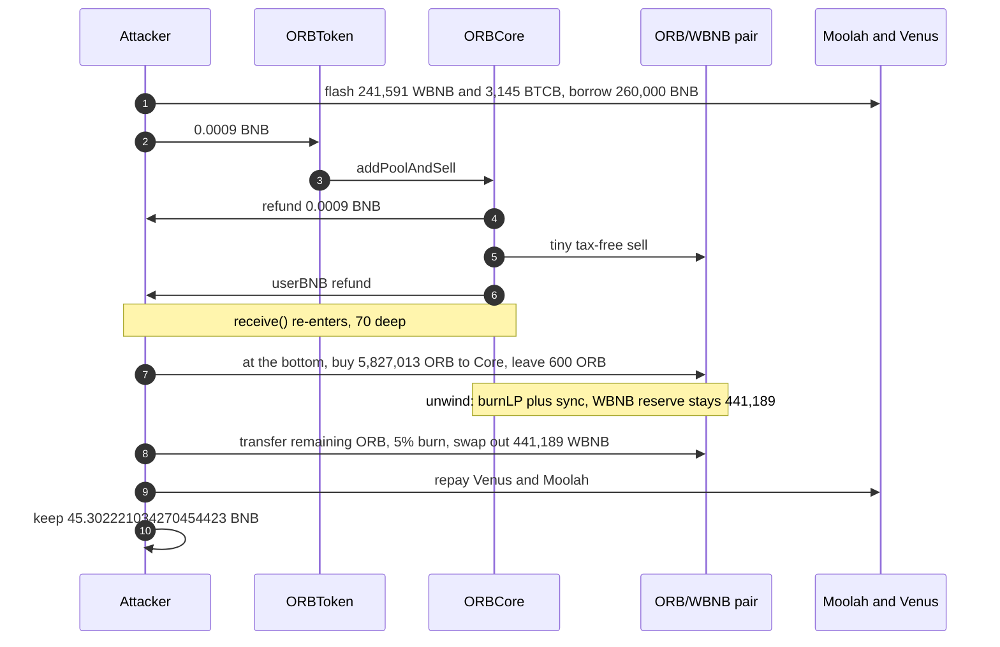
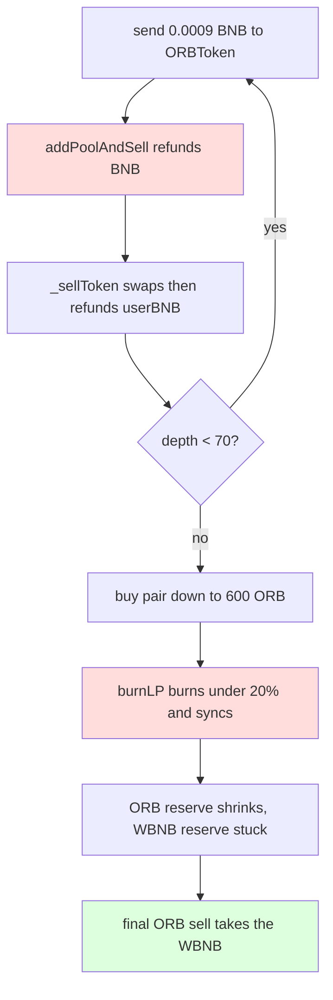

# ORB `addPoolAndSell` — BNB refund before the sell, then `burnLP` grinds the pair and a last swap takes the WBNB
> **Vulnerability classes:** vuln/reentrancy/cross-function · vuln/defi/reserve-manipulation · vuln/logic/incorrect-order-of-operations
> **Reproduction:** the PoC compiles and runs offline in an isolated Foundry project at [this project folder](.). Full verbose trace: [output.txt](output.txt). Verified sources: [sources/ORBToken_C4D272](sources/ORBToken_C4D272), [sources/ORBCore_24B630](sources/ORBCore_24B630).
---
## Key info
| | |
|---|---|
| **Loss** | **45.302221034270454423 BNB** net to the attacker after repaying every flash-loan and Venus leg. That is the ORB/WBNB pair's real ~45.318 WBNB reserve [output.txt:357] |
| **Vulnerable contracts** | ORBToken [`0xC4D27261C06407053Cad16Cb825ecc0eEE7ee7d7`](https://bscscan.com/address/0xC4D27261C06407053Cad16Cb825ecc0eEE7ee7d7#code); ORBCore [`0x24B6308AB84B182d0598b73d21a42f4C2bb33C18`](https://bscscan.com/address/0x24B6308AB84B182d0598b73d21a42f4C2bb33C18#code) |
| **Pair** | PancakeV2 ORB/WBNB [`0x64fad72e5dde70B2960497744B348FD64Cb4788c`](https://bscscan.com/address/0x64fad72e5dde70B2960497744B348FD64Cb4788c) (`token0 = WBNB`) |
| **Attacker EOA** | [`0xd8B49172B1A33e77C2619a78e08471FaCFf5dAd3`](https://bscscan.com/address/0xd8B49172B1A33e77C2619a78e08471FaCFf5dAd3) (holds 3,483 ORB before the attack) |
| **Attack contract** | [`0x4f33733a40FAE6C19c3A4Faf9BC08cE9a1806831`](https://bscscan.com/address/0x4f33733a40FAE6C19c3A4Faf9BC08cE9a1806831) |
| **Attack tx** | [`0x5e6b33b7d69b505d8ae6e50ca6967e13bf513b61593d29011dbcc6d134515b34`](https://bscscan.com/tx/0x5e6b33b7d69b505d8ae6e50ca6967e13bf513b61593d29011dbcc6d134515b34) |
| **Chain / block / date** | BSC (chain id 56) / exploit block 121,296,110, fork parent 121,296,109 / 12 September 2026 |
| **Compiler** | Solidity `v0.8.17+commit.8df45f5f`, optimizer on, 200 runs (token and core) |
| **Bug class** | `ORBToken.receive()` forwards BNB into `ORBCore.addPoolAndSell` with no reentrancy lock. The sell branch refunds that BNB, and `_sellToken` refunds the proceeds, both *before* `burnLP`. `burnLP` burns ORB out of the pair and `sync`s, but only up to 20% of the pair balance per call. A nested reentry buys the pool down to 600 ORB at the bottom, then each unwind burns 20%, and a final taxed sell takes the untouched WBNB. |

## TL;DR
Sending BNB to ORBToken is an implicit sell. `receive()` max-approves the sender to ORBCore and calls `addPoolAndSell{value: msg.value}(msg.sender)`. On the sell branch (`0.0001 BNB <= value < minBNB`) Core **sends the BNB back to the caller first**, then computes a sell size from the caller's ORB balance and calls `_sellToken`. `_sellToken` swaps ORB for BNB through the router, **sends the user's BNB out**, and only then calls `ORBToken.burnLP`, which burns ORB from the pair itself and `sync`s if the burn is under 20% of the pair's ORB balance.

Two facts make a naive loop useless. The attacker only holds 3,483 ORB, and the pair holds **45.318191860933453235 WBNB** and **5,826,613.420079447654698344 ORB** [output.txt:856]. `burnLP` cannot delete a 5.8M ORB reserve 20% at a time from a 3,483 ORB stack. The PoC first borrows Moolah's entire **241,591.119849192237224966 WBNB** [output.txt:380] and **3,145.888591519450458468 BTCB** [output.txt:390], posts the BTCB on Venus, and borrows **260,000 BNB**. With that temporary WBNB it `swapTokensForExactTokens` **5,827,013.419914897198966118 ORB** out of the pair, delivered to Core (a direct buy to any other address hits `revert('not buy')`). The pair is then **441,189.022873324448976447 WBNB** against the **600 ORB** the buy deliberately left behind.

The reentrancy is ordered so the big buy happens at maximum depth and every `burnLP` runs on the way back up, against the emptied ORB side, while the WBNB reserve stays 441,189.02. A final transfer of the attacker's remaining ORB into the pair (5% burn on that transfer: 124.171916809724528115 ORB burned of 2,483.438336194490562313 [output.txt:7820]) swaps out **441,189.008066050205155756 WBNB** [output.txt:7827]. After repaying Venus and both flash loans the attacker keeps **45.302221034270454423 BNB** [output.txt:357]. `[PASS] testExploit()` gas 14,964,604 [output.txt:355]. `assertApproxEqRel(profit, 45 ether, 0.03e18)` passes [output.txt:8150].

## Background — what ORB's sell path does
ORBToken is a taxed ERC-20 whose Pancake pair is not a normal market for outsiders:

- A transfer whose `from` or `to` is ORBCore skips the burn tax and returns immediately ([ORBToken.sol](sources/ORBToken_C4D272/ORBToken.sol) lines 389–393). Core is how sells are supposed to reach the pair.
- A transfer *from* the pair that is not a liquidity removal reverts with `'not buy'` (lines 403–412). Router buys must deliver ORB to Core, not to the attacker.
- A transfer *to* the pair burns `getSellBurnRatio()` of the amount first (lines 415–420). In this trace that ratio is 5%.

`burnLP` is `onlyCoreAddress` (lines 730–737). It burns `amount` from the pair and `sync`s only when `pairBalance / 5 > amount`. Core's sell path calls it with `sellTokenAmount * sellBurnTokenRatio / DENOMINATOR`. `sellBurnTokenRatio` is 6000 and `DENOMINATOR` is 10000 ([ORBCore.sol](sources/ORBCore_24B630/ORBCore.sol) lines 312 and 361), so each sell asks to burn 60% of the ORB that was sold, and the token will refuse the burn if that is 20% or more of the pair.

`addPoolAndSell` is `onlyTokenAddress` (line 501). The public entry is therefore ORBToken's `receive()` (lines 745–753): anyone sending BNB is approved `type(uint256).max` to Core and becomes `account` inside the sell.

## The vulnerable code
### Two external calls before the burn
```solidity
} else if (BNBValue >= SELL_BNB_LOWEST) {
    TransferHelper.safeTransferETH(account, BNBValue); // refund BEFORE _sellToken
    uint256 mulNumber = BNBValue / SELL_BNB_LOWEST;    // 0.0009 BNB -> mulNumber 9
    uint256 tokenBalance = IERC20(Token_Address).balanceOf(account);
    uint256 sellTokenAmount = tokenBalance * mulNumber / 10;
    _sellToken(account, sellTokenAmount);
}
```
(`addPoolAndSell`, [ORBCore.sol](sources/ORBCore_24B630/ORBCore.sol) lines 507–519.) `SELL_BNB_LOWEST` is `1e14` (0.0001 BNB), line 355. The trigger value in the PoC is `9 * 1e14` = 0.0009 BNB, so `mulNumber = 9` and the sell is 90% of the balance measured *after* the refund. There is no `nonReentrant`.

```solidity
TransferHelper.safeTransferETH(account, userBNB);          // refund BEFORE burnLP
uint256 sellBurnTax = sellTokenAmount * sellBurnTokenRatio / DENOMINATOR;
if (sellBurnTax > 0) IToken(Token_Address).burnLP(sellBurnTax);
```
(`_sellToken`, lines 670–673.) The swap itself has already run (line 644), against whatever reserves exist at this stack frame.

### `burnLP` rewrites the pair
```solidity
function burnLP(uint256 amount) public override onlyCoreAddress {
    address _pair = WBNB_Token_LP_Address;
    uint256 _balance = balanceOf[_pair];
    if (_balance / 5 > amount) {
        _burn(_pair, amount);
        IUniswapV2Pair(_pair).sync();
    }
}
```
(ORBToken lines 730–737.) Burning the pair's ORB and `sync`ing drops `reserve1` and leaves `reserve0` (WBNB) where it is. The constant product is not restored by a swap; it is replaced.

### Why the nesting has to be on the way down, burns on the way up
Each level does: swap (small, against the still-full pool) → `userBNB` refund → `burnLP`. Re-entering on the `userBNB` refund pushes the next swap *before* this level's `burnLP`. At depth 70 the big buy runs. Unwinding then runs 70 `burnLP`s against the 600 ORB that the buy left, each under the 20% cap, so the ORB reserve falls geometrically and the WBNB reserve does not. A flat loop after the buy would sell ORB back into the emptied pool on every iteration and refill the side the attacker is trying to delete.

Core is the token's privileged counterparty, so the `_sellToken` pull (`transferFrom` the attacker to Core) and Core's subsequent transfer into the pair are tax-free. The final drain is a raw `ORB.transfer(pair)` from the attacker, which does pay the 5% burn, and then `pair.swap` of the WBNB.

## Root cause — why it was possible
1. **Checks-effects-interactions is inverted twice.** State that matters (`burnLP` / `sync`) is after an ETH transfer to an attacker-controlled `account`. Both the pre-sell refund and the post-swap `userBNB` refund are reentry points, and the second one sits immediately before the burn.
2. **`receive()` is an unauthenticated sell entry.** It sets an unlimited ORB allowance to Core as a side effect and names `msg.sender` as the account whose balance will be sold.
3. **`burnLP` + `sync` is an external reserve write.** It is capped per call, but nothing stops the same call stack from invoking it once per nesting level. After the ORB side is dust, price is `reserveWBNB / reserveORB` with the numerator still equal to every WBNB the attacker just pushed in plus the original reserve.
4. **The tax whitelist makes the setup swaps not cost 5%.** Pair↔Core transfers skip `getSellBurnRatio`. The attacker's own final transfer is the one that is taxed, and that tax is small next to 441,189 WBNB of output.
5. **The pair forbids ordinary buys** (`'not buy'`), so the large ORB out has to be delivered to Core. That is a routing constraint, not an access check. The router `to` parameter is Core, and Core is already the token's trusted address.

## Preconditions
- The pair has a WBNB reserve worth taking. Here it is ~45.318 WBNB against ~5.827M ORB [output.txt:856]. The attacker's 3,483 ORB cannot burn that down alone; the leverage leg is what makes the 20% cap reachable.
- Moolah (`0x8F73b65B4caAf64FBA2aF91cC5D4a2A1318E5D8C`) will flash-loan its full WBNB and BTCB balances at 0% fee, and Venus vBNB will lend 260,000 BNB against that BTCB. Both are repaid in the same transaction.
- `addPoolAndSell` must still refund before `_sellToken`, and `burnLP` must still `sync` the pair. No lock is present on either contract in the verified source.
- The attacker needs a contract with `receive()` / `fallback` so the ETH refunds re-enter. The real attack contract is `0x4f33733a40FAE6C19c3A4Faf9BC08cE9a1806831`. The PoC deploys an equivalent and runs it under `vm.prank` of the real EOA, which approves its 3,483 ORB.

## Attack walkthrough (with numbers from the trace)
| # | Step | Effect (from [output.txt](output.txt)) |
|---|------|----------------------------------------|
| 1 | Outer Moolah `flashLoan` of all WBNB, nested `flashLoan` of all BTCB | 241,591.119849192237224966 WBNB [output.txt:380]; 3,145.888591519450458468 BTCB [output.txt:390] |
| 2 | Venus: `enterMarkets` + `mint` the BTCB, `borrow` 260,000 BNB, wrap all but 10 BNB | Collateral transfer [output.txt:448]. 10 BNB stays native so the 0.0009 BNB triggers can be sent as value |
| 3 | First `ORB.call{value: 0.0009 ether}` → `addPoolAndSell` | [output.txt:804]. Pair still ~45.318 WBNB / ~5.8266e6 ORB after the first tiny swap [output.txt:856] |
| 4 | On each `userBNB` refund, re-enter, up to depth 70. Swaps on the way down are wei-scale against the full pool | Nested `addPoolAndSell{value: 900000000000000}` and `swapExactTokensForETH` at [output.txt:883] and following |
| 5 | At the bottom, `swapTokensForExactTokens` buys 5,827,013.419914897198966118 ORB to Core, paying 441,143.712438481090236177 WBNB | [output.txt:6272]. Pair ORB before that buy is 5,827,613.419914897198966118 [output.txt:6269], so **600 ORB** is left on purpose. Pair WBNB after the buy is 441,189.022873324448976447 [output.txt:6289] |
| 6 | Unwind: each level's `burnLP` + `sync` cuts ORB, WBNB reserve unchanged | Late syncs keep `reserve0 = 441189022873324448976447` while `reserve1` falls through 1.928e14, 1.542e14, 1.234e14, 9.873e13 to **78,984,218,751,513** wei of ORB [output.txt:7694]–[output.txt:7778] |
| 7 | Final sell. Pull the EOA's remaining ORB, transfer 2,483.438336194490562313 ORB to the pair | 5% burn 124.171916809724528115 ORB [output.txt:7820]; pair receives 2,359.266419384766034198 ORB [output.txt:7821] |
| 8 | `pair.swap` pulls **441,189.008066050205155756 WBNB** | [output.txt:7827]. Reserves left: **0.014807274243820691 WBNB** and 2,359.266498368984785711 ORB [output.txt:7838] |
| 9 | Repay 260,000 BNB to vBNB [output.txt:7850], redeem BTCB, repay both Moolah loans, unwrap profit to the EOA | Attacker BNB profit **45.302221034270454423** [output.txt:8149] |

The ~0.016 BNB gap versus the original 45.318 WBNB reserve is the Venus interest and the 5% burn / swap fee on the final sell, not a second pool. SlowMist's dollar figure for the incident was about $32,610.

## Diagrams





## Remediation
1. **Follow checks-effects-interactions on both refunds.** Compute the sell, pull the ORB, swap, and `burnLP` *before* any `safeTransferETH` to `account`. Better: delete the pre-sell refund entirely and do not use "send BNB to the token" as a sell entry.
2. **Add a reentrancy lock that covers `receive`, `addPoolAndSell`, and `_sellToken`.** The two refunds are cross-function reentry into the same economic action. A single `nonReentrant` on the token and on Core, entered before the external ETH transfer, stops the nesting. The lock has to be shared across the token→core call, or the token can re-enter Core while Core still holds the lock only on its own frame.
3. **Delete `burnLP` + `sync`, or cap it by a keeper and by a fraction of reserves per block, not per call.** Burning the pair's own balance and `sync`ing is a reserve write with no swap invariant. Even a correct order of operations should not let a sell shrink the ORB reserve by 60% of the sold size.
4. **Do not whitelist Core around the pair tax and do not `revert('not buy')` for non-Core recipients as the only buy path.** Those two rules are what let the attacker move ORB through Core tax-free and force the big buy's output onto Core. A normal pair with a normal tax, if any, does not have this shape.
5. **The 20% `burnLP` cap is not a fix.** It is the reason the attack is a 70-deep loop instead of one call. A global per-block burn budget, checked in `burnLP` against reserves at the start of the block, would have rejected the unwind.

## How to reproduce
The PoC runs fully offline from the committed `anvil_state.json`. The harness rewrites `http://127.0.0.1:8546` and uses BSC chain id 56:

```bash
_shared/run_poc.sh 2026-09-ORB_exp -vvvvv
```

Fork block is **121,296,109**. Expected tail:

```
[PASS] testExploit() (gas: 14964604)
attacker BNB profit: 45.302221034270454423
Suite result: ok. 1 passed; 0 failed; 0 skipped
```

The full call trace is [output.txt](output.txt).

*Reference: [SlowMist ORB alert via AiCoin](https://www.aicoin.com/en/news-flash/3077700).*
