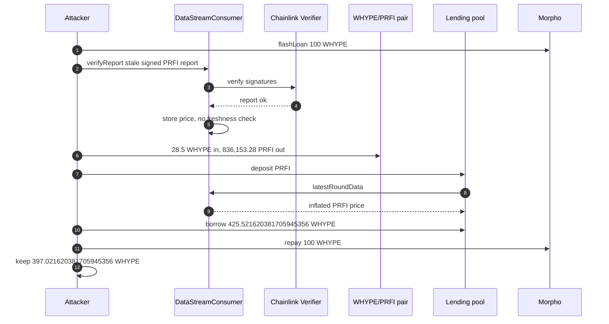
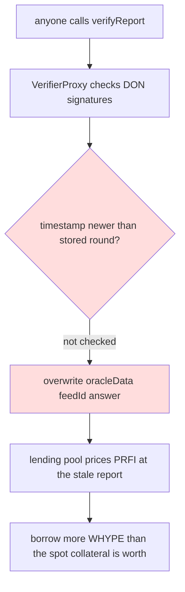

# PrimeFi `verifyReport` — permissionless stale Chainlink Data Streams report inflates PRFI and empties the WHYPE reserve
> **Vulnerability classes:** vuln/oracle/stale-price · vuln/access-control/missing-auth · vuln/defi/undercollateralized-borrow · vuln/auth/signature-replay
> **Reproduction:** online only. This folder has **no `anvil_state.json`**. Full verbose trace of the passing archival-fork run: [output.txt](output.txt). Verified oracle source: [sources/DataStreamConsumer_04EDBF](sources/DataStreamConsumer_04EDBF).
---
## Key info
| | |
|---|---|
| **Loss** | **425.521620381705945356 WHYPE** borrowed out of the lending reserve (aWHYPE balance after the borrow is 0). PoC net profit **397.021620381705945356 WHYPE** after a 100 WHYPE Morpho flash loan and 28.5 WHYPE spent buying PRFI [output.txt:7]. The real transaction netted ~398.7020 WHYPE after spending 26.82 WHYPE on PRFI. Headline ~$33.4K |
| **Vulnerable contract** | DataStreamConsumer — [`0x04EDBF3904789d80B0C991e0B66577F2208A2bE6`](https://hyperevmscan.io/address/0x04EDBF3904789d80B0C991e0B66577F2208A2bE6#code) |
| **Victim** | Aave-fork lending pool [`0xb339448E13E273f6F46e3390e0932Ab7fF9F113F`](https://hyperevmscan.io/address/0xb339448E13E273f6F46e3390e0932Ab7fF9F113F); WHYPE reserve sits in aWHYPE [`0xCF4642EF89683D0299B59738b1Cc3AC0177348Ba`](https://hyperevmscan.io/address/0xCF4642EF89683D0299B59738b1Cc3AC0177348Ba) |
| **Attacker EOA** | [`0x19bc1c7fD4Aa93F540498499b8f5B4FC3DDE5A52`](https://hyperevmscan.io/address/0x19bc1c7fD4Aa93F540498499b8f5B4FC3DDE5A52) |
| **Attack contract** | [`0x817D33738D979eD899ff2f6e9332246a2F2a6Da1`](https://hyperevmscan.io/address/0x817D33738D979eD899ff2f6e9332246a2F2a6Da1) (deployed and self-called in the exploit tx) |
| **Attack tx** | [`0xff990876d863a61732779c341991215856c89420b84daaf31eece7ecd5ff4243`](https://hyperevmscan.io/tx/0xff990876d863a61732779c341991215856c89420b84daaf31eece7ecd5ff4243) |
| **Chain / block / date** | HyperEVM (chain id 999) / exploit block 46,060,987, fork parent 46,060,986 / 16 September 2026 |
| **Compiler** | Solidity `v0.8.19+commit.7dd6d404`, optimizer on, 1000 runs |
| **Bug class** | `verifyReport(bytes)` is permissionless. It forwards the payload to the Chainlink verifier, which checks the DON signatures, then stores `report.price` for that `feedId` with no check that `observationsTimestamp` / `validFromTimestamp` is newer than the stored round. A valid stale PRFI report overwrites the live price. |

## TL;DR
PrimeFi's HyperEVM market prices PRFI through `DataStreamConsumer`, a Chainlink Data Streams middleware. Anyone may call `verifyReport`. The function does **not** skip the signature check: `verifierProxy.verify` still runs the DON threshold signatures. It then writes `oracleData[feedId].answer = report.price` and sets `updatedAt` from the report, even when that report is older than the price already stored.

The attacker replays two captured, genuinely signed reports. The PRFI feed moves to about **$0.1101** against a market price of about **$0.0021** (~52×). The incident write-up is PrimeFi's and Defimon's; this PoC does not print the price, it replays the same report bytes through the live verifier with no `vm.store`.

With the feed inflated, a 100 WHYPE Morpho flash loan buys PRFI from the thin WHYPE/PRFI pair, supplies it to the Aave-fork pool, and borrows **425.521620381705945356 WHYPE** [output.txt:315], which is the entire aWHYPE balance (the post-borrow `balanceOf(aWHYPE)` is 0 [output.txt:547]). The flash loan is repaid. PoC profit is **397.021620381705945356 WHYPE** [output.txt:8] because the constant-product buy spends 28.5 WHYPE to get the collateral. The real swap, through HyperswapPair's own accounting, spent 26.82 WHYPE for 795,587.89 PRFI and netted ~398.70 WHYPE. The reserve drain in the PoC matches the on-chain borrow to the wei. `[PASS] testExploit()` gas 2,381,399 [output.txt:4].

## Background — what the consumer is supposed to do
`DataStreamConsumer` is Prime's adapter from Chainlink Data Streams onto the lending pool's `latestRoundData()` interface. A keeper is supposed to push a fresh report. `verifyReport` decodes the schema version (v2, v3, or v4), optionally quotes a FeeManager fee, calls `VerifierProxy.verify(unverifiedReport, parameterPayload)`, and stores the decoded price under `oracleData[feedId]`.

`latestRoundData()` does not take a feed id from the caller. It looks up `feedIdByMiddleware[msg.sender]`, so the lending oracle middleware that Prime registered is who reads the stored answer. `setFeedIdByMiddleware` is `onlyOwner`. `verifyReport` is not.

The lending pool is an Aave V3-style pool. `deposit` / `borrow` call `latestRoundData()` on the PRFI and WHYPE feeds (the trace shows those calls at [output.txt:234] and [output.txt:240] during `deposit`). Collateral value is `amount * price`. The WHYPE/PRFI spot pool at [`0x981F145a71Da6DF4A7cBe892807782c9CC9a5515`](https://hyperevmscan.io/address/0x981F145a71Da6DF4A7cBe892807782c9CC9a5515) is not what the lending pool reads. Before the buy it holds **124.163947378370583235 WHYPE** and **4,489,924.835543476819373295 PRFI** [output.txt:100].

Chainlink's verifier is doing its job. The bug is which signed report the consumer is willing to store, and who is allowed to submit it.

## The vulnerable code
Verified source: [contracts_prime_oracles_chainlink_DataStreamConsumer.sol](sources/DataStreamConsumer_04EDBF/contracts_prime_oracles_chainlink_DataStreamConsumer.sol).

```solidity
function verifyReport(bytes memory unverifiedReport) external {
    (, bytes memory reportData) = abi.decode(unverifiedReport, (bytes32[3], bytes));
    uint16 reportVersion = (uint16(uint8(reportData[0])) << 8) | uint16(uint8(reportData[1]));
    if (reportVersion != 2 && reportVersion != 3 && reportVersion != 4) revert InvalidReportVersion(reportVersion);

    // fee quote omitted; then:
    bytes memory verified = verifierProxy.verify(unverifiedReport, parameterPayload);

    // v3 path (v2 and v4 are the same store):
    ReportV3 memory report = abi.decode(verified, (ReportV3));
    bytes32 feedId = report.feedId;
    OracleData storage data = oracleData[feedId];
    data.roundId = uint80(block.timestamp);
    data.answer = report.price;
    data.startedAt = report.validFromTimestamp;
    data.updatedAt = report.observationsTimestamp;
    data.answeredInRound = uint80(block.timestamp);
    emit DecodedPrice(feedId, report.price);
}
```
(lines 193–255.) There is no `onlyOwner`, no keeper allowlist, and no

```solidity
require(report.observationsTimestamp > data.updatedAt, "stale");
```

`roundId` is overwritten with `block.timestamp`, so a stale report also looks like a brand-new round to any consumer that only checks `updatedAt` against `block.timestamp` using the *new* timestamp from the old report. If the stale report's `observationsTimestamp` is still inside the lending pool's heartbeat, the market accepts it.

`latestRoundData` (lines 286–292) returns that stored tuple to whatever middleware address is calling. The owner-only setter is `setFeedIdByMiddleware` (line 262), which does not protect `verifyReport`.

The two payloads in [test/PrimeFinance_exp.sol](test/PrimeFinance_exp.sol) (`REPORT_1`, `REPORT_2`) are the bytes from the exploit trace, not values the PoC invents. `verifyReport` is called twice [output.txt:39], [output.txt:69].

## Root cause — why it was possible
1. **Signature validity is not freshness.** `verifierProxy.verify` accepts any report the DON signed, including one signed in the past. The consumer treats "the verifier returned" as "this is the price to store now."
2. **The store is an unconditional overwrite.** `oracleData[feedId]` is replaced field by field. Nothing compares `report.observationsTimestamp` or `report.validFromTimestamp` to `data.updatedAt` or to `block.timestamp` beyond whatever the verifier itself enforces, and the verifier's job here is the signature, not "newer than Prime's last round."
3. **`verifyReport` is `external` with no role.** Ownership exists and is used for `setFeedIdByMiddleware` and `withdrawToken`. The function that changes the price the lending pool reads is open.
4. **The lending pool trusts this feed against a thin spot market.** 28.5 WHYPE buys **836,153.280044686244838474 PRFI** out of a pool that only had ~124 WHYPE on the other side [output.txt:107]. At a 52× oracle price that stack is priced as far more WHYPE than the reserve holds, so `borrow` of the entire **425.521620381705945356 WHYPE** reserve succeeds [output.txt:315].
5. **The round id is `uint80(block.timestamp)`.** Downstream "is this round new?" checks that look at `roundId` or `updatedAt` see the attack block, not the report's real age, whenever they read the fields the consumer just wrote. `updatedAt` is the report's observation time, but `roundId` and `answeredInRound` are the current timestamp, which is a contradictory tuple.

## Preconditions
- A signed Data Streams report for the PRFI `feedId` whose price is far above spot, and whose observation timestamp is still inside whatever heartbeat the lending pool applies. The attacker does not forge the DON signature; they reuse one the DON already produced. Both reports are in the test file.
- The lending pool must still point at this consumer. PrimeFi later repointed the oracle at a hardened consumer and set PRFI LTV to 0.
- Enough WHYPE in aWHYPE to borrow. At the fork block that balance is exactly the amount borrowed: after the tx, `WHYPE.balanceOf(aWHYPE) == 0` [output.txt:547] and the drained amount is 425.521620381705945356 [output.txt:550].
- A flash loan so the attacker does not need the 28.5 WHYPE (100 WHYPE from Morpho Blue `0x68e37dE8d93d3496ae143F2E900490f6280C57cD` in the PoC; the real tx used the same shape). The spot pool must have PRFI inventory. It does: ~4.49M PRFI [output.txt:100].
- No keeper allowlist and no pause on `verifyReport` at block 46,060,986.

## Attack walkthrough (with numbers from the trace)
| # | Step | Effect (from [output.txt](output.txt)) |
|---|------|----------------------------------------|
| 1 | Attacker WHYPE before | 0 [output.txt:6] |
| 2 | Morpho `flashLoan` 100 WHYPE | [output.txt:30] |
| 3 | `verifyReport(REPORT_1)` then `verifyReport(REPORT_2)` on the real consumer | [output.txt:39], [output.txt:69]. Verifier signatures are checked inside the consumer; the PoC does not write oracle storage itself |
| 4 | Spot buy. Pair reserves before: 124.163947378370583235 WHYPE / 4,489,924.835543476819373295 PRFI | [output.txt:100] |
| 5 | Transfer 28.5 WHYPE in, `swap` out **836,153.280044686244838474 PRFI** | [output.txt:101], [output.txt:107]. This is more PRFI than the real tx's 795,587.89 because 28.5 WHYPE is a larger constant-product input than the 26.82 WHYPE HyperswapPair charged |
| 6 | `deposit` all PRFI as collateral | [output.txt:132]. Lending pool reads `latestRoundData` on the consumer during the deposit [output.txt:235] |
| 7 | `borrow` **425.521620381705945356 WHYPE**, interest-rate mode 2 | [output.txt:315] |
| 8 | Approve Morpho for the 100 WHYPE principal. Sweep the rest | Transfer of **397.021620381705945356 WHYPE** to the test contract [output.txt:540] |
| 9 | aWHYPE WHYPE balance | 0 [output.txt:547]. Drained amount logged 425.521620381705945356 [output.txt:550]. Profit logged 397.021620381705945356 [output.txt:551] |

397.021620381705945356 = 425.521620381705945356 − 28.5 exactly. The 100 WHYPE flash principal is repaid out of the borrow and does not change that difference: the contract starts the callback with 100, spends 28.5, receives 425.521620381705945356, and returns 100.

Assertions: drain equals 425.521620381705945356 within 0.01 WHYPE [output.txt:552]; profit is strictly between 395 and 399 WHYPE [output.txt:554], [output.txt:556]. The real attacker's ~398.70 sits in that same band; the PoC is lower only by the extra WHYPE the constant-product path pays.

## Diagrams





## Remediation
1. **Reject stale and out-of-order reports before storing.** Require `report.observationsTimestamp > oracleData[feedId].updatedAt` and `report.observationsTimestamp <= block.timestamp`, and bound `block.timestamp - report.observationsTimestamp` by the feed heartbeat. Do this in `verifyReport` for v2, v3, and v4. PrimeFi's post-incident consumer rejects expired or stale reports.
2. **Restrict callers.** `verifyReport` should be `onlyOwner` or an allowlisted keeper. Signature verification is not an allowlist: anyone who has seen a valid report can resubmit it. The owner-only `setFeedIdByMiddleware` shows the contract already had a role; it was applied to the wrong function.
3. **Do not set `roundId` to `block.timestamp`.** Persist the report's own round identity if the schema has one, so a consumer that checks `answeredInRound` cannot mistake a replay for a new round.
4. **Cap borrows off a spot cross-check.** Even with a fresh oracle, a feed that can be 52× the pool price should not unlock 100% of the WHYPE reserve against PRFI bought in the same block from a 124 WHYPE pool. A deviation check between the Data Streams price and the WHYPE/PRFI pair, or a low LTV on PRFI, bounds the damage. PrimeFi set PRFI LTV to 0 after the incident.

## How to reproduce
**There is no `anvil_state.json` in this folder.** The offline harness refuses to start:

```bash
_shared/run_poc.sh 2026-09-PrimeFinance_exp -vvvvv
# no anvil_state.json in 2026-09-PrimeFinance_exp
# exit 2, before forge
```

The test forks a live archival node itself. `setUp` calls `vm.createSelectFork("https://hyperliquid.drpc.org", 46_060_986)`. That URL has to be archival. `https://rpc.hyperliquid.xyz/evm` returns current storage for a historical block, the pool's `lastUpdateTimestamp` is then in the future, and Aave's interest index underflows (`MathError`) on `deposit`. `rpc.hyperlend.finance` and `rpc.purroofgroup.com` are the other archival endpoints noted in [test/PrimeFinance_exp.sol](test/PrimeFinance_exp.sol). From this folder, with network access:

```bash
forge test --match-path test/PrimeFinance_exp.sol -vvvvv
```

`output.txt` is the verbose trace of that online run. Expected tail:

```
[PASS] testExploit() (gas: 2381399)
Attacker Before exploit WHYPE Balance: 0.000000000000000000
WHYPE drained from reserve: 425.521620381705945356
WHYPE net profit to attacker: 397.021620381705945356
Attacker After exploit WHYPE Balance: 397.021620381705945356
Suite result: ok. 1 passed; 0 failed; 0 skipped
```

*Reference: [Defimon alert, quoted by Surf](https://x.com/Surf_Liquid/status/2100496032132190527).*


## References

- https://x.com/DefimonAlerts/status/2100306169231245535 (@DefimonAlerts secondary analysis)
