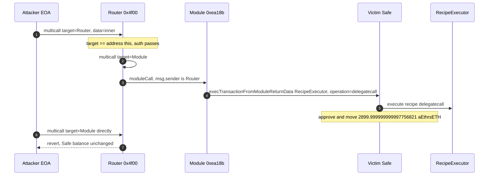
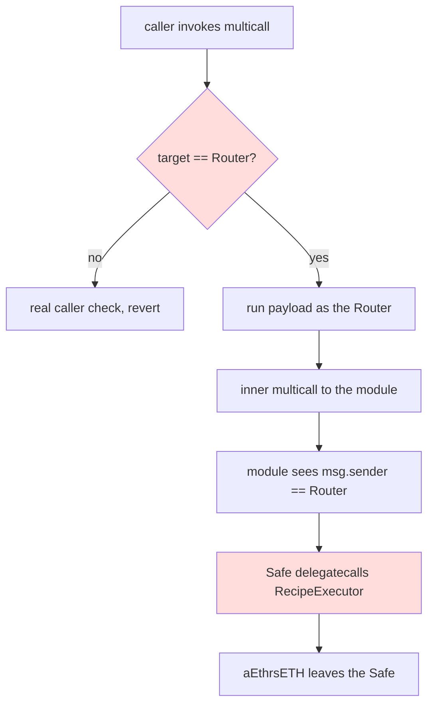

# rsETH Safe drain — Router `multicall` treats a self-call as authorized and the enabled module delegatecalls a recipe
> **Vulnerability classes:** vuln/access-control/auth-bypass · vuln/auth/caller-check · vuln/logic/self-call
> **Reproduction:** the PoC compiles and runs offline in an isolated Foundry project at [this project folder](.). Full verbose trace: [output.txt](output.txt). The Router and the Safe module are unverified on Etherscan (`fetch_sources` returned UNVERIFIED for both). The trace below is against the real bytecode.
---
## Key info
| | |
|---|---|
| **Loss** | **2,899.999999999997756821 aEthrsETH** pulled from the victim Safe (~2,900 rsETH, reported ~$7.73M–$7.8M). Safe before: 53,402.655157601774360853. After: 50,502.655157601776604032 [output.txt:357] |
| **Vulnerable contract** | Multicall Router [`0x4f0055926c839D1d960a82CBF84E2eE933958ebC`](https://etherscan.io/address/0x4f0055926c839D1d960a82CBF84E2eE933958ebC) (`multicall(address,bytes[])`, selector `0x00c25829`). Unverified |
| **Enabled module** | [`0xeA18B13d11f705a68F0954f637949e1eaA7AC4ca`](https://etherscan.io/address/0xeA18B13d11f705a68F0954f637949e1eaA7AC4ca) (distinct from the Router; `isModuleEnabled` is true). Unverified |
| **Victim Safe** | [`0x40E93a52F6Af9fCD3b476aeDADD7FeABD9f7AbA8`](https://etherscan.io/address/0x40E93a52F6Af9fCD3b476aeDADD7FeABD9f7AbA8) (Gnosis Safe proxy, singleton `0xd9Db270c1B5E3Bd161E8c8503c55cEABeE709552`) |
| **Recipe target** | RecipeExecutor [`0xCb14A7ACe59b7A7B19Ba3Fee0F3A37d23fa62157`](https://etherscan.io/address/0xCb14A7ACe59b7A7B19Ba3Fee0F3A37d23fa62157), entered by delegatecall |
| **aToken / underlying** | aEthrsETH [`0x2D62109243b87C4bA3EE7bA1D91B0dD0A074d7b1`](https://etherscan.io/address/0x2D62109243b87C4bA3EE7bA1D91B0dD0A074d7b1); rsETH [`0xA1290d69c65A6Fe4DF752f95823fae25cB99e5A7`](https://etherscan.io/address/0xA1290d69c65A6Fe4DF752f95823fae25cB99e5A7) |
| **Attacker EOA** | Example tx is the Yoink frontrunner [`0xFDe0d1575Ed8E06FBf36256bcdfA1F359281455A`](https://etherscan.io/address/0xFDe0d1575Ed8E06FBf36256bcdfA1F359281455A), who captured ~2,882.37 rsETH. Later copycats `0x0dC2c5D6b05A317076CF501f7E7be36a5dfe9b66` and `0x2f7e143e27F2fa26Ef3B8AC72698F1D321422f67` hit an already-drained Safe. The bug is permissionless; the PoC uses a fresh EOA |
| **Attack contract** | PoC deploys `RsETHSafeModuleAttacker`. The real tx used the caller's prepared contract plus a Uniswap v4 pool of "Permissionless Attacker Token" to unwind aEthrsETH into rsETH. That MEV leg is not what this test asserts |
| **Attack tx** | [`0x0e7680b06cb8a6f86c149d9ba90d98e3d334e7b072dde03909d43fcfd98a8705`](https://etherscan.io/tx/0x0e7680b06cb8a6f86c149d9ba90d98e3d334e7b072dde03909d43fcfd98a8705) |
| **Chain / block / date** | Ethereum (chain id 1) / example tx block 25,980,525, fork parent 25,980,524 / 15 September 2026 |
| **Compiler** | Unknown. Router and module have no verified source, so Etherscan has no compiler metadata. The PoC is Solidity `^0.8.10` |
| **Bug class** | `multicall(address _contract, bytes[] _data)` authorizes the call when `_contract == address(this)`. Wrapping the payload in `multicall(ROUTER, [multicall(MODULE, [moduleCall])])` makes the inner call run with the Router as `msg.sender`. The module trusts the Router and `execTransactionFromModuleReturnData`s a recipe into the Safe with operation delegatecall. |

## TL;DR
A whale Safe held **53,402.655157601774360853 aEthrsETH** and had enabled a custom module, `0xeA18B13d...`. That module will act on the Safe when the Router calls it. The Router will act for anyone who calls `multicall` with the target set to the Router itself, because its auth check short-circuits on `target == address(this)`.

The attack is two nested `multicall`s and nothing else the attacker is allowed to do:

1. Outer: `ROUTER.multicall(ROUTER, [inner])`. Target is the Router, so the caller check passes.
2. Inner, now executing as the Router: `multicall(MODULE, [forwardPayload])`. The module sees `msg.sender == Router` and forwards `execTransactionFromModuleReturnData(RecipeExecutor, 0, executeRecipe(...), 1)` into the Safe.
3. The trace shows `RecipeExecutor.execute(...) [delegatecall]` [output.txt:417]. The recipe runs in the Safe's storage context and moves aEthrsETH. One of the Safe's own follow-up calls `approve`s the Permit2-style spender for exactly **2,899.999999999997756820 aEthrsETH** [output.txt:443].

The same module payload **without** the outer self-wrap reverts [output.txt:392], and the Safe balance is unchanged [output.txt:405]. That negative control is the bug in one assertion.

This PoC stops at the victim-side extraction: **2,899.999999999997756821 aEthrsETH** leaves the Safe [output.txt:358]. It does not model Yoink's Uniswap v4 hook race. In the real block the frontrunner took ~2,882.37 rsETH and swapped ~17.63 rsETH to ETH for the builder. Gross extraction is the ~2,900 rsETH figure. `[PASS] testExploit()` gas 786,495 [output.txt:355]. `assertApproxEqAbs(extracted, 2900 ether, 1 ether)` passes [output.txt:654].

Safe's singleton and Aave's aToken did what an enabled module told them to do. The flaw is the Router's self-call auth, plus a module that treats the Router as a trusted forwarder.

## Background — what these contracts are
The Safe at `0x40E93a...` is a normal Gnosis Safe proxy. Modules skip owner signatures: if `isModuleEnabled(module)` and the module calls `execTransactionFromModuleReturnData`, the Safe runs the call. At the parent block the module `0xeA18B13d...` is enabled. The PoC asserts that before touching balances [output.txt:374].

The Router `0x4f00...` and the module are different contracts. Alerts that collapsed them into one address are wrong; the trace is Router → Router → module → Safe. Both are unverified, mined-selector contracts in the shape of a private DeFi Saver deployment (RecipeExecutor `execute`, action ids, a delegatecall into the Safe). `fetch_sources` on chain id 1 for both addresses returned UNVERIFIED, so this write-up does not quote a Solidity body for `_isAuthorized`. The behaviour is fixed by the trace and by the negative control:

- `multicall(address,bytes[])` selector `0x00c25829` is what the attacker calls.
- `multicall(MODULE, payload)` from an arbitrary caller reverts.
- `multicall(ROUTER, [encoded multicall(MODULE, payload)])` succeeds and the inner frame's caller, from the module's point of view, is the Router.

The recipe body the module forwards is private. The PoC splits it into `RC_HEAD`, `RC_MID`, and `RC_TAIL` around the two amount words and splices `DRAIN = 2899999999999997756820` back in, so the amount is a typed argument rather than a frozen blob. Changing `DRAIN` changes what is approved and moved. See [test/RsETHSafeModule_exp.sol](test/RsETHSafeModule_exp.sol).

The real capture after the Safe lost the aTokens was a Uniswap v4 pool the original attacker had initialised against a worthless token, so the aEthrsETH could be swapped out and redeemed for rsETH. Yoink copied that path in the same block. The test does not need that pool to show the authorization failure: the Safe's aEthrsETH balance drops by the requested amount either way.

## The vulnerable code
No verified source. The call pattern, from the PoC and the trace:

```solidity
// inner = multicall(MODULE, [moduleCall])   runs with the Router as msg.sender
bytes memory inner = abi.encodeCall(IMulticallRouter.multicall, (MODULE, _one(_moduleCall(amount))));
// outer = multicall(ROUTER, [inner])        target == Router, auth short-circuits
ROUTER.multicall(address(ROUTER), _one(inner));
```

([test/RsETHSafeModule_exp.sol](test/RsETHSafeModule_exp.sol) `exploit`.)

The negative control is the inner call alone:

```solidity
ROUTER.multicall(MODULE, _one(_moduleCall(amount))); // reverts
```

What the successful trace actually does:

- Outer `multicall(ROUTER, ...)` [output.txt:410].
- Inner `multicall(MODULE, ...)` [output.txt:411], still inside the Router (`0x4f005592...`).
- Safe `execTransactionFromModuleReturnData(RecipeExecutor, 0, recipe)` [output.txt:415], implemented by delegatecall to the Safe singleton [output.txt:416].
- `RecipeExecutor.execute(...) [delegatecall]` [output.txt:417]. Operation is delegatecall: the executor's code runs at the Safe's address. The recipe's later `execTransactionFromModuleReturnData` frames are also delegatecalls [output.txt:441].
- The Safe `approve`s `2,899.999999999997756820` aEthrsETH [output.txt:443], i.e. `DRAIN` in wei (`2899999999999997756820`).

A direct caller never gets to line 415. The revert of the unwrapped call is `vm.expectRevert` in the test, and the balance assert after it is equal to the pre-state [output.txt:405].

## Root cause — why it was possible


## Secondary analysis (@DefimonAlerts)

> Router multicall(address,bytes[]) authorizes when target == address(this); the nested call runs as the trusted Router, and the enabled Safe module execTransactionFromModuleReturnData’s a RecipeExecutor delegatecall (operation=1) that pulls aEthrsETH with no owner signature.

Source: https://x.com/DefimonAlerts/status/2099729577002053884


## Secondary analysis (@blockaid_)

> Router multicall(address,bytes[]) authorizes when the target is address(this), so a nested call runs as the trusted executor and the enabled Safe module execTransactionFromModuleReturnData's a delegatecall recipe that pulls aEthrsETH; an attacker-created Uniswap v4 hook then unwraps aEthrsETH to rsETH.

Source: https://x.com/blockaid_/status/2099732957803999342


## Secondary analysis (@blockaid_)

> Router multicall authorizes when target == address(this), so a nested call runs as the trusted executor and an enabled Safe module pulls aEthrsETH via execTransactionFromModule without an owner signature; an attacker-created Uniswap v4 hook then unwraps aEthrsETH to rsETH.

Source: https://x.com/blockaid_/status/2099738004776477083


## Secondary analysis (@PeckShieldAlert)

> Router multicall authorizes when target == address(this); the nested call runs as the Router and an enabled Safe module execTransactionFromModuleReturnData’s a RecipeExecutor delegatecall that pulls aEthrsETH without owner signatures.

Source: https://x.com/PeckShieldAlert/status/2099740493165068581


## Secondary analysis (@Phalcon_xyz)

> multicall authorizes when the supplied target is address(this), so a nested call runs as the trusted executor and an enabled Safe module execTransactionFromModuleReturnData’s an attacker recipe (delegatecall)

Source: https://x.com/Phalcon_xyz/status/2099741447776096270


## Secondary analysis (@blockaid_)

> Permissionless keeper multicall is accepted as an authorized module caller; the enabled helper then execTransactionFromModuleReturnData’s the Uni V4 LP module through Permit2/PositionManager so the Safe adds liquidity to an attacker-hooked v4 pool whose hook unwraps aEthrsETH to rsETH. Same bug as the registry Router self-call auth bypass (multicall authorizes target == address(this)).

Source: https://x.com/blockaid_/status/2099742327858188522


## Secondary analysis (@PeckShieldAlert)

> Router multicall authorizes a self-call (target == address(this)); the nested call runs as the router, so an enabled Safe module delegatecalls an attacker recipe and pulls aEthrsETH without owner signatures.

Source: https://x.com/PeckShieldAlert/status/2099744390143217951


## Secondary analysis (@SlowMist_Team)

> Router multicall(address,bytes[]) returns authorized when _contract == address(this), so a nested call runs as the Router and the enabled Safe module execTransactionFromModuleReturnData’s a recipe with DELEGATECALL, moving aEthrsETH.

Source: https://x.com/SlowMist_Team/status/2099779127662493875


## Secondary analysis (@GoPlusSecurity)

> multicall authorizes when target==address(this), so a nested call runs as the executor; the enabled Safe module then execTransactionFromModuleReturnData with operation=DELEGATECALL and arbitrary logic runs in the Safe context.

Source: https://x.com/GoPlusSecurity/status/2099831338086047751


## Secondary analysis (@GoPlusSecurity)

> Router multicall authorizes target==address(this); enabled Safe module then execTransactionFromModuleReturnData with operation=DELEGATECALL

Source: https://x.com/GoPlusSecurity/status/2099831352879456558


## Secondary analysis (@GoPlusSecurity)

> Router multicall authorizes target==address(this), so a nested call runs as the router; the enabled Safe module then execTransactionFromModuleReturnData’s a recipe with operation=delegatecall and the Safe approves and transfers aEthrsETH.

Source: https://x.com/GoPlusSecurity/status/2099831367374946806


## Secondary analysis (@GoPlusSecurity)

> Router multicall(address,bytes[]) authorizes target==address(this), so a nested multicall runs as the router; the enabled Safe module then execTransactionFromModuleReturnData’s a RecipeExecutor call with operation=delegatecall and moves aEthrsETH.

Source: https://x.com/GoPlusSecurity/status/2099831370801619285

1. **Authorization is on the target address, and the target is allowed to be the Router.** A check of the form "if the contract we are about to call is ourselves, allow it" is true for every caller who passes `address(this)`. It does not identify the user. Once that outer call is allowed, every inner call inherits the Router's identity.
2. **The module trusts that identity.** It does not re-check the original `tx.origin` or an owner signature. `msg.sender == Router` is enough to drive `execTransactionFromModuleReturnData` with operation 1. Delegatecall means the recipe can `approve` and move tokens that belong to the Safe, which is what [output.txt:443] is.
3. **The Safe module was enabled on purpose.** This is not a Safe singleton bug and not an owner-key compromise. `isModuleEnabled(0xeA18B13d...)` is true before the attack [output.txt:374]. An enabled module is an alternative signer. The mistake was enabling a module whose only caller check can be satisfied by the Router's self-call bypass.
4. **The bypass is permissionless and was in the public mempool.** Two later "exploiter" addresses show up only at blocks 25,980,849 and 25,980,871, against a Safe that no longer has the 2,900 aEthrsETH. Yoink won the race in block 25,980,525. The PoC attributes the drain to one attacker because any address that lands the outer `multicall` first gets the same Safe-side effect.

## Preconditions
- The victim Safe has the module enabled, and the module accepts calls from this Router. Both are true at block 25,980,524. The Safe's aEthrsETH balance is at least `DRAIN` (53,402.66 > 2,900) [output.txt:385].
- The attacker can call the Router. No Safe owner signature, no module role, no token approval from the attacker.
- The recipe the module is willing to forward has to move aEthrsETH. The PoC uses the recipe shape from the real trace, with the amount spliced in. A different amount pulls a different amount; the auth bypass does not depend on 2,900 specifically, the Safe just has to hold it.
- Uniswap v4 and the attacker token are only required for the *conversion* of aEthrsETH into rsETH in the public mempool. They are not required for the Safe to lose the aTokens.

## Attack walkthrough (with numbers from the trace)
| # | Step | Effect (from [output.txt](output.txt)) |
|---|------|----------------------------------------|
| 1 | Fork block 25,980,524. Check the module and the balance | `isModuleEnabled` true [output.txt:374]. Safe aEthrsETH **53,402.655157601774360853** [output.txt:357] |
| 2 | Negative control: `multicall(MODULE, [recipe])` from the attacker EOA, no self-wrap | Call at [output.txt:392] reverts. Balance still 53,402.655157601774360853 [output.txt:405] |
| 3 | Outer `multicall(ROUTER, [inner])` | [output.txt:410] |
| 4 | Inner `multicall(MODULE, [recipe])` as the Router | [output.txt:411] |
| 5 | Module asks the Safe to `execTransactionFromModuleReturnData` the RecipeExecutor | [output.txt:415]. Singleton delegatecall [output.txt:416]. `RecipeExecutor.execute` itself is a delegatecall [output.txt:417] |
| 6 | Recipe, in the Safe's context, approves `DRAIN` aEthrsETH and continues the DFS actions | approve of 2,899.999999999997756820 [output.txt:443] |
| 7 | Measure the Safe | Extracted **2,899.999999999997756821** aEthrsETH [output.txt:358]. Left **50,502.655157601776604032** [output.txt:359]. The 1 wei versus `DRAIN` is the aToken's balance rounding under the liquidity index, inside the test's 1 ether tolerance [output.txt:654] |

The ~$7.8M headline is this gross figure at the transaction-time rsETH price. The 2,882.37 rsETH number is Yoink's profit after ~17.63 rsETH was sold for the builder. This trace asserts the Safe-side number, not the searcher's split.

## Diagrams





## Remediation
1. **Do not treat `target == address(this)` as authorization.** A self-call is how a user builds a batch, not how a contract proves the user is allowed to act as the contract. If the Router needs an internal batch entry, gate it with `msg.sender == address(this)` on a separate function that external users cannot reach, and keep the external `multicall` on an allowlist or on `msg.sender` being a real keeper.
2. **The module must not trust the Router as a blanket `msg.sender`.** Bind module calls to a specific Safe owner signature, a per-recipe hash the owners approved, or `msg.sender` being an end-user the Safe configured. "The Router called me" is not an owner.
3. **Do not delegatecall a recipe built from unsanitized bytes.** `execTransactionFromModuleReturnData(..., operation=1)` gives the callee the Safe's approvals and balances. If a module must call a helper, use `operation = 0` (call) and a fixed target, or a recipe registry of hashed, pre-approved actions.
4. **Disable the module.** On the victim Safe, `disableModule(0xeA18B13d...)` removes the path even if the Router stays broken. Safe's own contracts do not need a patch for this incident; the owner enabled the module.
5. **The negative control should be a permanent test.** `multicall(MODULE, ...)` from an EOA must keep reverting after any Router change. A regression that makes the unwrapped call succeed is the vulnerability returning.

## How to reproduce
The PoC runs fully offline from the committed `anvil_state.json`. The harness rewrites `http://127.0.0.1:8545` and uses Ethereum chain id 1:

```bash
_shared/run_poc.sh 2026-09-RsETHSafeModule_exp -vvvvv
```

Fork block is **25,980,524**. Expected tail:

```
[PASS] testExploit() (gas: 786495)
victim Safe aEthrsETH (before): 53402.655157601774360853
aEthrsETH extracted from victim Safe: 2899.999999999997756821
victim Safe aEthrsETH (after): 50502.655157601776604032
Suite result: ok. 1 passed; 0 failed; 0 skipped
```

The full call trace is [output.txt](output.txt). Router and module sources are not in `sources/` because both addresses are unverified.

*Reference: [BlockSec, Multicall Router and the rsETH Safe](https://blocksec.com/blog/web3-security-multicall-router-nostra-exploits).*


## References

- https://x.com/DefimonAlerts/status/2099729577002053884 (@DefimonAlerts secondary analysis)

- https://x.com/blockaid_/status/2099732957803999342 (@blockaid_ secondary analysis)

- https://x.com/blockaid_/status/2099738004776477083 (@blockaid_ secondary analysis)

- https://x.com/PeckShieldAlert/status/2099740493165068581 (@PeckShieldAlert secondary analysis)

- https://x.com/Phalcon_xyz/status/2099741447776096270 (@Phalcon_xyz secondary analysis)

- https://x.com/blockaid_/status/2099742327858188522 (@blockaid_ secondary analysis)

- https://x.com/PeckShieldAlert/status/2099744390143217951 (@PeckShieldAlert secondary analysis)

- https://x.com/SlowMist_Team/status/2099779127662493875 (@SlowMist_Team secondary analysis)

- https://x.com/GoPlusSecurity/status/2099831338086047751 (@GoPlusSecurity secondary analysis)

- https://x.com/GoPlusSecurity/status/2099831352879456558 (@GoPlusSecurity secondary analysis)

- https://x.com/GoPlusSecurity/status/2099831367374946806 (@GoPlusSecurity secondary analysis)

- https://x.com/GoPlusSecurity/status/2099831370801619285 (@GoPlusSecurity secondary analysis)
