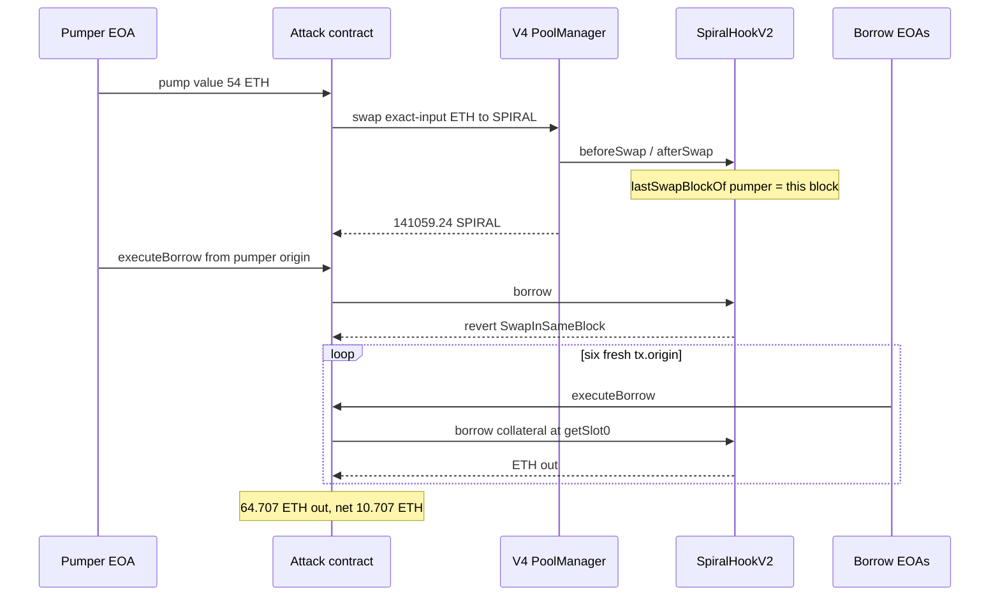
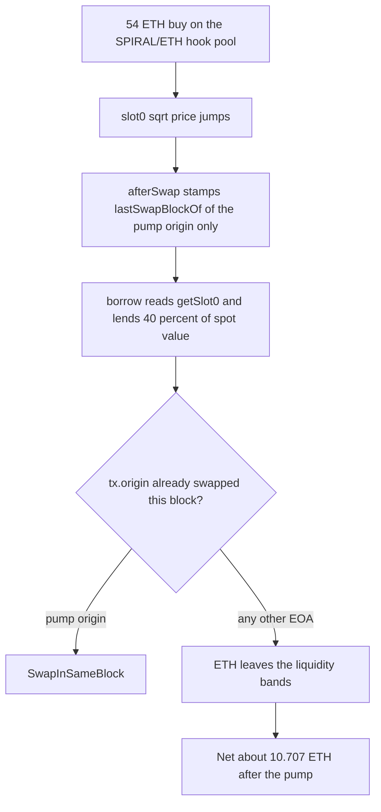

# SpiralHookV2 — Uniswap V4 spot `getSlot0` prices borrow collateral, and `noSameBlockSwap` keys the guard on `tx.origin`

> **Vulnerability classes:** vuln/oracle/spot-price · vuln/oracle/price-manipulation · vuln/access-control/tx-origin · vuln/access-control/guard-bypass
> **Reproduction:** isolated Foundry project at [this folder](.). Full verbose trace: [output.txt](output.txt). Verified hook source: [sources/SpiralHookV2_172557](sources/SpiralHookV2_172557).

---

## Key info

| | |
|---|---|
| **Loss** | **10.707280986613435410 ETH** net. 54 ETH buys **141,059.241329869479115783 SPIRAL**; six same-block borrows pull **64.707280986613435410 ETH** back out. SlowMist printed the loss as **~10.7 ETH (~$26.8k)**. |
| **Vulnerable contract** | `SpiralHookV2` [`0x1725577d…aacc`](https://etherscan.io/address/0x1725577dC9B1ee2D95dB49c2193226471594aacc) — the V4 hook and the lending book ([sources/SpiralHookV2_172557](sources/SpiralHookV2_172557)) |
| **SPIRAL** | [`0x6a77E392…b12b`](https://etherscan.io/address/0x6a77E39240dA69Ea788e4cF93663D2c41EA4b12b) (`currency1`) |
| **PoolManager** | Uniswap V4 [`0x000000000004444c5dc75cB358380D2e3dE08A90`](https://etherscan.io/address/0x000000000004444c5dc75cB358380D2e3dE08A90) |
| **PoolKey** | `{ currency0: ETH (address(0)), currency1: SPIRAL, fee: 0, tickSpacing: 60, hooks: SpiralHookV2 }` |
| **Attacker EOA (pump)** | [`0x859E69A2…a2F0`](https://etherscan.io/address/0x859E69A29244A10800A34eE66919426C02afa2F0) |
| **Attack contract** | [`0x0C23C8BC…6F86`](https://etherscan.io/address/0x0C23C8BC3b7C565f3f9F4aC691A4Dc4275086F86). This PoC deploys a reconstruction at `0x5615dEB7…b72f` ([output.txt:371](output.txt)). |
| **Chain / block / date** | Ethereum (chainId **1**) / live attack block **25,974,146** (7 txs) / fork parent **25,974,145** / 2026-09-14 |
| **Compiler** | Solidity **v0.8.26+commit.8a97fa7a**, optimizer **on**, **1** run (per [sources/SpiralHookV2_172557/_meta.json](sources/SpiralHookV2_172557/_meta.json)) |
| **Bug class** | `borrow` values SPIRAL at the live V4 spot (`poolManager.getSlot0`) with no TWAP and no move cap. `noSameBlockSwap` records `lastSwapBlockOf[tx.origin]`, so six fresh EOAs borrow against the pumped spot in the same block. |
| **LTV** | `LTV_BPS = 4000` (40%) in [SpiralStateV2.sol](sources/SpiralHookV2_172557/contracts_canonical_v2_SpiralStateV2.sol) |

---

## TL;DR

1. Spiral's canonical hook is a Uniswap V4 hook **and** a SPIRAL/ETH lender. `borrow(collateralSpiral, minEthOut)` pulls SPIRAL and sizes the ETH debt off `LDF.spiralValueInETH(sqrtPriceX96, amount)` read from `getSlot0` in the same transaction.
2. The intended same-block defence, `noSameBlockSwap`, reverts only when `lastSwapBlockOf[tx.origin]` is already this block. `afterSwap` writes that slot for **the swapping origin only**. `msg.sender` of `borrow` can stay the same attack contract.
3. One origin spends **54 ETH** to buy **141,059.241329869479115783 SPIRAL** and move the spot. That origin is then burned: its own `borrow` reverts `SwapInSameBlock()` (`0x003adfed`) at [output.txt:448](output.txt).
4. Six other EOAs, each with `lastSwapBlockOf == 0`, call the same contract's `executeBorrow` in the same block and extract **64.707280986613435410 ETH**. Net of the 54 ETH pump: **10.707280986613435410 ETH** ([output.txt:957](output.txt)). `[PASS] testExploit()` gas **1,636,736**.

---

## Background

[Spiral](https://spir8l.com) (`@spir8l_com`) runs a SPIRAL/ETH pool whose hook also books leveraged longs and plain borrows. The canonical pool is fully bonded into the curve (no reserved short inventory). Borrowers lock SPIRAL and receive ETH taken out of the hook's V4 liquidity bands, at a fixed **40% LTV** of the spot value, minus an origination fee (`ORIG_FEE_BPS = 100`).

The live incident is one Ethereum block, **25,974,146**, with seven transactions: one 54 ETH buy (selector `0x5705b581` from `0x859E69A2…`) and six `borrow` calls (selector `0x1242e326`) from six other EOAs into the same attack contract `0x0C23C8BC…`. This PoC does not replay that calldata. It forks the parent block and reconstructs the pump plus the six collateral amounts with typed calls ([test/SpiralHookV2_exp.sol](test/SpiralHookV2_exp.sol)).

---

## The vulnerable code

Verified `borrow` ([contracts_canonical_v2_SpiralHookV2.sol](sources/SpiralHookV2_172557/contracts_canonical_v2_SpiralHookV2.sol)):

```solidity
function borrow(uint256 collateralSpiral, uint256 minEthOut)
    external nonReentrant noSameBlockSwap
    returns (uint256 positionId, uint256 ethOut)
{
    // ...
    require(spiral.transferFrom(msg.sender, address(this), collateralSpiral), "SpiralPullFail");

    (uint160 sqrtP, int24 currentTick,,) = poolManager.getSlot0(_poolId());
    uint256 collateralValue = LDF.spiralValueInETH(sqrtP, collateralSpiral);
    // ...
    uint256 plannedDebt = (collateralValue * LTV_BPS) / 10_000;
    // unlocks a liquidity band and pays ethOut to msg.sender
}
```

`spiralValueInETH` is instantaneous spot, not a TWAP ([contracts_LDF.sol](sources/SpiralHookV2_172557/contracts_LDF.sol)):

```solidity
/// spot (ETH per SPIRAL) = 1 / V4_price = 2^192 / sqrtPriceX96^2
function spiralValueInETH(uint160 sqrtPriceX96, uint256 spiralAmount) internal pure returns (uint256) {
    uint256 sqrtP = uint256(sqrtPriceX96);
    uint256 a = FullMath.mulDiv(spiralAmount, 1 << 96, sqrtP);
    return FullMath.mulDiv(a, 1 << 96, sqrtP);
}
```

There is no max deviation from the pre-swap sqrt price, no oracle delay, and no comparison to `swapSpiralForEthOnCurve` (the code's own note that selling back down the curve returns **less** ETH than spot × amount).

The guard that was supposed to stop a same-block pump-and-borrow ([contracts_canonical_v2_SpiralStateV2.sol](sources/SpiralHookV2_172557/contracts_canonical_v2_SpiralStateV2.sol)):

```solidity
modifier noSameBlockSwap() {
    if (uint64(block.number) <= lastSwapBlockOf[tx.origin]) revert SwapInSameBlock();
    _;
    lastSwapBlockOf[tx.origin] = uint64(block.number);
}
```

`afterSwap` stamps the same key ([SpiralHookV2.sol](sources/SpiralHookV2_172557/contracts_canonical_v2_SpiralHookV2.sol) `afterSwap`):

```solidity
function afterSwap(...) external onlyPoolManager returns (bytes4, int128) {
    lastSwapBlockOf[tx.origin] = uint64(block.number);
    // ...
}
```

The modifier comment says the slot means "no second gated call per block **per EOA**." It does not bind the pool's sqrt price to the block, and it does not key on `msg.sender`. The attack contract is `msg.sender` on every `borrow`; only `tx.origin` rotates.

---

## Root cause

1. **Collateral is the manipulable spot.** A permissionless V4 exact-input ETH→SPIRAL swap moves `slot0` inside the block. `borrow` then lends 40% of that inflated `spiralValueInETH`.
2. **The same-block fence is per `tx.origin`, not per pool or per `msg.sender`.** The pump burns only the origin that swapped. Any other EOA still has `lastSwapBlockOf == 0` and passes `noSameBlockSwap` while the spot is already wrong.
3. **`borrow` is permissionless** once `poolInitialized` and `tradingOpen` are set. Nothing checks that the depositor did not just buy the collateral from this same pool, and `minEthOut` is caller-chosen (the attack passes `0`).

The hook is left holding **141,059.24 SPIRAL** booked at the pumped entry spot against **64.707 ETH** of debt. When the spot mean-reverts, that collateral cannot cover the ETH already paid out. The attacker's profit is ETH-out minus ETH-in; they do not repay.

---

## Preconditions

- `tradingOpen` and `poolInitialized` are true on `SpiralHookV2`, and at least one liquidity band can fund ~65 ETH of borrows (`TickFull` would abort `_findFeasibleBorrowBand`).
- The SPIRAL/ETH V4 pool is thin enough that **54 ETH** of exact-input buy moves spot enough for 40% LTV on the acquired SPIRAL to exceed 54 ETH.
- The attacker can send the pump and the borrows as **separate transactions in one block** (or one test that pranks several origins). A single origin cannot: the pumper's own borrow reverts.
- No external price cap, TWAP, or chainlink-style bound on `getSlot0`.

---

## Attack walkthrough

Fork of block **25,974,145**. Reconstruction in [test/SpiralHookV2_exp.sol](test/SpiralHookV2_exp.sol). Numbers are the `[PASS]` logs.

1. **Pump.** `pumperEOA` calls `exploiter.pump{value: 54 ether}()`. The unlock callback swaps exact-input 54 ETH → SPIRAL (`amountSpecified = -54e18`, [output.txt:390](output.txt) `beforeSwap`, [output.txt:401](output.txt) `afterSwap`). The hook writes `lastSwapBlockOf[pumperEOA] = 25974145` ([output.txt:431](output.txt)). SPIRAL received: **141,059.241329869479115783** ([output.txt:426](output.txt)).
2. **Same origin cannot borrow.** `executeBorrow` from `pumperEOA` reaches `borrow` and reverts `SwapInSameBlock()` (`0x003adfed`) at [output.txt:448](output.txt). The guard is real; it is just scoped to the wrong identity.
3. **Six fresh origins borrow the whole inventory** in the same block. Each `lastSwapBlockOf(eoa)` reads **0** (first check [output.txt:457](output.txt)). `msg.sender` of `borrow` is the exploiter on every call. Collateral amounts are the on-chain splits (they sum to the pump output):

| # | Origin (PoC) | SPIRAL in | ETH out | Log |
|---|---|---|---|---|
| 0 | `0xa05cA205…18B9` | 26,194.701114956762271800 | 12.301514615574584162 | [output.txt:525](output.txt) |
| 1 | `0x7B57bF4a…9082` | 47,692.129493628870889046 | 22.397103346934662924 | [output.txt:607](output.txt) |
| 2 | `0x7671B1e1…3B09` | 26,519.137370015462073767 | 10.934312370255774461 | [output.txt:691](output.txt) |
| 3 | `0xf6cd2AE8…92Db` | 25,799.735239233127730276 | 12.116031358043034158 | [output.txt:784](output.txt) |
| 4 | `0x92C15B81…F867` | 7,786.470121408795247191 | 3.656669934193414355 | [output.txt:866](output.txt) |
| 5 | `0xcC2B0703…39bF` | 7,067.067990626460903703 | 3.301649361611965350 | [output.txt:951](output.txt) |

4. **Settle.** Total ETH pulled **64.707280986613435410** ([output.txt:956](output.txt)). Net after the 54 ETH pump: **10.707280986613435410** ([output.txt:957](output.txt)). `assertApproxEqAbs` against 10.7 ETH with a 0.3 ETH tolerance passes ([output.txt:962](output.txt)).

The live EOAs differ from these `makeAddr` origins; the collateral amounts, the 54 ETH pump, and the per-borrow ETH out match the on-chain economics the test was written against.

---

## Diagrams





---

## Remediation

- **Do not lend against `getSlot0` of the pool the borrower can swap.** Price collateral with a long TWAP, an external feed, or `swapSpiralForEthOnCurve` (the contract already treats spot × amount as an over-estimate of executable proceeds) and cap the per-block move.
- **Key the same-block fence on the pool, not on `tx.origin`.** Set a single `lastSwapBlock` (or a sqrt-price checkpoint) on any swap in the pool, and reject `borrow` until a later block. `tx.origin` is the wrong principal: one contract, many EOAs, all pass.
- **Reject `tx.origin` auth in general.** Phishing aside, it does not bind the account that holds the position (`msg.sender`).
- **Borrow cap and min-collateral versus pool depth.** A 54 ETH swap should not be able to extract more ETH than it put in. A deviation check `postSqrt / preSqrt` inside the same block would have made `plannedDebt` fail `TickFull` or a dedicated `OracleMove` revert.
- Keep `minEthOut`, but do not treat a caller-supplied slippage floor as oracle protection.

---

## How to reproduce

Offline, from the committed `anvil_state.json` (anvil `--load-state`, no RPC):

```bash
_shared/run_poc.sh 2026-09-SpiralHookV2_exp -vvvvv
```

Expected tail:

```
[PASS] testExploit() (gas: 1636736)
SPIRAL bought by 54 ETH pump: 141059.241329869479115783
total ETH pulled from 6 borrows: 64.707280986613435410
NET PROFIT (after repaying the 54 ETH pump): 10.707280986613435410
Suite result: ok. 1 passed; 0 failed; 0 skipped
```

*Reference: [SlowMist TI Alert](https://x.com/SlowMist_Team/status/2099410818244968850).*
