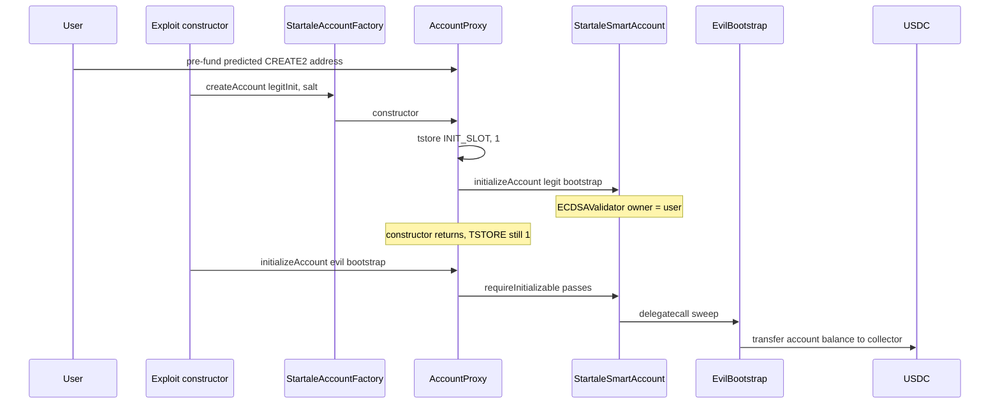
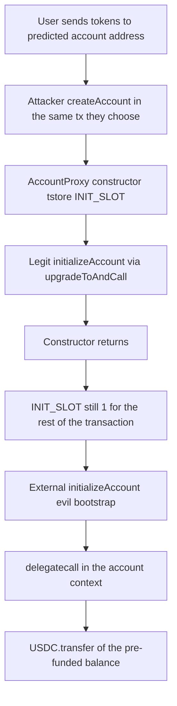

# Startale ERC-7579 accounts — transient `INIT_SLOT` stays set after the proxy constructor, so `initializeAccount` can be called again in the same transaction

> **Vulnerability classes:** vuln/logic/incorrect-initialization · vuln/access-control/missing-auth · vuln/dependency/unsafe-external-call · vuln/logic/delegatecall-target-confusion
> **Reproduction:** isolated Foundry project at [this folder](.). Full verbose trace: [output.txt](output.txt). Impl: [sources/StartaleSmartAccount_000000](sources/StartaleSmartAccount_000000). Factory (includes `AccountProxy`): [sources/StartaleAccountFactory_000000](sources/StartaleAccountFactory_000000).

---

## Key info

| | |
|---|---|
| **Loss (this PoC)** | **32.555561 USDC** swept from 3 reconstructed pre-funded accounts. Attacker USDC **0 → 32.555561** ([output.txt:369](output.txt), [output.txt:679](output.txt)). |
| **Loss (reported)** | ExVul: **~$2,876 USDC+USDT** from **~330** counterfactual accounts across **~41** constructor batches. The example tx below moved **427.551160 USDC** from 23 of 40 accounts created in that tx. This test is a 3-account slice of that mechanism, not a calldata replay. |
| **Implementation** | `StartaleSmartAccount` [`0x000000b8…E05A`](https://etherscan.io/address/0x000000b8f5f723A680d3D7EE624Fe0bC84a6E05A) |
| **Factory** | `StartaleAccountFactory` [`0x0000003B…ef90`](https://etherscan.io/address/0x0000003B3E7b530b4f981aE80d9350392Defef90) |
| **Default validator** | `ECDSAValidator` [`0x00000072…C7b1`](https://etherscan.io/address/0x00000072F286204Bb934eD49D8969E86F7dEC7b1) |
| **Token in this tx / PoC** | USDC [`0xA0b86991…eB48`](https://etherscan.io/address/0xA0b86991c6218b36c1d19D4a2e9Eb0cE3606eB48) |
| **Example attack tx** | [`0x1a021a27c8db5ecd6428a567cedf008872f205c55e590d4dcd2ea10e31a036a2`](https://etherscan.io/tx/0x1a021a27c8db5ecd6428a567cedf008872f205c55e590d4dcd2ea10e31a036a2) @ block **25,987,506**. The tx `to` is empty: the drain runs in the constructor. |
| **Attacker EOA** | [`0x901DafdE…7AAB`](https://etherscan.io/address/0x901DafdE7057BC2478d1eF640fb5515EA4757AAB). Live collector [`0xe2719E3b…EcdE`](https://etherscan.io/address/0xe2719E3b28EeF69bf3C4A9D7FC7280c5a015EcdE). |
| **Chain / block / date** | Ethereum (chainId **1**) / fork parent **25,987,505** / alert 2026-09-16 |
| **Compiler** | Solidity **v0.8.30+commit.73712a01**, optimizer **on**, **499** runs, Cancun (TSTORE/TLOAD). Meta: [impl](sources/StartaleSmartAccount_000000/_meta.json), [factory](sources/StartaleAccountFactory_000000/_meta.json). |
| **Bug class** | `AccountProxy`'s constructor `tstore`s an "initializable" flag that EIP-1153 keeps for the **whole transaction**. `initializeAccount` for an external caller checks only that flag, then `delegatecall`s a caller-supplied bootstrap. |

---

## TL;DR

1. Users pre-fund the counterfactual address of a Startale ERC-7579 account (ERC-4337 / factory `CREATE2`) before anyone deploys it.
2. `AccountProxy`'s constructor calls `Initializable.setInitializable()` (`tstore(INIT_SLOT, 1)`) and then `upgradeToAndCall` into `initializeAccount`. The comment says the flag is only true during construction. **EIP-1153 transient storage is transaction-scoped.** The `TSTORE` is not rolled back when the constructor returns, so `INIT_SLOT` stays 1 on that account until the tx ends.
3. `initializeAccount` does not check "already initialized" before the bootstrap. An external caller passes `requireInitializable()` for the rest of the tx and `delegatecall`s any bootstrap in the account's context. A sweep bootstrap transfers the account's USDC. No signature, no module ownership, no attacker capital.
4. This PoC deploys three accounts, `deal`s the first three real victim amounts (10.100000 + 11.145075 + 11.310486 USDC), and re-inits each in the constructor. Recipient balance **32.555561 USDC**. `[PASS] testExploit()` gas **1,442,926**. If the flag died with the constructor, the second `initializeAccount` would revert `NotInitializable()` and the test would fail.

---

## Background

Startale's account stack (Ethereum deployment of the same ERC-7579 implementation used with the SCS bundler) is a factory plus an ERC-1967 proxy:

| Piece | Role |
|---|---|
| `StartaleAccountFactory.createAccount(initData, salt)` | `CREATE2` the proxy at a publicly computable address |
| `AccountProxy` constructor | `tstore` the init flag, then `upgradeToAndCall(impl, initData)` |
| `initData` | `abi.encode(bootstrap, bootstrapCall)` |
| Legit bootstrap | `ECDSAValidator.onInstall(owner)` so `isInitialized()` becomes true |
| `initializeAccount` | external entry that `delegatecall`s that bootstrap |

`isInitialized()` is "default validator has an owner **or** sentinel lists are set" ([StartaleSmartAccount.sol](sources/StartaleSmartAccount_000000/src_StartaleSmartAccount.sol) `isInitialized`). It is **not** consulted as a one-shot latch at the start of `initializeAccount`.

The example receipt (block 25,987,506) has 40 `AccountCreated` events, 40 validator owner registrations, then 23 USDC `Transfer`s to the collector totalling 427.551160 USDC. USDT was not in that tx. The ~$2,876 figure is the campaign sum.

---

## The vulnerable code

`AccountProxy` claims the flag prevents re-initialization ([src_utils_AccountProxy.sol](sources/StartaleAccountFactory_000000/src_utils_AccountProxy.sol)):

```solidity
/// @dev A proxy contract that uses the ERC1967 upgrade pattern and sets the initializable flag
///      in the constructor to prevent reinitialization
contract AccountProxy is Proxy {
  constructor(address implementation, bytes memory data) payable {
    Initializable.setInitializable();
    ERC1967Utils.upgradeToAndCall(implementation, data);
  }
}
```

The flag is transient, not a storage latch ([src_lib_Initializable.sol](sources/StartaleSmartAccount_000000/src_lib_Initializable.sol)):

```solidity
// keccak256(abi.encode(uint256(keccak256("initializable.transient.startale.account")) - 1)) & ~bytes32(uint256(0xff));
bytes32 constant INIT_SLOT = 0x754fd8b321c4649cb777ae6fdce7e89e9cceaa31a4f639795c7807eb7f1a2700;

function setInitializable() internal {
    bytes32 slot = INIT_SLOT;
    assembly { tstore(slot, 0x01) }
}

function requireInitializable() internal view {
    bytes32 slot = INIT_SLOT;
    assembly {
        let isInitializable := tload(slot)
        if iszero(isInitializable) {
            mstore(0x0, 0xaed59595) // NotInitializable()
            revert(0x1c, 0x04)
        }
    }
}
```

`initializeAccount` ([src_StartaleSmartAccount.sol](sources/StartaleSmartAccount_000000/src_StartaleSmartAccount.sol)):

```solidity
function initializeAccount(bytes calldata initData) external payable virtual {
    // Protect this function to only be callable when used with the proxy factory or when
    // account calls itself
    if (msg.sender != address(this)) {
      Initializable.requireInitializable();
    }
    _initializeAccount(initData);
}

function _initializeAccount(bytes calldata initData) internal {
    // decode (bootstrap, bootstrapCall) from initData
    (bool success,) = bootstrap.delegatecall(bootstrapCall);
    require(success, AccountInitializationFailed());
    if (!_amIERC7702()) {
      require(isInitialized(), AccountNotInitialized());
    }
}
```

Two mistakes stack:

- The natdoc says "only the proxy factory or the account itself." The code does **not** check `msg.sender == factory`. Any external caller is accepted while `tload(INIT_SLOT) == 1`.
- There is no `require(!isInitialized())` before the `delegatecall`. The post-check only requires that **some** validator init still exists. The legit constructor init already set the default validator, so an evil bootstrap that only transfers tokens still leaves `isInitialized() == true`.

`createAccount` itself is permissionless ([StartaleAccountFactory.sol](sources/StartaleAccountFactory_000000/src_factory_StartaleAccountFactory.sol)): anyone who knows `(initData, salt)` — both are public, and the address was precomputed for funding — can deploy the counterfactual account.

---

## Root cause

EIP-1153 transient storage lives until the end of the **transaction**, not until the end of the constructor frame. `TSTORE` inside `AccountProxy`'s constructor is still visible to a later call to that same address in the same tx. The design assumed "constructor-only" and implemented it with `tstore`.

Because the second `initializeAccount` runs a caller-chosen `bootstrap.delegatecall`, the attacker executes arbitrary code with the account as `address(this)`: `USDC.transfer` of `balanceOf(address(this))` to the collector. The first init's owner registration is irrelevant; the sweep does not need to be the owner.

A storage `initialized` boolean set in the constructor and cleared or never left set, or a factory-only `msg.sender` check, would have made the second call revert. The PoC is the negative test: the second call succeeds.

---

## Preconditions

- A counterfactual Startale account address holds tokens or ETH **before** deployment. The factory address and init hash are enough to compute it (`computeAccountAddress`).
- The account is not yet deployed, so the attacker can be the one who calls `createAccount` and the follow-up `initializeAccount` in one tx (in the live attack, both sit in the exploit contract's constructor).
- `INIT_SLOT` is not cleared at the end of the constructor, and `initializeAccount` has no one-shot latch.
- No signature from the pre-committed owner is required to deploy or to re-enter init. Attacker capital is zero (gas only).

---

## Attack walkthrough

Fork **25,987,505**. The test builds three victims with owners `0xB0B0000+i` and salts `keccak256("startale-victim", i)`, predicts the address, and `deal`s USDC to stand in for the real pre-fund. The exploit contract's constructor then does, per account, what the live constructor batch did. Trace: [output.txt](output.txt).

1. **Attacker USDC before: 0** ([output.txt:392](output.txt)).
2. **Account 0.** `createAccount` deploys `0x91E9f6Ed…58D6`. Constructor `delegatecall`s `LegitBootstrap.init` and registers the victim owner. `isInitialized()` is true. Then, still in the constructor tx, `initializeAccount(evilInit)` `delegatecall`s `EvilBootstrap.sweep` and `USDC.transfer`s **10.100000 USDC** (`10100000`) to the test contract ([output.txt:558](output.txt)).
3. **Account 1.** Same shape at `0x1479E089…440d`. Sweep **11.145075 USDC** (`11145075`) ([output.txt:603](output.txt)).
4. **Account 2.** Same shape at `0xf664bDCB…7488`. Sweep **11.310486 USDC** (`11310486`) ([output.txt:648](output.txt)).
5. **Assert.** `balanceOf(recipient) == 32555561`. Log: `USDC drained from 3 reconstructed victims: 32.555561` ([output.txt:666](output.txt)). Attacker after: **32.555561** ([output.txt:679](output.txt)).

Those three amounts are the first three real pre-funded balances named in the example tx (sum **32.555561**, about 7.6% of that tx's 427.551160 USDC). The PoC addresses are not the live victim addresses; the init path is the same code.

---

## Diagrams





---

## Remediation

- **Do not use transient storage as a constructor-only latch.** EIP-1153 lifetime is the transaction. Use a persistent `initialized` flag that is set on the first successful init and never cleared by an unprivileged caller, and `require(!initialized)` before any bootstrap `delegatecall`.
- **Clearing `INIT_SLOT` at the end of the constructor is not enough by itself** if anything else in the same tx can `tstore` it again, but a `tstore(slot, 0)` after `upgradeToAndCall` would have stopped *this* re-entry. Prefer the storage latch anyway.
- **Bind the caller.** If init is only legal from the factory during `createAccount` or from a self-call, check `msg.sender == FACTORY` (immutable) or `msg.sender == address(this)`. `requireInitializable()` alone is not an auth check.
- **Do not `delegatecall` a caller-supplied bootstrap on a second entry.** The first init may install modules; a later init must not be an arbitrary call in the account context. Validate the bootstrap against a factory-stored allowlist, or have the factory call an internal initializer that is not part of the fallback ABI.
- **Users:** do not park assets on a Startale counterfactual address that is not yet deployed, until the implementation ships a one-shot initializer. Already-deployed accounts are not in this window: the flag is gone on the next transaction.

---

## How to reproduce

The test file sets `forge-config: default.evm_version = "cancun"` because the deployed bytecode uses TSTORE/TLOAD. Offline, from the committed `anvil_state.json`:

```bash
_shared/run_poc.sh 2026-09-Startale_exp -vvvvv
```

Expected tail:

```
[PASS] testExploit() (gas: 1442926)
Attacker Before exploit USDC Balance: 0.000000
USDC drained from 3 reconstructed victims: 32.555561
Attacker After exploit USDC Balance: 32.555561
Suite result: ok. 1 passed; 0 failed; 0 skipped
```

*Reference: [ExVul alert](https://x.com/exvulsec/status/2100111910524072258).*
