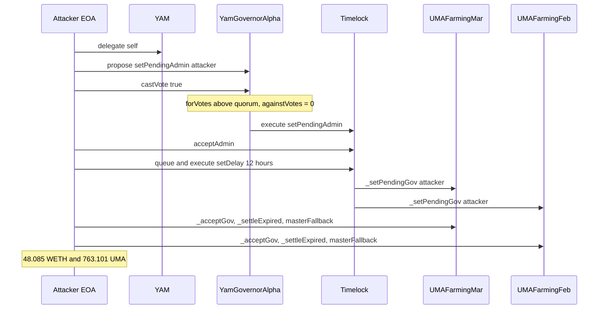
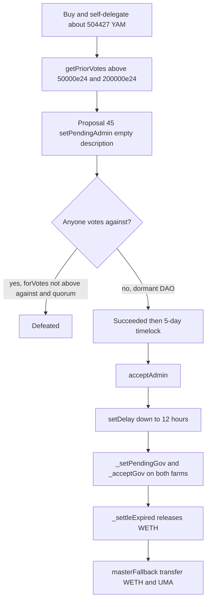

# Yam Finance — hardcoded GovernorAlpha quorum on a dormant DAO, then `masterFallback` drains the expired UMA farms

> **Vulnerability classes:** vuln/governance/quorum-manipulation · vuln/governance/admin-takeover · vuln/access-control/live-admin-power-on-dormant-protocol · vuln/logic/arbitrary-external-call
> **Reproduction:** isolated Foundry project at [this folder](.). Full verbose trace: [output.txt](output.txt). Governor: [sources/YamGovernorAlpha_2DA253](sources/YamGovernorAlpha_2DA253). Timelock: [sources/Timelock_8b4f16](sources/Timelock_8b4f16). Farms: [sources/UMAFarmingMar_ffb607](sources/UMAFarmingMar_ffb607), [sources/UMAFarmingFeb_c0AE1e](sources/UMAFarmingFeb_c0AE1e).

---

## Key info

| | |
|---|---|
| **Loss (this PoC)** | **48.085375043290366770 WETH** and **763.101265318097645247 UMA** to the attacker. MAR **23.499119440368500920 WETH** + the UMA; FEB **24.586255602921865850 WETH**. |
| **Loss (reported)** | Defimon: those balances cashed out via FixedFloat as **~48.15 ETH (~$121k)**. The earlier alert put **~$337k** at risk if the Timelock admin moved; the realized pull is the UMA-farm subset, not a second $337k. |
| **Governor** | `YamGovernorAlpha` [`0x2DA25383…4aeA`](https://etherscan.io/address/0x2DA253835967D6E721C6c077157F9c9742934aeA) |
| **Timelock** | [`0x8b4f1616…3EC5`](https://etherscan.io/address/0x8b4f1616751117C38a0f84F9A146cca191ea3EC5) (Compound-style). At the fork: `admin == governor`, `delay == 432000` (5 days). |
| **YAM (votes)** | [`0x0AaCfbeC…8521`](https://etherscan.io/address/0x0AaCfbeC6a24756c20D41914F2caba817C0d8521) |
| **UMAFarmingMar** | uGAS-MAR21 [`0xffb60741…1DE2`](https://etherscan.io/address/0xffb607418dBEaB7A888e079A34Be28A30d8E1DE2). `gov == timelock`. |
| **UMAFarmingFeb** | uGAS-FEB21 [`0xc0AE1e1e…9835`](https://etherscan.io/address/0xc0AE1e1e172ECD4C56fD8043FD5Afe5a473E9835). `gov == timelock`. |
| **Attacker EOA** | [`0x26881Eac…f982`](https://etherscan.io/address/0x26881EacC00Bcccd7c4ebE14BD7840dD989Bf982) |
| **Proposal tx** | [`0xf3c9b1d7094bd11e6aa065c5efb009afa682a961c72e3f4c1bc20e6a25d2e25a`](https://etherscan.io/tx/0xf3c9b1d7094bd11e6aa065c5efb009afa682a961c72e3f4c1bc20e6a25d2e25a) @ block **25,884,997** — proposal **#45**, description `"0x"`, one action `setPendingAdmin(attacker)` |
| **Chain / block / date** | Ethereum (chainId **1**) / fork **25,884,984** (YAM already bought, not yet delegated) / proposal ~2026-09-02, drain confirmed 2026-09-14 |
| **Compiler** | Solidity **v0.5.15+commit.6a57276f**, optimizer on. Governor **200** runs, Timelock **50000**, MAR **1**, FEB **5**. |
| **Bug class** | Quorum and proposal threshold are constants (`200000 * 10**24`, `50000 * 10**24`), not a share of current turnout. One self-delegated balance cleared both, nobody voted against, and the new Timelock admin used `masterFallback` as an arbitrary call on the farms. |

---

## TL;DR

1. Yam's GovernorAlpha is the Compound fork: `state()` marks a proposal **Succeeded** when `forVotes > againstVotes` and `forVotes >= quorumVotes()`. There is no extra "for" threshold and no requirement that anyone else vote.
2. At fork block 25,884,984 the attacker already holds **504,427.049076663433225108 YAM** (bought with their own funds the block before; not a flash loan) and `delegates == address(0)`. After `delegate(self)`, `getCurrentVotes` is **201,664.0626 × 10^24**, above both `proposalThreshold` (**50,000 × 10^24**) and `quorumVotes` (**200,000 × 10^24**).
3. Proposal #45 is a single call, empty description: `Timelock.setPendingAdmin(attacker)`. The attacker casts the only vote. After the voting period, `state == Succeeded` (enum 4) with zero against-votes ([output.txt:512](output.txt)).
4. They wait out the **5-day** delay, `acceptAdmin`, then queue `setDelay(12 hours)` (the Timelock `MINIMUM_DELAY`), take `gov` of both UMA farming contracts, call `_settleExpired()` so the expired uGAS EMP releases WETH into the farm, and `masterFallback` `WETH.transfer` / `UMA.transfer` to themselves.
5. Trace totals: **48.085375043290366770 WETH** and **763.101265318097645247 UMA**. `[PASS] test_YamGovernanceTakeover()` gas **1,274,587**. The FixedFloat hop to ~48.15 ETH is off-fork.

The stake has to sit through `votingDelay` (1 block) + `votingPeriod` (12,345 blocks, ~2 days) + the 5-day timelock, so it cannot be flash-borrowed. Dormancy is the exploit: an active DAO would have voted against.

---

## Background

Yam Finance's governance token still uses the 2020 GovernorAlpha / Timelock pair. The governor's admin of record is the Timelock; the Timelock is admin of the protocol contracts, including two legacy UMA farming contracts from the uGAS-FEB21 and uGAS-MAR21 expiries. Both farms still custody WETH collateral inside long-expired UMA ExpiringMultiParty minters, plus MAR's UMA reward balance. `gov` on each farm is the Timelock.

Defimon's 2026-09-02 alert asked holders to vote against #45 before block 25,897,343. They did not. On 2026-09-14 the same monitor confirmed execution and the farm drain.

This PoC forks **after** the open-market YAM buy (block 25,884,984: balance present, delegate still unset) and **before** self-delegation (next block on the live chain). From there every governance step is a real typed call. `vm.roll` / `vm.warp` compress the ~12-day calendar; they do not skip a check.

---

## The vulnerable code

Quorum is not "4% of votes cast" or "4% of current supply." It is a constant written against the original YAM supply comment ([YamGovernorAlpha.sol](sources/YamGovernorAlpha_2DA253/YamGovernorAlpha.sol)):

```solidity
function quorumVotes() public view returns (uint256) { return 200000 * 10**24; } // 4% of YAM
function proposalThreshold() public view returns (uint256) { return 50000 * 10**24; } // 1% of YAM
function votingDelay() public pure returns (uint256) { return 1; } // 1 block
function votingPeriod() public pure returns (uint256) { return 12345; } // ~2 days
```

Passage ([same file](sources/YamGovernorAlpha_2DA253/YamGovernorAlpha.sol) `state`):

```solidity
} else if (proposal.forVotes <= proposal.againstVotes || proposal.forVotes < quorumVotes()) {
    return ProposalState.Defeated;
} else if (proposal.eta == 0) {
    return ProposalState.Succeeded;
}
```

`propose` only checks `getPriorVotes(msg.sender, block.number - 1) >= proposalThreshold()`. A wallet that just self-delegated a balance above **both** constants can propose and, if `againstVotes` stays 0, pass the proposal alone.

The Timelock then does what Compound's timelock does once `pendingAdmin` is set ([Timelock.sol](sources/Timelock_8b4f16/Timelock.sol)):

```solidity
uint256 public constant MINIMUM_DELAY = 12 hours;

function setDelay(uint256 delay_) public {
    require(msg.sender == address(this), "Timelock::setDelay: Call must come from Timelock.");
    require(delay_ >= MINIMUM_DELAY, "Timelock::setDelay: Delay must exceed minimum delay.");
    delay = delay_;
}

function acceptAdmin() public {
    require(msg.sender == pendingAdmin, "Timelock::acceptAdmin: Call must come from pendingAdmin.");
    admin = msg.sender;
    pendingAdmin = address(0);
}
```

`setPendingAdmin` after `admin_initialized` must be called by the Timelock itself, which is why the proposal targets the Timelock rather than calling `setPendingAdmin` from the EOA. After `acceptAdmin`, the attacker **is** the admin, so they can queue `setDelay(MINIMUM_DELAY)` and any other Timelock call, including `_setPendingGov` on the farms. That is not a timelock bug; it is the admin power the quorum handed over. The 5-day delay only slows the first step.

The farm escape hatch, identical on MAR and FEB ([UMAFarmingMar.sol](sources/UMAFarmingMar_ffb607/UMAFarmingMar.sol)):

```solidity
function _settleExpired() public onlyGovOrSubGov {
    minter.settleExpired();
}

function masterFallback(address target, bytes memory data) public onlyGovOrSubGov {
    target.call.value(0)(data);
}
```

`_settleExpired` pulls the expired EMP's WETH collateral onto the farm. `masterFallback` then performs any zero-value call as the farm: here `WETH.transfer(attacker, balance)` and `UMA.transfer(attacker, balance)`. The return value is ignored. `onlyGovOrSubGov` is not a protection once gov is the attacker.

---

## Root cause

1. **Quorum and the proposal threshold are absolute constants**, commented as 4% and 1% of the original YAM supply. They do not track circulating supply, delegated supply, or recent turnout. A single balance whose `getPriorVotes` exceeds `200000 * 10**24` is a majority of a one-voter election.
2. **The DAO was dormant.** `forVotes <= againstVotes` is the only opposition check. With `againstVotes == 0`, any for-vote at or above quorum succeeds. No guardian cancelled #45 (cancel requires the guardian, or the proposer to have fallen under the threshold).
3. **Timelock admin is protocol admin.** `setPendingAdmin` is one call. `acceptAdmin` does not require a second vote. `setDelay` can then be lowered to 12 hours by the Timelock calling itself, so every later farm call waits hours, not five days.
4. **`masterFallback` is an arbitrary call** on contracts that still hold settleable collateral years after the EMP expiry. Becoming gov is enough to empty them. The governance takeover is what made that reachable; the fallback is why "gov" meant "drain."

The purchased YAM is real capital at risk across the whole delay. That is why this is not a flash-loan vote. It is a low-turnout constant-quorum takeover.

---

## Preconditions

- Attacker YAM balance whose prior votes exceed `quorumVotes()` (**2e29**) and `proposalThreshold()` (**5e28**). Here **504,427.049076663433225108** YAM raw balance maps to **201664062636824099514174674941** votes after self-delegation. Undelegated YAM does not count; the fork starts at `delegates == 0`.
- No opposing votes during the 12,345-block voting period, and no guardian `cancel`.
- Timelock `admin` is the governor and `admin_initialized` is already true, so the only path onto `pendingAdmin` is a Timelock self-call (the proposal).
- Both farms have `gov == timelock`, expired EMP minters that still release WETH on `settleExpired`, and a `masterFallback` that will `call` a token `transfer`. MAR also holds the UMA balance.
- The attacker can wait: 1 block voting delay, ~2 days of voting, 5 days, then 12 hours after the delay cut. The PoC warps that; the live attacker did not.

---

## Attack walkthrough

Fork **25,884,984**, prank `0x26881Eac…f982`. Trace: [output.txt](output.txt).

1. **Stake already on the EOA.** `YAM.balanceOf` logs **504,427.049076663433225108** ([output.txt:405](output.txt)). `delegates == 0`. Timelock admin is the governor, delay **432000**, both farms' gov is the Timelock (asserts at [output.txt:381](output.txt)–[output.txt:397](output.txt)).
2. **Self-delegate and checkpoint.** `YAM.delegate(attacker)`, `vm.roll(+2)`. Vote weight **201664062636824099514174674941**. `quorumVotes()` **200000000000000000000000000000**. `proposalThreshold()` **50000000000000000000000000000** ([output.txt:435](output.txt)–[output.txt:441](output.txt)). Both `assertGt` pass.
3. **Propose #45.** `propose([timelock], [0], ["setPendingAdmin(address)"], [abi.encode(attacker)], "0x")`. `ProposalCreated` id **45**, startBlock **25884987**, endBlock **25897332**, description `"0x"` ([output.txt:465](output.txt)).
4. **Vote alone.** Roll to Active, `castVote(45, true)`. `VoteCast` weight **2.016e29** ([output.txt:500](output.txt)). Roll `votingPeriod + 1`. `state == 4` Succeeded ([output.txt:512](output.txt)).
5. **Queue and wait 5 days.** `queue` → Timelock `queueTransaction` `setPendingAdmin` ([output.txt:519](output.txt)), `state == 5` Queued ([output.txt:532](output.txt)). Warp `432000 + 1`, `execute`. `NewPendingAdmin(attacker)` ([output.txt:541](output.txt)).
6. **acceptAdmin.** `NewAdmin(attacker)` ([output.txt:558](output.txt)). Storage admin slot moves from the governor to the EOA ([output.txt:560](output.txt)).
7. **Cut the delay.** Queue and execute `setDelay(43200)`. `NewDelay(43200)` ([output.txt:578](output.txt)).
8. **Take the farms.** Timelock `_setPendingGov(attacker)` on MAR ([output.txt:600](output.txt)) and FEB ([output.txt:617](output.txt)), then `_acceptGov` on both ([output.txt:626](output.txt), [output.txt:632](output.txt)).
9. **Settle and sweep.** MAR `_settleExpired` pulls **23.499119440368500920 WETH** from the EMP `0xfA3AA7EE…c669` ([output.txt:661](output.txt)). `masterFallback(WETH, transfer)` sends that WETH to the attacker ([output.txt:686](output.txt)). `masterFallback(UMA, transfer)` sends **763.101265318097645247 UMA** ([output.txt:694](output.txt)). FEB `_settleExpired` pulls **24.586255602921865850 WETH** ([output.txt:718](output.txt)) and `masterFallback` forwards it ([output.txt:741](output.txt)).
10. **Totals** ([output.txt:753](output.txt)–[output.txt:757](output.txt)):

| | Amount |
|---|---|
| WETH from MAR | 23.499119440368500920 |
| WETH from FEB | 24.586255602921865850 |
| WETH to attacker | 48.085375043290366770 |
| UMA to attacker | 763.101265318097645247 |

`assertGt(wethGained, 48 ether)` passes ([output.txt:764](output.txt)).

---

## Diagrams





---

## Remediation

- **Quorum must track participation or current supply**, not a 2020 constant. A fixed `200000 * 10**24` on a rebasing token with no voters is a one-wallet majority. Use a percentage of `yam.getCurrentVotes` supply, or a high absolute floor that a few percent of today's supply cannot clear, and require a minimum number of distinct voters for admin-changing proposals.
- **Split admin powers.** `setPendingAdmin` on the Timelock should not be a normal GovernorAlpha proposal, or it should need a higher quorum, a guardian veto that actually fires, and a second confirmation after the delay. The live guardian did not cancel.
- **Do not leave `masterFallback`-style arbitrary calls** on contracts that still custody assets. Replace it with explicit `transfer` helpers that send only to a fixed reserves address (the contract already has `_getTokenFromHere` for that). Ignore-success `target.call` is a drain primitive the moment gov moves.
- **Settle or sunset the expired EMP farms.** `_settleExpired` still releases WETH years later. Move leftover collateral to a multisig that is not the dormant Timelock, or freeze gov transfers.
- **Watch dormant GovernorAlpha forks.** The cost of this attack was the YAM purchase plus waiting. Voting against #45 before the end block was the only in-flight mitigation, and it did not happen.

---

## How to reproduce

Offline, from the committed `anvil_state.json` (anvil `--load-state`, no RPC). The harness forks Ethereum at block **25,884,984**:

```bash
_shared/run_poc.sh 2026-09-YamFinance_exp -vvvvv
```

Expected tail:

```
[PASS] test_YamGovernanceTakeover() (gas: 1274587)
attacker YAM stake (purchased, at risk): 504427.049076663433225108
attacker vote weight (underlying denom): 201664062636824099514174674941
quorumVotes(): 200000000000000000000000000000
proposalThreshold(): 50000000000000000000000000000
proposalId: 45
WETH drained from MAR: 23.499119440368500920
UMA  drained from MAR: 763.101265318097645247
WETH drained from FEB: 24.586255602921865850
TOTAL WETH drained to attacker: 48.085375043290366770
TOTAL UMA  drained to attacker: 763.101265318097645247
Suite result: ok. 1 passed; 0 failed; 0 skipped
```

*Reference: [Defimon Alerts, 2026-09-14 update](https://x.com/DefimonAlerts/status/2099355802909691999) (attempt: [2026-09-02](https://x.com/DefimonAlerts/status/2095019159847313766)).*
